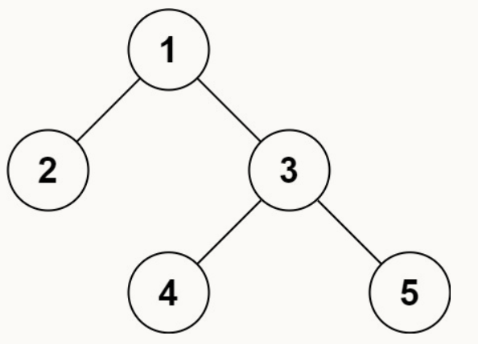

# 37.序列化二叉树


## 参考链接

[剑指offer_在线编程_ - 牛客网](https://www.nowcoder.com/exam/oj/ta?page=1&tpId=13&type=265)

[剑指 Offer 37. 序列化二叉树-跟着帅地玩转校招，刷爆各类算法题 - 帅地玩Offer](https://www.playoffer.cn/576.html)

[LCR 156. 序列化与反序列化二叉树 - 力扣（LeetCode）](https://leetcode.cn/problems/xu-lie-hua-er-cha-shu-lcof/submissions/564342428/)


## 个人尝试❌

```java
/**
 * Definition for a binary tree node.
 * public class TreeNode {
 *     int val;
 *     TreeNode left;
 *     TreeNode right;
 *     TreeNode(int x) { val = x; }
 * }
 */
public class Codec {

    // Encodes a tree to a single string.
    public String serialize(TreeNode root) {
        if (root == null) return null;
        StringBuilder sb = new StringBuilder();
        Deque<TreeNode> queue = new ArrayDeque<>();
        queue.offerLast(root);
        while (!queue.isEmpty()) {
            TreeNode tmp = queue.pollFirst();

            if (sb.length() == 0) sb.append(tmp.val);
            else {
                sb.append(",");
                sb.append(tmp.val);
            }

            if (tmp.left == null) sb.append(",?");
            else {
                queue.offerLast(tmp.left);
                sb.append(",");
                sb.append(tmp.left.val);
            }

            if (tmp.right == null) sb.append(",?");
            else {
                queue.offerLast(tmp.right);
                sb.append(",");
                sb.append(tmp.right.val);
            }
        }
        return sb.toString();
    }

    // Decodes your encoded data to tree.
    public TreeNode deserialize(String data) {
        if (data == null) return null;

        TreeNode cur, left = null, right = null, root = null;
        for (int i = 0, j = 0; i < data.length(); i++) {
            //j记录i的前值
            while (i < data.length() && data.charAt(i) != ',') i++;
            cur = new TreeNode(0);
            if (j == 0) root = cur;
            //substring 不包括 i
            cur.val = Integer.valueOf(data.substring(j, i));
            i++; j = i;
            //这里存在很大问题！父节点的左右分别等于同一个值，并且父节点的left和right会在下面语句中被覆盖
            if (left != null) left.left = cur;
            if (right != null) right.right = cur;

            //左孩子
            while (i < data.length() && data.charAt(i) != ',') i++;
            if (data.substring(j, i).equals("?")) {
                cur.left = null;
                left = null;
            }
            else left = cur;
            //右孩子
            i++; j = i;
            while (i < data.length() && data.charAt(i) != ',') i++;
            if (data.substring(j, i).equals("?")) {
                cur.right = null;
                right = null;
            }
            else right = cur;
            j = i; j++;
        }
        return root;
    }
}

// Your Codec object will be instantiated and called as such:
// Codec codec = new Codec();
// codec.deserialize(codec.serialize(root));
```

尝试着做了下,存在许多问题

在序列化方法中,

​    对于一个节点, 不仅存储 val ，也存储左右孩子节点的 val , 

​    接着轮到左右孩子存储时, 再次存储孩子节点的 val ,随后存储孩子节点的左右孩子节点的 val ，

​    这样的序列化一点都不精简，会使得序列化后的存储空间占据较大

​    例如 对于 [1,2,3,null,null,4,5]，输出 [1,2,3,  2,?,?,  3,4,5,  4,?,?,  5,?,?]

反序列化方法中，

​    尝试着使用 left、right 保存父节点的左右孩子是否为空，

​    不为空则在孩子节点反序列化时将孩子节点的地址传递给父节点，

​    但是，这么做是有问题的，即在左孩子节点存储左孩子节点的左右孩子节点时，会覆盖掉父节点的left、right，这么做就造成了父节点右孩子节点的缺失（代码中还有一处问题，就是将父节点的左右节点赋予同一个值）


## 优秀题解

```java
public class Codec {
    //序列化
    public String serialize(TreeNode root) {
        if(root == null) return "[]";
        StringBuilder res = new StringBuilder("[");
        Queue<TreeNode> queue = new LinkedList<>() {{ add(root); }};
        //层序遍历
        while(!queue.isEmpty()) {
            TreeNode node = queue.poll();
            //当队列头节点不为空时，左右孩子进队（不管孩子节点是否为空）
            if(node != null) {
                res.append(node.val + ",");
                queue.add(node.left);
                queue.add(node.right);
            }
            //当队列头节点为空时，输出字符串“null”
            else res.append("null,");
        }
        //去掉最后一个“，”
        res.deleteCharAt(res.length() - 1);
        res.append("]");
        return res.toString();
    }

    //反序列化
    public TreeNode deserialize(String data) {
        if(data.equals("[]")) return null;
        String[] vals = data.substring(1, data.length() - 1).split(",");
        TreeNode root = new TreeNode(Integer.parseInt(vals[0]));
        Queue<TreeNode> queue = new LinkedList<>() {{ add(root); }};
        int i = 1;
        //队列保存遍历过的 非null 但 还未处理左右孩子节点的 节点，
        //i 遍历孩子节点
        while(!queue.isEmpty()) {
            TreeNode node = queue.poll();
            if(!vals[i].equals("null")) {
                node.left = new TreeNode(Integer.parseInt(vals[i]));
                queue.add(node.left);
            }
            //不管孩子节点是否为 null，i 都要 + 1
            i++;
            if(!vals[i].equals("null")) {
                node.right = new TreeNode(Integer.parseInt(vals[i]));
                queue.add(node.right);
            }
            i++;
        }
        return root;
    }
}

作者：Krahets
链接：https://leetcode.cn/problems/xu-lie-hua-er-cha-shu-lcof/solutions/187388/mian-shi-ti-37-xu-lie-hua-er-cha-shu-ceng-xu-bian-/
来源：力扣（LeetCode）
著作权归作者所有。商业转载请联系作者获得授权，非商业转载请注明出处。
```

序列化：

* 层序遍历
* 队列头节点不为空时，左右孩子进队（null 节点也进队，例如 [1,2,3,null,null,4,5]
* 输出字符串时，队列头节点不为 null，输出 val；为空，输出 null

反序列化：

* 先使用 split 将 String 拆分成 String[]，方便后续取值
* 使用一个队列，保存 已遍历过、非空、左右节点尚未处理的节点
* 采用 i 变量遍历孩子节点
