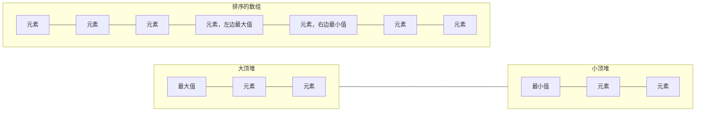

# 41.数据流中的中位数

## 参考链接

[剑指offer_在线编程_牛客网](https://www.nowcoder.com/exam/oj/ta?page=1&tpId=13&type=265)

[LCR 160. 数据流中的中位数 - 力扣（LeetCode）](https://leetcode.cn/problems/shu-ju-liu-zhong-de-zhong-wei-shu-lcof/)

[剑指 Offer 41. 数据流中的中位数-跟着帅地玩转校招，刷爆各类算法题帅地玩Offer](https://www.playoffer.cn/584.html)

[zhedahht/CodingInterviewChinese2: 《剑指Offer：名企面试官精讲典型编程面试题》第二版源代码](https://github.com/zhedahht/CodingInterviewChinese2)


## 优秀题解

```java
class MedianFinder {
    Queue<Integer> A, B;
    public MedianFinder() {
        A = new PriorityQueue<>(); // 小顶堆，保存较大的一半
        B = new PriorityQueue<>((x, y) -> (y - x)); // 大顶堆，保存较小的一半
    }
    public void addNum(int num) {
        if(A.size() != B.size()) {
            A.add(num);
            B.add(A.poll());
        } else {
            B.add(num);
            A.add(B.poll());
        }
    }
    public double findMedian() {
        return A.size() != B.size() ? A.peek() : (A.peek() + B.peek()) / 2.0;
    }
}

作者：Krahets
链接：https://leetcode.cn/problems/shu-ju-liu-zhong-de-zhong-wei-shu-lcof/solutions/227309/mian-shi-ti-41-shu-ju-liu-zhong-de-zhong-wei-shu-y/
来源：力扣（LeetCode）
著作权归作者所有。商业转载请联系作者获得授权，非商业转载请注明出处。
```


对题解的思考

[LCR 160. 数据流中的中位数 - 力扣（LeetCode）](https://leetcode.cn/problems/shu-ju-liu-zhong-de-zhong-wei-shu-lcof/solutions/227309/mian-shi-ti-41-shu-ju-liu-zhong-de-zhong-wei-shu-y/)

[zhedahht/CodingInterviewChinese2: 《剑指Offer：名企面试官精讲典型编程面试题》第二版源代码](https://github.com/zhedahht/CodingInterviewChinese2)




```java
class MedianFinder {
    Queue<Integer> max, min;
    /** initialize your data structure here. */
    public MedianFinder() {
        // 左边（最大堆）
        max = new PriorityQueue<>(Comparator.reverseOrder());
        // 右边（最小堆），保持 左边元素 < 右边元素
        min = new PriorityQueue<>();
    }
    
    public void addNum(int num) {
        // 个数为 0 / 相等 时，放左边（最大堆）
        if (max.size() == min.size()) {
             // 防止放 左边（最大堆） 时，元素 > 右边（最小堆）部分元素
            min.offer(num);
            max.offer(min.poll());
        } else {
            max.offer(num);
            min.offer(max.poll());
        } 
    }
    
    public double findMedian() {
        // 取最大堆 下标为0 的元素
        if (max.size() != min.size()) {
            return max.peek();
        } else {    // 最大堆 下标为0 的元素 和 最小堆 下标为0 的元素 求平均
            return (max.peek() + min.peek()) / 2.0;
        }
    }
}

/**
 * Your MedianFinder object will be instantiated and called as such:
 * MedianFinder obj = new MedianFinder();
 * obj.addNum(num);
 * double param_2 = obj.findMedian();
 */
```

