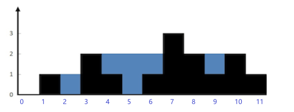

# 7.接雨水

## 参考链接

[42. 接雨水 - 力扣（LeetCode）- windliang的题解](https://leetcode.cn/problems/trapping-rain-water/solutions/9112/xiang-xi-tong-su-de-si-lu-fen-xi-duo-jie-fa-by-w-8/?envType=study-plan-v2&envId=top-100-liked)

[42. 接雨水 - 力扣（LeetCode）- 官方题解](https://leetcode.cn/problems/trapping-rain-water/solutions/692342/jie-yu-shui-by-leetcode-solution-tuvc/?envType=study-plan-v2&envId=top-100-liked)


## 优秀题解



```java
public int trap(int[] height) {
    int sum = 0;
    //最两端的列不用考虑，因为一定不会有水。所以下标从 1 到 length - 2
    for (int i = 1; i < height.length - 1; i++) {
        int max_left = 0;
        //找出左边最高
        for (int j = i - 1; j >= 0; j--) {
            if (height[j] > max_left) {
                max_left = height[j];
            }
        }
        int max_right = 0;
        //找出右边最高
        for (int j = i + 1; j < height.length; j++) {
            if (height[j] > max_right) {
                max_right = height[j];
            }
        }
        //找出两端较小的
        int min = Math.min(max_left, max_right);
        //只有较小的一段大于当前列的高度才会有水，其他情况不会有水
        if (min > height[i]) {
            sum = sum + (min - height[i]);
        }
    }
    return sum;
}

作者：windliang
链接：https://leetcode.cn/problems/trapping-rain-water/solutions/9112/xiang-xi-tong-su-de-si-lu-fen-xi-duo-jie-fa-by-w-8/
来源：力扣（LeetCode）
著作权归作者所有。商业转载请联系作者获得授权，非商业转载请注明出处。
```

按列求解，只需留意当前柱子的左右最大高度柱子与自身的关系；

当左右最大高度柱子中较矮的柱子 小于 等于 当前柱子高度时，无法接雨水；

当左右最大高度柱子中较矮的柱子 大于 当前柱子高度时，可接雨水；

另外，对于数组中每个元素都去寻找左右最高柱子的操作，可以采用两个数组进行简化，使用空间换取时间；

```java
class Solution {
    // 动态规划
    public int trap(int[] height) {
        int n = height.length;
        if (n == 0) {
            return 0;
        }

        int[] leftMax = new int[n];
        // dp数组初始化
        leftMax[0] = height[0];
        for (int i = 1; i < n; ++i) {
            // dp[i] = max(dp[i - 1], height[i])
            // 存储左右最大高度柱子的数组，只会存储自身及以上的高度
            leftMax[i] = Math.max(leftMax[i - 1], height[i]);
        }

        int[] rightMax = new int[n];
        rightMax[n - 1] = height[n - 1];
        for (int i = n - 2; i >= 0; --i) {
            rightMax[i] = Math.max(rightMax[i + 1], height[i]);
        }

        int ans = 0;
        for (int i = 0; i < n; ++i) {
            // 即使左右最大高度柱子中较矮柱子小于当前柱子高度也可直接相加
            // 因为小于当前柱子的高度不被存储，其存储的是自身高度
            ans += Math.min(leftMax[i], rightMax[i]) - height[i];
        }
        return ans;
    }
}

作者：力扣官方题解
链接：https://leetcode.cn/problems/trapping-rain-water/solutions/692342/jie-yu-shui-by-leetcode-solution-tuvc/
来源：力扣（LeetCode）
著作权归作者所有。商业转载请联系作者获得授权，非商业转载请注明出处。
```

