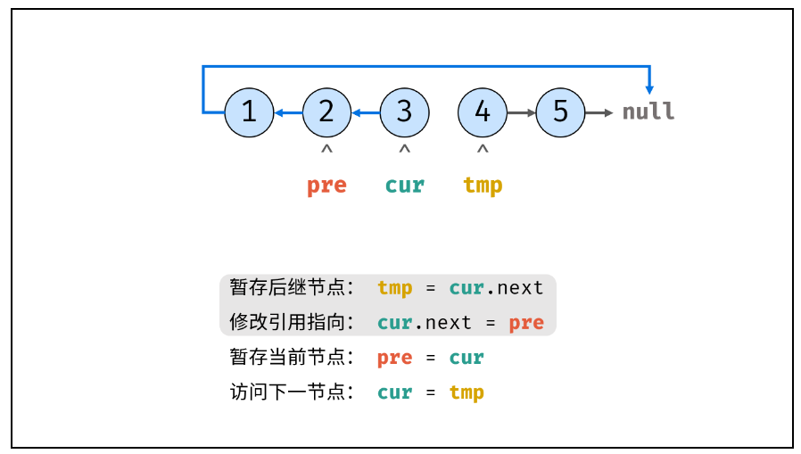

# 24.反转链表


## 参考链接

[牛客网-剑指Offer](https://www.nowcoder.com/exam/oj/ta?page=1&tpId=13&type=265)

[帅地](https://www.playoffer.cn/540.html)

[LeetCode](https://leetcode.cn/problems/fan-zhuan-lian-biao-lcof/description/)


## 个人题解

```java
/**
 * Definition for singly-linked list.
 * public class ListNode {
 *     int val;
 *     ListNode next;
 *     ListNode() {}
 *     ListNode(int val) { this.val = val; }
 *     ListNode(int val, ListNode next) { this.val = val; this.next = next; }
 * }
 */
class Solution {
    public ListNode trainningPlan(ListNode head) {
        if (head == null || head.next == null) return head;

        ListNode convert = null;
        //头插法
        while (head != null) {
            ListNode tmp = new ListNode(head.val);
            tmp.next = convert;
            convert = tmp;
            head = head.next;
        }

        return head = convert;
    }
}
//时间复杂度O(n)
//申请的内存空间相对较多，空间复杂度O(n)
```


## 优秀题解

```java
class Solution {
    public ListNode trainningPlan(ListNode head) {
        ListNode cur = head, pre = null;
        while(cur != null) {
            ListNode tmp = cur.next; // 暂存后继节点 cur.next
            cur.next = pre;          // 修改 next 引用指向
            pre = cur;               // pre 暂存 cur
            cur = tmp;               // cur 访问下一节点
        }
        return pre;
    }
}

//时间复杂度：O(n)
//空间复杂度：O(1)
    
//作者：Krahets
//链接：https://leetcode.cn/problems/fan-zhuan-lian-biao-lcof/solutions/476929/jian-zhi-offer-24-fan-zhuan-lian-biao-die-dai-di-2/
//来源：力扣（LeetCode）
//著作权归作者所有。商业转载请联系作者获得授权，非商业转载请注明出处。
```

