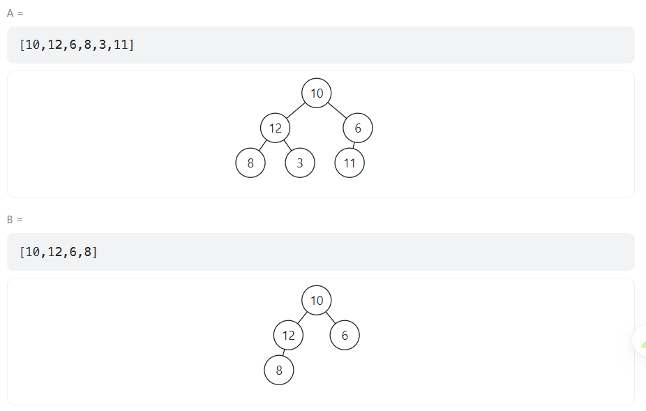

# 26.树的子结构

## 参考链接

<br>

[牛客网-剑指Offer](https://www.nowcoder.com/exam/oj/ta?page=1&tpId=13&type=265)

[帅地](https://www.playoffer.cn/544.html)

[LeetCode](https://leetcode.cn/problems/shu-de-zi-jie-gou-lcof/)


## 个人尝试（错误的题解）

<br>

```java
/**
 * Definition for a binary tree node.
 * public class TreeNode {
 *     int val;
 *     TreeNode left;
 *     TreeNode right;
 *     TreeNode(int x) { val = x; }
 * }
 */
class Solution {
    public boolean isSubStructure(TreeNode A, TreeNode B) {
        //先序遍历，tree2，arr2
        if (B == null) return false;
        Deque<TreeNode> stack = new ArrayDeque<>();
        stack.add(B);
        List<TreeNode> list = new ArrayList<>();
        while (!stack.isEmpty()) {
            TreeNode top = stack.removeLast();
            list.add(top);
            if (top.right != null) stack.add(top.right);
            if (top.left != null) stack.add(top.left);
        }
        int index = 0;
        stack.add(A);
        while (!stack.isEmpty()) {
            TreeNode top = stack.removeLast();

            if (index < list.size() && top.val == list.get(index).val) index++;
            else index = 0;

            if (top.right != null) stack.add(top.right);
            if (top.left != null) stack.add(top.left);
        }

        if (index == list.size()) return true;
        else return false;
    }
}
```

尝试使用 [先序遍历，作者：代码随想录](https://www.programmercarl.com/%E4%BA%8C%E5%8F%89%E6%A0%91%E7%9A%84%E8%BF%AD%E4%BB%A3%E9%81%8D%E5%8E%86.html#%E6%80%9D%E8%B7%AF) 遍历Tree B，随后将结果存到一个List中

然后，使用List与Tree A做对比

事实证明，想法是错的，遇到以下测试用例就没辙了（当Tree B =[10, 6, 11]也输出false）




## 优秀题解

<br>

```java
class Solution {
    public boolean isSubStructure(TreeNode A, TreeNode B) {
        return (A != null && B != null) && (recur(A, B) || isSubStructure(A.left, B) || isSubStructure(A.right, B));
    }
    boolean recur(TreeNode A, TreeNode B) {
        if(B == null) return true;
        if(A == null || A.val != B.val) return false;
        return recur(A.left, B.left) && recur(A.right, B.right);
    }
}

作者：Krahets
链接：https://leetcode.cn/problems/shu-de-zi-jie-gou-lcof/solutions/
来源：力扣（LeetCode）
著作权归作者所有。商业转载请联系作者获得授权，非商业转载请注明出处。
```

先序遍历 + 递归

isSubStructure “找个帮手”帮我判断此时的Tree A和Tree B是否相等，不相等，没事，Tree A那不还有左右子树嘛，一个个来

recur（帮手），我只要判断此时 节点A 和 节点B 的值是否相等即可，左右子树的判断那不跟我一样吗，直接划分成一样的小问题来解决