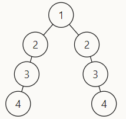

# 55Ⅱ.平衡二叉树

## 参考链接

<br/>

[剑指offer_在线编程_牛客网](https://www.nowcoder.com/exam/oj/ta?page=2&tpId=13&type=265)

[剑指 Offer 55 – II. 平衡二叉树-跟着帅地玩转校招，刷爆各类算法题帅地玩Offer](https://www.playoffer.cn/616.html)

[LCR 176. 判断是否为平衡二叉树 - 力扣（LeetCode）](https://leetcode.cn/problems/ping-heng-er-cha-shu-lcof/solutions/159235/mian-shi-ti-55-ii-ping-heng-er-cha-shu-cong-di-zhi/)


## 个人尝试 （❌，错误）

<br/>

尝试使用递归遍历左右子树，并且在递归返回值时返回子树高度，从叶子节点为0开始递增；

但是，代码存在漏洞，遇到

`[1,2,2,3,null,null,3,4,null,null,4]` 也会返回 `true`



```java
/**
 * Definition for a binary tree node.
 * public class TreeNode {
 *     int val;
 *     TreeNode left;
 *     TreeNode right;
 *     TreeNode() {}
 *     TreeNode(int val) { this.val = val; }
 *     TreeNode(int val, TreeNode left, TreeNode right) {
 *         this.val = val;
 *         this.left = left;
 *         this.right = right;
 *     }
 * }
 */
class Solution {
    public boolean isBalanced(TreeNode root) {
        if (root == null) return true;
        int left = dfs(root.left);
        int right = dfs(root.right);
        return (Math.abs(left - right) < 2);
    }
    public int dfs(TreeNode root) {
        if (root == null) return 0;
        return (Math.max(dfs(root.left), dfs(root.right)) + 1);
    }
}
```


## 优秀题解

```java
class Solution {
    public boolean isBalanced(TreeNode root) {
        return recur(root) != -1;
    }

    private int recur(TreeNode root) {
        if (root == null) return 0;
        
        int left = recur(root.left);
        // 剪枝，-1 代替 false
        if(left == -1) return -1;
        int right = recur(root.right);
        if(right == -1) return -1;
        // 判断左右子树高度差
        return Math.abs(left - right) < 2 ? Math.max(left, right) + 1 : -1;
    }
}

作者：Krahets
链接：https://leetcode.cn/problems/ping-heng-er-cha-shu-lcof/solutions/159235/mian-shi-ti-55-ii-ping-heng-er-cha-shu-cong-di-zhi/
来源：力扣（LeetCode）
著作权归作者所有。商业转载请联系作者获得授权，非商业转载请注明出处。
```


怎么在递归返回时既可以返回左右子树最大高度，又可以在左右子树高度差大于1时及时终止递归呢？

答：可以使用 `-1` 来代替 `false` 及时终止递归
