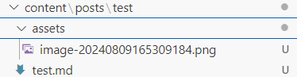
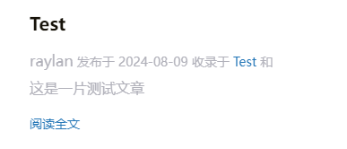
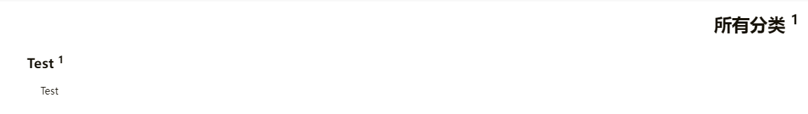

# Hugo使用学习


## 图片引用

先明确文件目录结构为



|—content

|	|—posts

|	|	|—test

|	|	|	|—test.md

|	|	|	|	|assets

|	|	|	|	|	|—image.png

现在test.md中需要引用image.png

正确语法为

```markdown

```

原先Typora使用的引用方式为

```markdown

```

省略了 `./`，且文件夹名为 `.asserts`，导致图片加载异常


## 文章分类

```
# 文章所属的类别
categories: 
- test
```






## 草稿（xxx.md）

设置文章为草稿版本

```markdown
---
draft: true
---
```

