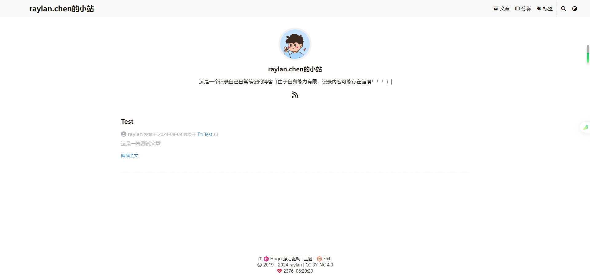
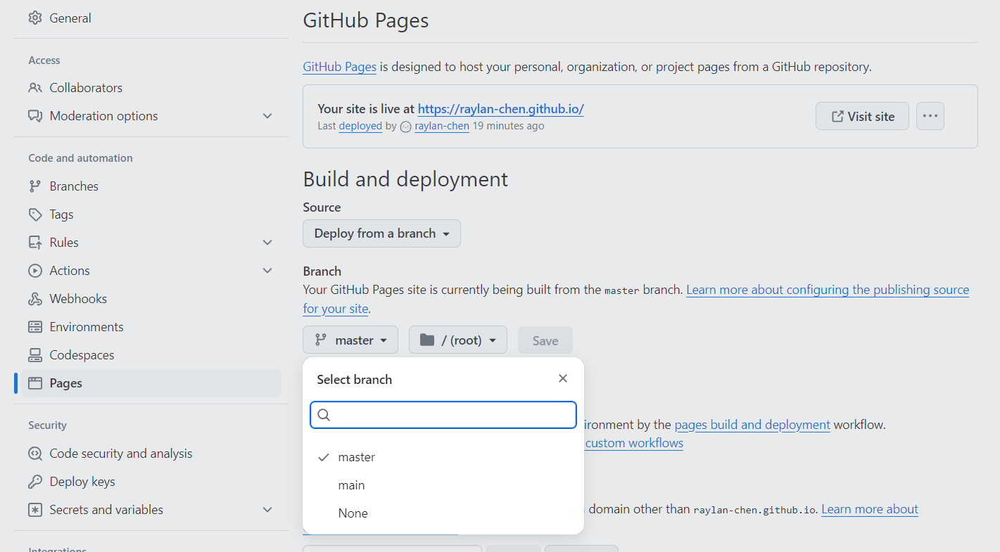
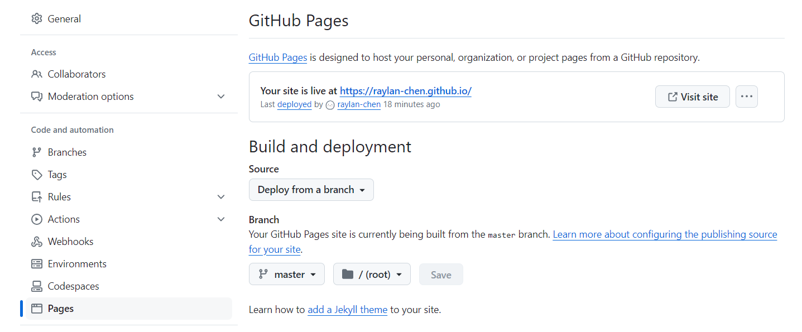
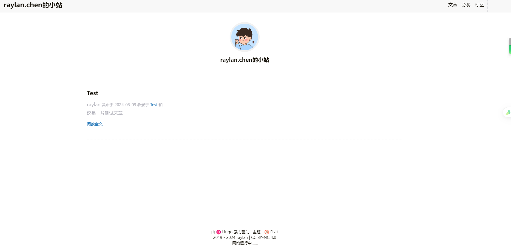

# 搭建个人博客（Github + Hugo）


## 参考链接

<https://www.haoyep.com/posts/windows-hugo-blog-github/#%E4%B8%BB%E9%A2%98>

<https://cuttontail.blog/blog/create-a-wesite-using-github-pages-and-hugo/>


## 搭建过程

准备工具：Git、Visual Studio Code、Chocolatey（Windows包管理器）

chocolatey安装hugo

```bash
choco install hugo-extended
```

准备文件夹 G:/blog

使用Hugo新建网站（此时位于G:/

```bash
WIN11@DESKTOP-42B4J2H MINGW64 /g
$ hugo new site blog
Congratulations! Your new Hugo site was created in G:\blog.

Just a few more steps...

1. Change the current directory to G:\blog.
2. Create or install a theme:
   - Create a new theme with the command "hugo new theme <THEMENAME>"
   - Or, install a theme from https://themes.gohugo.io/
3. Edit hugo.toml, setting the "theme" property to the theme name.
4. Create new content with the command "hugo new content <SECTIONNAME>\<FILENAME>.<FORMAT>".
5. Start the embedded web server with the command "hugo server --buildDrafts".

See documentation at https://gohugo.io/.
```

进入/blog，初始化git仓库

```bash
WIN11@DESKTOP-42B4J2H MINGW64 /g/blog
$ git init
Initialized empty Git repository in G:/blog/.git/
```

git submodule add + Hugo主题

```bash
WIN11@DESKTOP-42B4J2H MINGW64 /g/blog (master)
$ git submodule add https://github.com/hugo-fixit/FixIt.git themes/FixIt
Cloning into 'G:/blog/themes/FixIt'...
remote: Enumerating objects: 23934, done.
remote: Counting objects: 100% (3999/3999), done.
remote: Compressing objects: 100% (1575/1575), done.
remote: Total 23934 (delta 2542), reused 3701 (delta 2352), pack-reused 19935
Receiving objects: 100% (23934/23934), 55.62 MiB | 6.44 MiB/s, done.
Resolving deltas: 100% (13740/13740), done.
warning: in the working copy of '.gitmodules', LF will be replaced by CRLF the next time Git touches it
```

基础配置，修改hugo.toml文件（自定义修改baseUrl、title、个人图片等内容），hugo.toml文件配置可参考如下

```
https://www.haoyep.com/posts/windows-hugo-blog-github/#%E5%9F%BA%E7%A1%80%E9%85%8D%E7%BD%AE
```

修改文章前缀模板，模板参考：

```
https://www.haoyep.com/posts/windows-hugo-blog-github/#%E4%BF%AE%E6%94%B9%E6%96%87%E7%AB%A0%E5%89%8D%E7%BC%80%E6%A8%A1%E6%9D%BF
```

创建第一篇文章（markdown文件）

```bash
hugo new posts/test.md
```

本地测试

```bash
hugo server -D --disableFastRender 
```

本地测试结果

http://localhost:1313/




使用VSCode终端，生成静态HTML网页

```bash
PS G:\blog> hugo
```

进入`public`文件夹（hugo命令生成的静态网页存放处

```bash
cd publc
```

本地初始化Git仓库，并与 username.github.io 仓库（已提前创建完毕，并生成了Github Pages）关联

```bash
git init
git remote add github git@github.com:raylan-chen/raylan-chen.github.io.git
git add .
git commit -m "自定义记录"
git push github master
```

由于原先仓库创建时，主分支为main，现需切换分支






访问https://raylan-chen.github.io/

