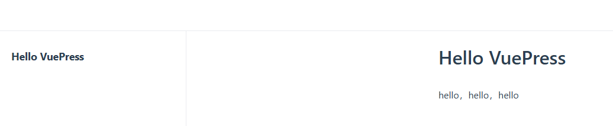
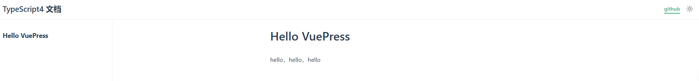
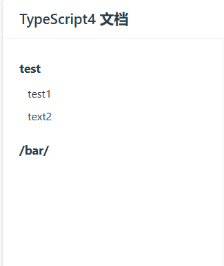
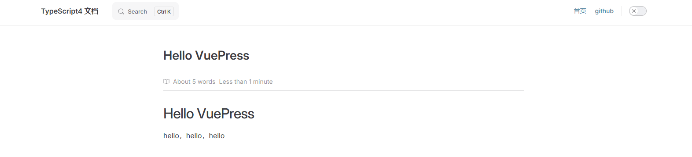
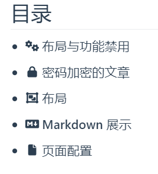
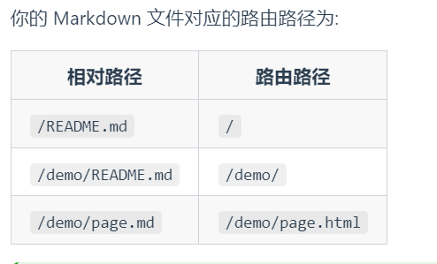
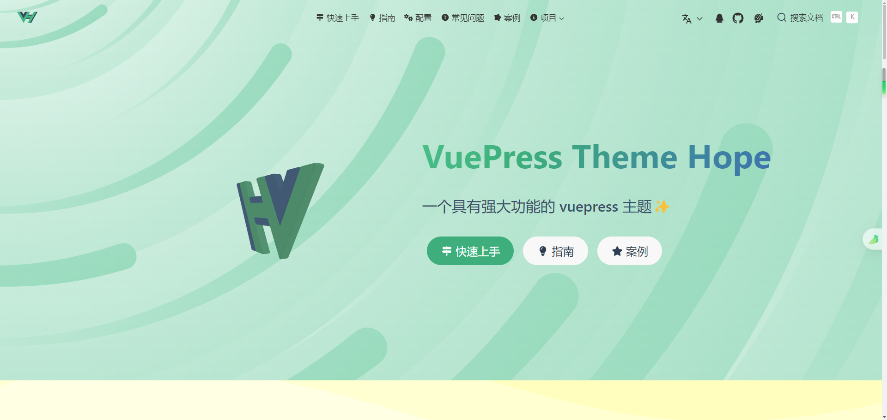
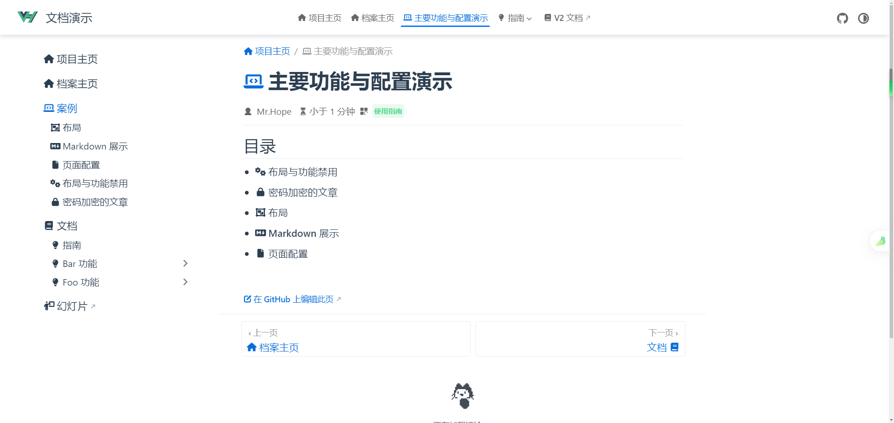

# 搭建个人博客(GithubPages+VuePress)


## 参考链接

<https://vuepress.vuejs.org/zh/guide/getting-started.html>


准备工具：

Chocolatey（Windows包管理工具）


## 安装依赖环境

安装Node.js

```bash
choco install nodejs
```

安装pnpm

```
choco install pnpm
```


## 创建项目

创建vuepress-starter文件夹

初始化项目

```
git init
pnpm init
```

安装VuePress

```bash
# 安装 vuepress 和 vue
pnpm add -D vuepress@next vue
# 安装打包工具和主题
pnpm add -D @vuepress/bundler-vite@next @vuepress/theme-default@next
```

报错了

```bash
$ pnpm add -D vuepress@next vue
 WARN  GET https://registry.npmjs.org/vue error (ECONNRESET). Will retry in 10 seconds. 2 retries left.
```

查看并更改pnpm源

```bash
# 查看当前源
pnpm config get registry

# 修改为淘宝源
pnpm config set registry https://registry.npmmirror.com/

# 还原到默认源
pnpm config set registry https://registry.npmjs.org/

参考链接：
https://juejin.cn/post/7337953934773911561#heading-3
```

创建目录及文件

```bash
mkdir docs
mkdir docs/.vuepress
touch docs/.vuepress/config.js
```

config.js

```js
import { viteBundler } from '@vuepress/bundler-vite'
import { defaultTheme } from '@vuepress/theme-default'
import { defineUserConfig } from 'vuepress'

export default defineUserConfig({
  bundler: viteBundler(),
  theme: defaultTheme(),
})
```

创建第一篇文档

```bash
echo '# Hello VuePress' > docs/README.md
```


## 目录结构

```
├─ docs
│  ├─ .vuepress
│  │  └─ config.js
│  └─ README.md
└─ package.json
```

`docs`: 放置Markdown文件

`.vuepress`: 放置配置文件、临时文件、缓存文件和构建输出文件（可添加到`.gitignore`）

gitigonre文件示例：

```
# VuePress 默认临时文件目录
.vuepress/.temp
# VuePress 默认缓存目录
.vuepress/.cache
# VuePress 默认构建生成的静态文件目录
.vuepress/dist
```


## 使用VuePress

修改`package.json`中的”scripts“

```json
"scripts": {
    "test": "echo \"Error: no test specified\" && exit 1",
	"docs:dev": "vuepress dev docs",
    "docs:build": "vuepress build docs"
  },
```

启动开发服务器

```bash
#启动一个热重载的开发服务器，修改你的 Markdown 文件时，浏览器中的内容也会自动更新
pnpm docs:dev
```

访问 http://localhost:8080 



构建网站

```bash
#在`docs/.vuepress/dist`构建生成的静态文件
pnpm docs:build
```


## 丰富网站内容


### 增加网站标题和描述

`docs/.vuepress/config.js`文件

```bash
export default defineUserConfig({
  bundler: viteBundler(),
  theme: defaultTheme(),
  title: 'TypeScript4 文档',
  description: 'TypeScript4 最新官方文档翻译',
})
```


### 配置导航栏

```js
theme: defaultTheme({
    navbar: [
      {
        text: 'github',
        link: '',
      },
    ]
  }),
```

前端



教程文档

https://ecosystem.vuejs.press/zh/themes/default/config.html#navbar


### 侧边栏

教程文档

<https://ecosystem.vuejs.press/zh/themes/default/config.html#sidebar>

```js
theme: defaultTheme({
    //导航栏

    //侧边栏
    sidebar: [
      {
        text: 'test',
        prefix: '/foo/',
        link: '/foo/',
        collapsible: false,
        children: [
          {
            text: 'test1',
            link: '',
          },
          {
            text: 'text2',
            link: '',
          },
        ],
      },
      '/bar/README.md',
    ],
  }),
```

前端



### 更换主题

Plume官方文档

<https://theme-plume.vuejs.press/guide/quick-start/#%E5%AE%8C%E6%88%90>

安装相关依赖（？此时自己也不知道操作的正确性

```js
 pnpm add -D vuepress-theme-plume @vuepress/bundler-vite@next
```

config.js文件修改

```js
import { plumeTheme } from 'vuepress-theme-plume'
export default defineUserConfig({
  bundler: viteBundler(),
  theme: plumeTheme({
      ...
```

前端界面




## 安装hope主题并生成一个Demo，以学习语法

官方文档：https://theme-hope.vuejs.press/zh/

https://theme-hope.vuejs.press/zh/guide/intro/install.html#%E5%AE%89%E8%A3%85


### 新建VuePress（Hope）项目

新建一个hope主题的VuePress项目（在新建项目时，不知道该用什么键来更改选择，所以选择使用键盘打出自己想要的选项）

```bash
WIN11@DESKTOP-42B4J2H MINGW64 /g/blog-vuepress
$ pnpm create vuepress-theme-hope hope-demo
? Select a language to display / 选择显示语言 简体中文
? 选择包管理器 (Use arrow keys)
? 选择包管理器 pnpm
? 你想要使用哪个打包器？ (Use arrow keys)
? 你想要使用哪个打包器？ vite
生成 package.json...
? 设置应用名称 (vuepress-theme-hope-template) hope-demo
? 设置应用名称 hope-demo
? 设置应用描述 (A project of vuepress-theme-hope) hope-demo
? 设置应用描述 hope-demo
? 设置应用版本号 (2.0.0)
? 设置应用版本号 2.0.0
? 设置协议 (MIT)
? 设置协议 MIT
生成 tsconfig.json...
? 你想要创建什么类型的项目？ docs
? 项目需要用到多语言么? (y/N) n
? 项目需要用到多语言么? no
生成模板...
? 是否初始化 Git 仓库? (Y/n) y
? 是否初始化 Git 仓库? yes
? 是否需要一个自动部署文档到 GitHub Pages 的工作流？ (Y/n) y
? 是否需要一个自动部署文档到 GitHub Pages 的工作流？ yes
...
模板已成功生成!
? 是否想要现在启动 Demo 查看? (Y/n) y
? 是否想要现在启动 Demo 查看? yes
启动开发服务器...
启动成功后，请在浏览器输入给出的开发服务器地址(默认为 'localhost:8080')
```

使用tree-node-cli生成文件结构树

```bash
#安装tree-node-cli，其依赖于node环境
#参考链接
#https://juejin.cn/post/7046287977000992781
#https://juejin.cn/post/6844903861254094862#heading-3

#设置全局 bin 目录
pnpm config set global-bin-dir "C:\your\custom\path"
#更新环境变量

#全局
pnpm install -g tree-node-cli
```

使用tree-node-cli生成文件结构树

```bash
#忽略“node_modules等文件”，将生成内容输入到tree.md
tree -I ".git|node_modules|.cache|.temp" -a > tree.md
```


### 文件结构树

```
hope-demo
├── package.json
├── pnpm-lock.yaml
├── src    #Markdown文件存放处
│   ├── .vuepress
│   │   ├── config.ts
│   │   ├── navbar.ts   #导航栏
│   │   ├── public
│   │   │   ├── assets
│   │   │   │   ├── icon
│   │   │   │   │   ├── apple-icon-152.png
│   │   │   │   └── image
│   │   │   │       ├── advanced.svg
│   │   │   ├── favicon.ico
│   │   │   ├── logo.png
│   │   │   └── logo.svg
│   │   ├── sidebar.ts    #侧边栏
│   │   ├── styles
│   │   │   ├── config.scss
│   │   │   ├── index.scss
│   │   │   └── palette.scss
│   │   └── theme.ts    #主题设置
│   ├── README.md    #项目主页
│   ├── demo
│   │   ├── README.md
│   │   ├── disable.md
│   │   ├── encrypt.md
│   │   ├── layout.md
│   │   ├── markdown.md
│   │   └── page.md
│   ├── guide
│   │   ├── README.md
│   │   ├── bar
│   │   │   ├── README.md
│   │   │   └── baz.md
│   │   └── foo
│   │       ├── README.md
│   │       └── ray.md
│   └── portfolio.md
├── tree.md
└── tsconfig.json
```


### 目录自动生成

/src/demo/README.md

```markdown
---
title: 主要功能与配置演示
index: false
icon: laptop-code
category:
  - 使用指南
---

<Catalog />
目录的自动生成：
https://theme-hope.vuejs.press/zh/config/plugins/others.html
```

示例：


### Markdown文件与路由路径的对应关系

<https://theme-hope.vuejs.press/zh/get-started/content.html#%E9%A1%B5%E9%9D%A2%E7%9A%84%E7%94%9F%E6%88%90>




## 初始化个人博客项目

```bash
$ pnpm create vuepress-theme-hope blog
? Select a language to display / 选择显示语言 (Use arrow keys)
? Select a language to display / 选择显示语言 简体中文
? 选择包管理器 (Use arrow keys)
? 选择包管理器 pnpm
? 你想要使用哪个打包器？ (Use arrow keys)
? 你想要使用哪个打包器？ vite
生成 package.json...
? 设置应用名称 (vuepress-theme-hope-template) blog
? 设置应用名称 blog
? 设置应用描述 (A project of vuepress-theme-hope) blog
? 设置应用描述 blog
? 设置应用版本号 (2.0.0)
? 设置应用版本号 2.0.0
? 设置协议 (MIT)
? 设置协议 MIT
生成 tsconfig.json...
? 你想要创建什么类型的项目？ (Use arrow keys)
? 你想要创建什么类型的项目？ blog
? 项目需要用到多语言么? (y/N) n
? 项目需要用到多语言么? no
生成模板...
? 是否初始化 Git 仓库? (Y/n) n
? 是否初始化 Git 仓库? no
...
Done in 36.2s
模板已成功生成!
? 是否想要现在启动 Demo 查看? (Y/n) n
? 是否想要现在启动 Demo 查看? no
提示: 请使用 "pnpm run docs:dev" 命令启动开发服务器
```


### 文章，Markdown语法

```markdown
换行：空两格空格
```

### 博客首页

/src/README.md  

默认的博客首页差不多呈以下界面



由于自己想让博客首页直接呈现博客目录、博客侧边栏，例如以下界面



所以将home: true给注释了（前面加#）  

参考:  
[theme-hope真实项目](https://theme-hope.vuejs.press/zh/demo/projects.html#%E4%BD%BF%E7%94%A8-vuepress-theme-hope-%E7%9A%84%E6%96%87%E6%A1%A3)  
<https://github.com/OpenWebGAL/WebGAL_Doc>

随后，将不需要的内容删除

### 侧边栏

根据生成的侧边栏文件，照葫芦画瓢，修改成自定义内容  
图标可以参考<https://fontawesome.com/search>中的图标名称  
官方文档<https://theme-hope.vuejs.press/zh/guide/interface/icon.html>

### TODO

博客还有很多不完善的地方，例如 搜索引擎、浏览量统计、评论等功能
