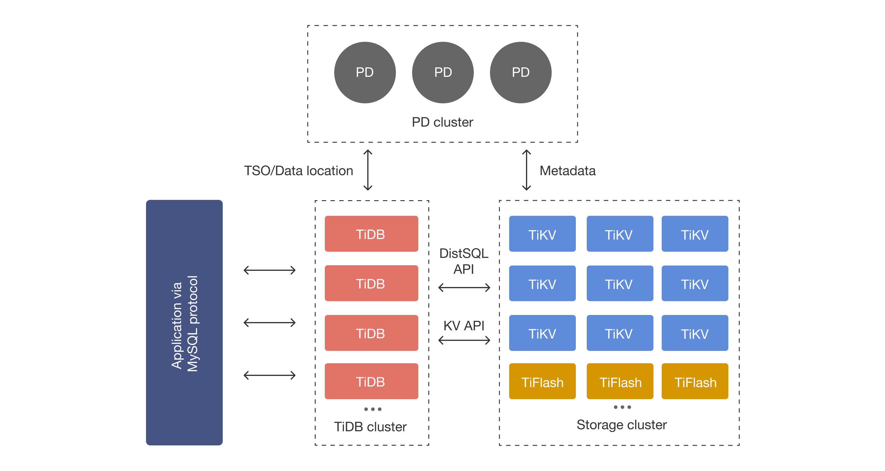

# TiDB

## 相关资料

[最小拓扑架构 | TiDB 文档中心](https://docs.pingcap.com/zh/tidb/stable/minimal-deployment-topology/)

[TiDB 整体架构 | TiDB 文档中心](https://docs.pingcap.com/zh/tidb/stable/tidb-architecture/)

[TiProxy 简介 | TiDB 文档中心](https://docs.pingcap.com/zh/tidb/stable/tiproxy-overview/)

[TiDB 数据库的存储 | TiDB 文档中心](https://docs.pingcap.com/zh/tidb/stable/tidb-storage/)

[TiDB 数据库的计算 | TiDB 文档中心](https://docs.pingcap.com/zh/tidb/stable/tidb-computing/)

[博客 - 三篇文章了解 TiDB 技术内幕 - 说计算 | TiDB 社区](https://pingkai.cn/tidbcommunity/blog/59bde89a)

[存储引擎 TiKV 简介 | TiDB 文档中心](https://docs.pingcap.com/zh/tidb/stable/tikv-overview/)

[TiDB 乐观事务模型 | TiDB 文档中心](https://docs.pingcap.com/zh/tidb/stable/optimistic-transaction/)

[TiDB 悲观事务模式 | TiDB 文档中心](https://docs.pingcap.com/zh/tidb/stable/pessimistic-transaction/)

[博客 - TiDB 悲观锁实现原理 | TiDB 社区](https://pingkai.cn/tidbcommunity/blog/7730ed79)

## TiDB 架构

 
TiProxy：

负载均衡组件。

 
TiDB Server：

接收客户端连接，执行 SQL 解析和优化，最终生成分布式执行计划。

 
PD(Placement Driver) Server：

TiDB 集群元信息管理模块，存储每个 TiKV 节点的数据分布情况，提供 DashBoard 管控界面，为分布式事务分配事务 ID。

 
TiKV Server(单机 KV 存储引擎 RocksDB)：

负责存储数据，提供事务的 Key-Value 存储引擎，存储数据的基本单位是 Region；TiKV 数据自动维护多副本（默认三副本），天然支持高可用和自动故障转移。

