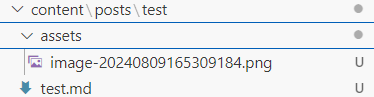

# Hugo使用学习

## Markdown 引用图片

先明确文件目录结构为



```
content/
├── posts/
│   ├── test/
│   │   ├── assets/
│   │   │    └── image.png
│   │   └── test.md
```

现在 test.md 中需要引用 image.png

正确语法为

```markdown

```

原先Typora使用的引用方式为

```markdown

```

省略了 `./`，且文件夹名为 `.asserts`，导致图片加载异常


## 文章分类

Hugo允许在内容文件中使用yaml、toml或json来添加前置格式

[前置格式 | Hugo官方文档](https://hugo.opendocs.io/content-management/front-matter/)

Markdown 文件，Front matter，使用 YAML 分类文章

```
---
# 文章所属的类别
categories: 
- test
---
```


## 草稿（xxx.md）

Markdown 文件，Front matter，使用 YAML 设置文章为草稿版本

```markdown
---
draft: true
---
```

>By default, Hugo does not publish draft pages when you build your site. To include draft pages when you build your site, use the `--buildDrafts` command line flag.
>
>以上内容来自<https://gohugo.io/methods/page/draft/>
