# Windows + Docker

## 参考链接

[Win11-Docker安装与IDEA集成 - 彼方杂记](https://qiuzhong.fun/archives/docker-tool#1.%E5%AE%89%E8%A3%85%E7%8E%AF%E5%A2%83)

[Windows 10 | Docker — 从入门到实践](https://yeasy.gitbook.io/docker_practice/install/windows)

[在 Windows 上安装 Docker Desktop_Docker中文网](https://docker.github.net.cn/desktop/install/windows-install/)

[安装 WSL | Microsoft Learn](https://learn.microsoft.com/zh-cn/windows/wsl/install?source=recommendations)

[如何使用windows版Docker并在IntelliJ IDEA使用Docker运行Spring Cloud项目 - 嘿123 - 博客园](https://www.cnblogs.com/hei12138/p/ideausedocker.html)

[Windows中使用Docker安装Redis_redis docker windows-CSDN博客](https://blog.csdn.net/qubernet/article/details/125575695)


## 环境


```
Windows 11 专业版
21 H2
```


## Docker 安装


### 开启 Hyper-V


[Win11-Docker安装与IDEA集成 - 彼方杂记](https://qiuzhong.fun/archives/docker-tool#3.2-%E6%9B%B4%E6%96%B0wsl)

控制面板——程序——启动或关闭Windows功能——Hyper-V

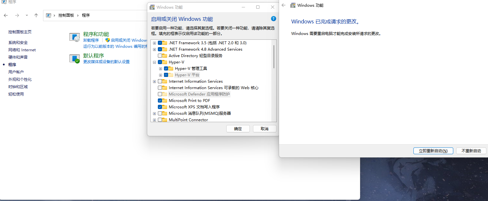

[喜大普奔！Hyper-V 和 VMWare 终于可以无缝共存、同时运行了！早期，Hyper-V 和 VMWare Wor - 掘金](https://juejin.cn/post/6854573210399145991)


### 更新WSL


[Win11-Docker安装与IDEA集成 - 彼方杂记](https://qiuzhong.fun/archives/docker-tool#3.2-%E6%9B%B4%E6%96%B0wsl)

想更新WSL，并设置 WSL 2 为默认版本

没更新成功

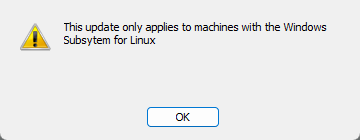

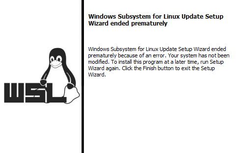

```shell
# 启动WSL
dism.exe /online /enable-feature /featurename:Microsoft-Windows-Subsystem-Linux /all /norestart
# 开启虚拟化
dism.exe /online /enable-feature /featurename:VirtualMachinePlatform /all /norestart
```

重启之后，可以了

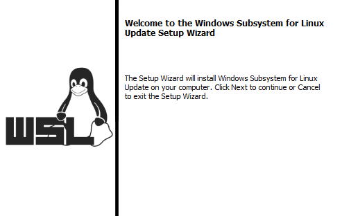

不过 貌似不需要运行 Update 程序，可以直接 cmd 设置

```shell
C:\Users\WIN11>wsl --set-default-version 2
有关与 WSL 2 的主要区别的信息，请访问 https://aka.ms/wsl2
操作成功完成。

C:\Users\WIN11>wsl --status
默认版本：2

适用于 Linux 的 Windows 子系统内核可以使用“wsl --update”手动更新，但由于你的系统设置，无法进行自动更新。
 若要接收自动内核更新，请启用 Windows 更新设置:“在更新 Windows 时接收其他 Microsoft 产品的更新”。
 有关详细信息，请访问https://aka.ms/wsl2kernel。

未找到 WSL 2 内核文件。若要更新或恢复内核，请运行“wsl --update”。
```


### 安装 WSL


另外，看到了另一篇文章提到了 Docker Desktop 貌似可以安装在 Hyper-V 或 WSL 

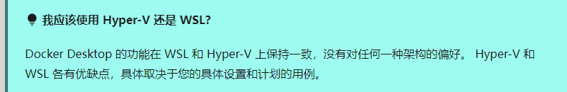

要不 还是选择 WSL？ 说不定 还能在需要时用用 Ubuntu？

[在 Windows 上安装 Docker Desktop_Docker中文网](https://docker.github.net.cn/desktop/install/windows-install/)

```
Docker Desktop是不是可以运行在Hyper-V或者WSL

是的，Docker Desktop可以在Hyper-V和WSL上运行。具体来说：

1. 在Hyper-V上运行
Docker Desktop能够利用Hyper-V来创建和管理Docker容器和镜像。Hyper-V提供了虚拟化的支持，使Docker可以在Windows上高效地运行。启用Hyper-V后，Docker Desktop会自动配置所需的虚拟机环境来运行Linux容器。

2. 在WSL 2上运行
Docker Desktop也支持WSL 2，这是推荐的运行模式。使用WSL 2时，Docker可以直接运行在Linux容器中，利用WSL 2的轻量级虚拟化。这种模式启动更快，资源占用更低，还允许在Windows和Linux环境之间更流畅地共享文件。

不过，使用 Docker Desktop 的 WSL 2 后端时，不同用户帐户之间无法直接共享容器和镜像。这是因为 WSL 2 使用的是每个用户帐户独立的 Linux 发行版环境

Anserer by ChatGPT
```

[安装 WSL | Microsoft Learn](https://learn.microsoft.com/zh-cn/windows/wsl/install)

cmd

```shell
C:\Users\WIN11>wsl --list --online
无法解析服务器的名称或地址

C:\Users\WIN11>wsl --list --verbose
适用于 Linux 的 Windows 子系统没有已安装的分发版。
可以通过访问 Microsoft Store 来安装分发版:
https://aka.ms/wslstore
```

通过 Microsoft Store 安装 Ubuntu with WSL

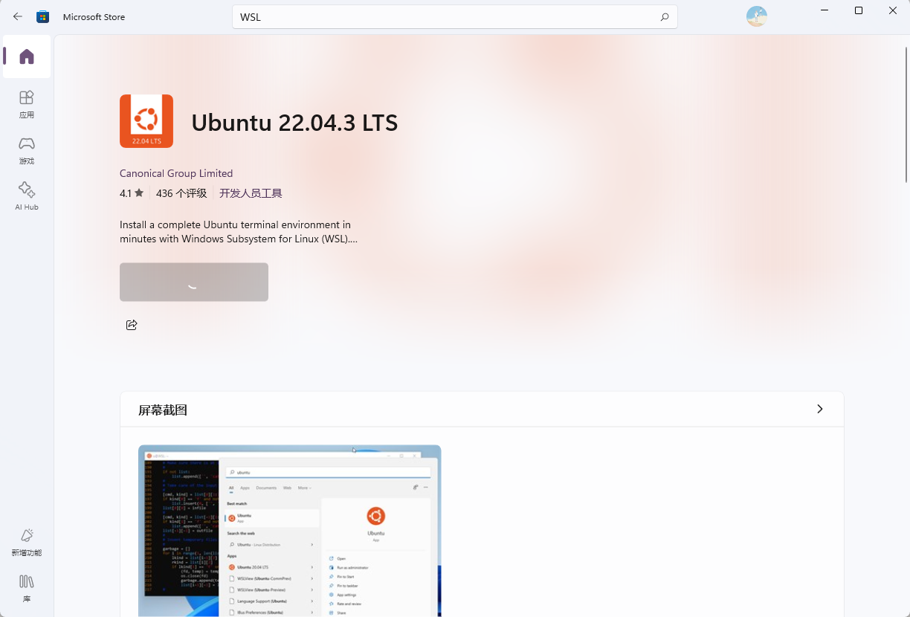

报错，在评论区找到了解决办法

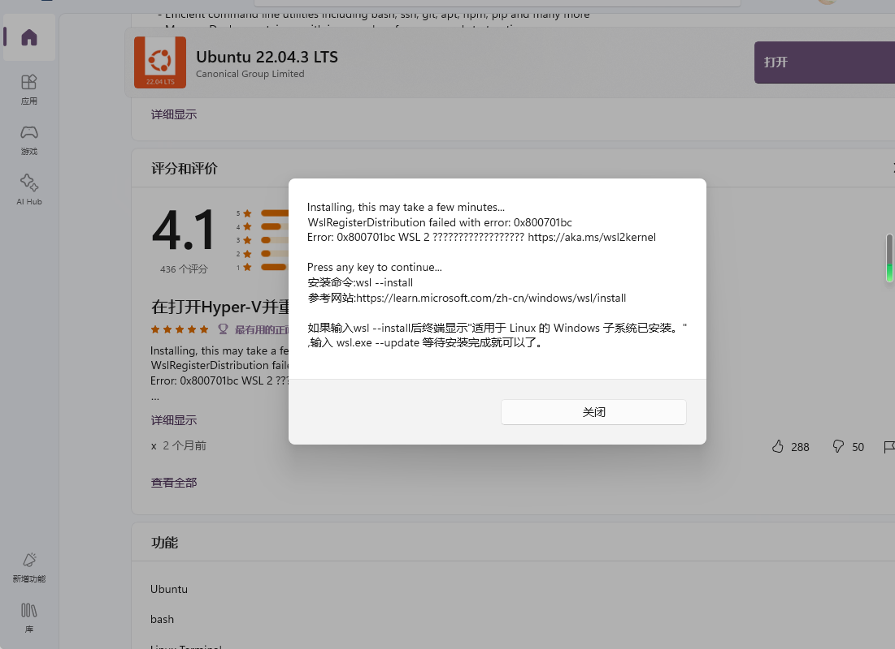

cmd

```shell
C:\Users\WIN11>wsl.exe --update
正在安装: 适用于 Linux 的 Windows 子系统
已安装 适用于 Linux 的 Windows 子系统。
```

还是报错

```shell
Installing, this may take a few minutes...
WslRegisterDistribution failed with error: 0x80370102
Please enable the Virtual Machine Platform Windows feature and ensure virtualization is enabled in the BIOS.
For information please visit https://aka.ms/enablevirtualization
Press any key to continue...
```

[BIOS启用虚拟化 - 搜索](https://cn.bing.com/search?q=BIOS%e5%90%af%e7%94%a8%e8%99%9a%e6%8b%9f%e5%8c%96&qs=HS&sc=10-0&cvid=CB9F925BB5E5436B8EFF494EAF782816&FORM=QBLH&sp=1&lq=0)

[如何在 BIOS 中启用虚拟化（VT-x 或 AMD-V） - 哔哩哔哩](https://www.bilibili.com/read/cv18299675/)

重启，狂按 F2 （不同机子可能不同），进入 BIOS，找到 Virtualization Technology改为 Enabled，按 F10 保存并退出

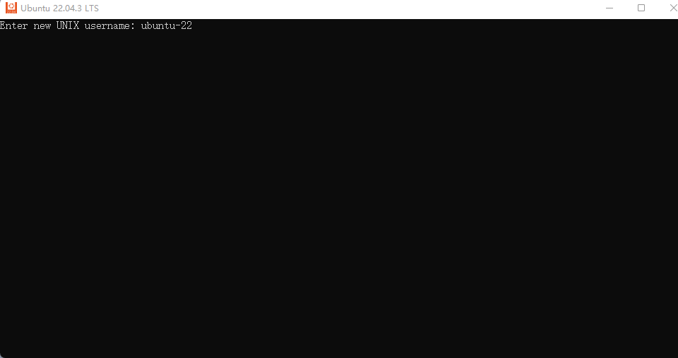

貌似可以了

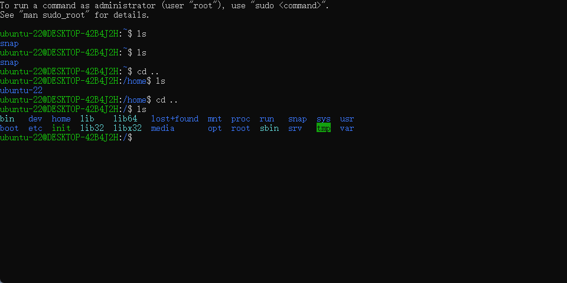

[windows WSL2避坑指南 - 菩提树下的杨过 - 博客园](https://www.cnblogs.com/yjmyzz/p/wsl2-tutorial-1.html)

关于 虚拟机 的安装位置

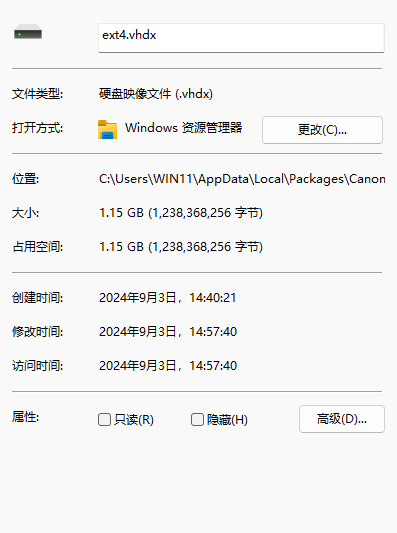

C盘空间好像有点吃紧了...

赶紧学习前辈进行迁移

[windows WSL2避坑指南 - 菩提树下的杨过 - 博客园](https://www.cnblogs.com/yjmyzz/p/wsl2-tutorial-1.html)

```shell
C:\Users\WIN11>wsl -l -v
  NAME            STATE           VERSION
* Ubuntu-22.04    Running         2

C:\Users\WIN11>wsl --shutdown

C:\Users\WIN11>wsl --export Ubuntu-22.04 I:\WSL\Ubuntu-22.04\Ubuntu-22.04.bak
正在导出，这可能需要几分钟时间。
操作成功完成。

C:\Users\WIN11>wsl --unregister Ubuntu-22.04
正在注销。
操作成功完成。

C:\Users\WIN11>wsl --import Ubuntu-22.04 I:\WSL\Ubuntu-22.04\ I:\WSL\Ubuntu-22.04\Ubuntu-22.04.bak --version 2
正在导入，这可能需要几分钟时间。
操作成功完成。

C:\Users\WIN11>
```

接下来 回到正轨...


### 安装 Docker Desktop


修改Docker默认安装位置

[Win11-Docker安装与IDEA集成 - 彼方杂记](https://qiuzhong.fun/archives/docker-tool#2.%E6%89%80%E9%9C%80%E8%BD%AF%E4%BB%B6)

```shell
C:\Users\WIN11>mklink /j "C:\Program Files\Docker" "G:\Software\Docker"
为 C:\Program Files\Docker <<===>> G:\Software\Docker 创建的联接
```


[Docker Desktop: The #1 Containerization Tool for Developers | Docker](https://www.docker.com/products/docker-desktop/)

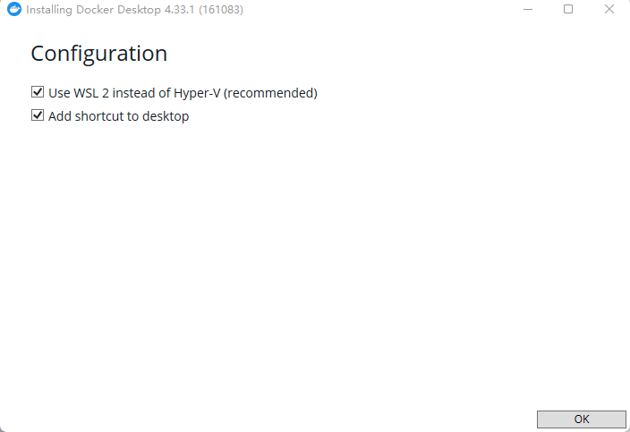


安装好后，重启电脑

不知道为什么Docker Desktop 显示 docker desktop engine stopped，甚至有时候是空白页

[【已解决】win10系统 Docker 提示Docker Engine stopped解决全过程记录-CSDN博客](https://blog.csdn.net/cplvfx/article/details/138033592)

[【 Docker Desktop stopped... 问题解决】_docker engine stopped-CSDN博客](https://blog.csdn.net/weixin_43895742/article/details/122915814)

重启 貌似没起作用，启动 服务 貌似也没起作用

卸载，重新选择版本试试

[Docker Desktop release notes | Docker Docs](https://docs.docker.com/desktop/release-notes/#4330)

终于可以了...

```
原本貌似选择的 4.34.0（2024-08-29）
后来 降到了 4.33.0（2024-07-25）
```


可能又不是版本的问题...

4.33.0 可以貌似是因为自己忘记将 C:\Program Files\Docke 目录通过软链接指向其他目录

当我卸载掉 C盘的Docker Desktop，软链接到其他目录貌似又不行了...

[如何将Docker（Windows桌面版)自定义安装目录_docker怎么更改安装路径-CSDN博客](https://blog.csdn.net/qq_41467216/article/details/130501349)

这次采用 管理员 身份 运行 Docker Desktop Installer

并且 采用 管理员 身份 运行 cmd，然后 软链接

还是不行...

最后试一次，换成 4.24.0 版本 2023-09-28

管理员身份 运行 Installer 和 cmd

重启，还是不行，在 服务 里面貌似还找不到 Docker Desktop，算了 不折腾了，老老实实装C盘吧，把时间花在主线任务上


不过可以改下镜像的存放位置

[Windows安装Docker、自定义安装目录_docker desktop安装其他盘-CSDN博客](https://blog.csdn.net/CUFEECR/article/details/134626579)

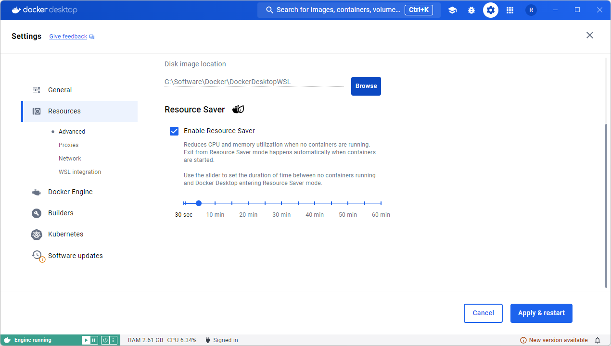


另外，有时间 或许可以试试 Chocolatey 安装 Docker？暂时先不折腾

[【零基础入门Docker】如何在 Windows 上使用 Chocolatey 安装 Docker-SDN博客](https://blog.csdn.net/arthas777/article/details/133738448)


Docker Desktop 设置

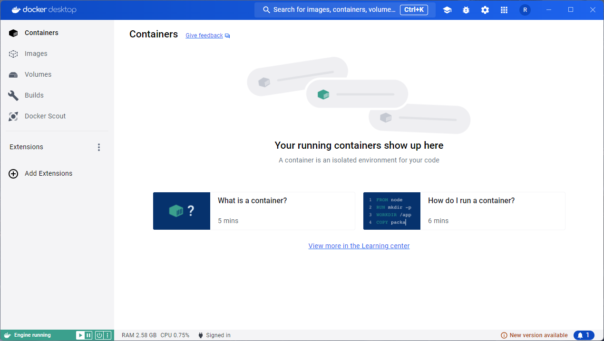

Setting 中 开放 2375 端口（本地连接，不需要加TLS加密）

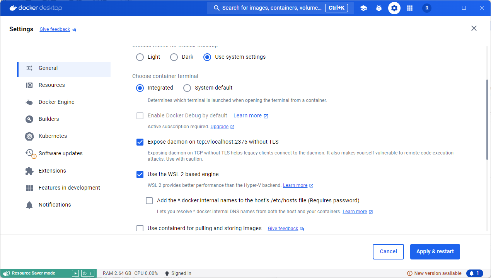

增加镜像

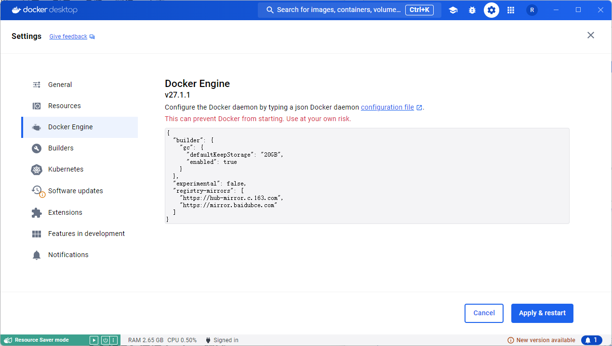

```
{
  "builder": {
    "gc": {
      "defaultKeepStorage": "20GB",
      "enabled": true
    }
  },
  "experimental": true,
  "registry-mirrors": [
    "https://hub-mirror.c.163.com",
    "https://mirror.baidubce.com"
  ]
}
```

[Win11-Docker安装与IDEA集成 - 彼方杂记](https://qiuzhong.fun/archives/docker-tool#idea%E9%9B%86%E6%88%90docker)

[镜像加速器 | Docker — 从入门到实践](https://yeasy.gitbook.io/docker_practice/install/mirror)


## 容器的操作学习


[启动 | Docker — 从入门到实践](https://yeasy.gitbook.io/docker_practice/container/run)

```shell
# 新建容器并启动，倘若本地没有镜像会自动去 配置的镜像仓库 / Docker Hub 拉取
docker run ubuntu:18.04 /bin/echo 'hello world'
# -t 分配伪终端(pseudo-tty)并绑定到容器的标准输入，-i 容器的标准输入保持打开
docker run -t -i ubuntu:18.04 /bin/bash

# 查看正在运行的容器
docker ps

# 查看所有容器（包括 status = exited）
docker ps -a

# 查看所有容器 container id（包括 status = exited）
docker ps -a -q

# 终止所有容器
docker stop $(docker ps -q)

# 启动已终止的容器
docker container start

# 删除所有容器，-a 选项表示列出所有容器（包括停止的容器），而 -q 则只输出容器的 ID
docker rm $(docker ps -aq)
```


## Docker 创建 Redis 容器


docker 拉取 镜像 redis

[Windows中使用Docker安装Redis_redis docker windows-CSDN博客](https://blog.csdn.net/qubernet/article/details/125575695)

[Windows版Docker安装Redis教程(保姆级)，适合开发环境快速提供Redis服务_windows docker 安装redis-CSDN博客](https://blog.csdn.net/BXD19931010/article/details/135065606)

```shell
docker pull redis
```


下载 redis.conf 配置文件 <http://download.redis.io/redis-stable/redis.conf>

修改配置文件

```conf
# 端口号
# Accept connections on the specified port, default is 6379 (IANA #815344).
# If port 0 is specified Redis will not listen on a TCP socket.
port 6379

# 连接密码
# The requirepass is not compatible with aclfile option and the ACL LOAD
# command, these will cause requirepass to be ignored.
#
requirepass 123456

# 持久化
# Note that changing this value in a config file of an existing database and
# restarting the server can lead to data loss. A conversion needs to be done
# by setting it via CONFIG command on a live server first.
#
# Please check https://redis.io/topics/persistence for more information.

appendonly yes

# You will also need to set a password unless you explicitly disable protected
# mode.
# ~~~~~~~~~~~~~~~~~~~~~~~~~~~~~~~~~~~~~~~~~~~~~~~~~~~~~~~~~~~~~~~~~~~~~~~~
# bind 127.0.0.1 -::1
bind 0.0.0.0
```

新建 G:\Software\Redis\docker-redis 以及 G:\Software\Redis\docker-redis\data 文件夹，用于挂载配置文件和存放数据持久化

构建 Redis 容器，并在后台运行容器

```shell
docker run -p 6379:6379 --name docker-redis-6379 -v G:\Software\Redis\docker-redis:/etc/redis/redis.conf -v G:\Software\Redis\docker-redis\data:/data -d redis redis-server /etc/redis/redis.conf --requirepass 123456 --appendonly yes
```

在宿主机 启动 Another Redis Desktop Manager

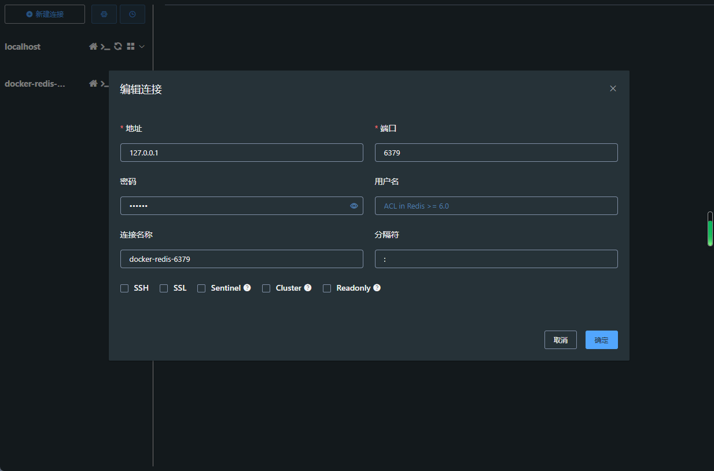

连接成功

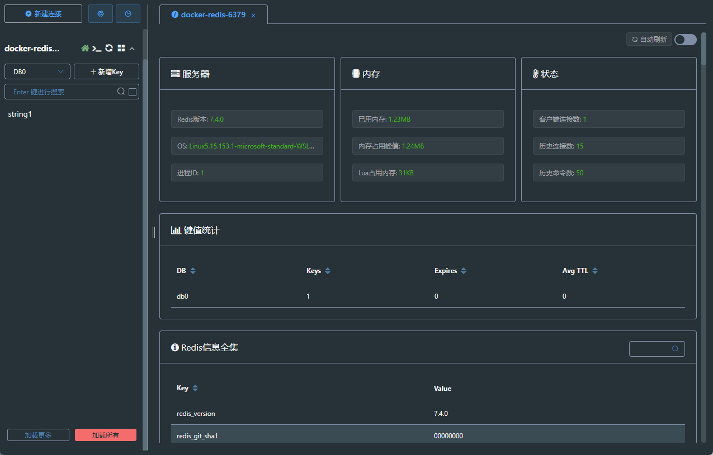

另外 可以在 cmd 使用 redis-cli

```shell
C:\Users\WIN11>docker exec -it docker-redis-6379 /bin/bash
root@1dadf0ec71b3:/data# redis-cli
127.0.0.1:6379> keys *
(error) NOAUTH Authentication required.
127.0.0.1:6379> exit
root@1dadf0ec71b3:/data# redis-cli -a your-password
Warning: Using a password with '-a' or '-u' option on the command line interface may not be safe.
127.0.0.1:6379> keys *
1) "string1"
```


## IDEA 连接 Docker，本地项目访问 Docker 中的 Redis


IDEA 插件安装

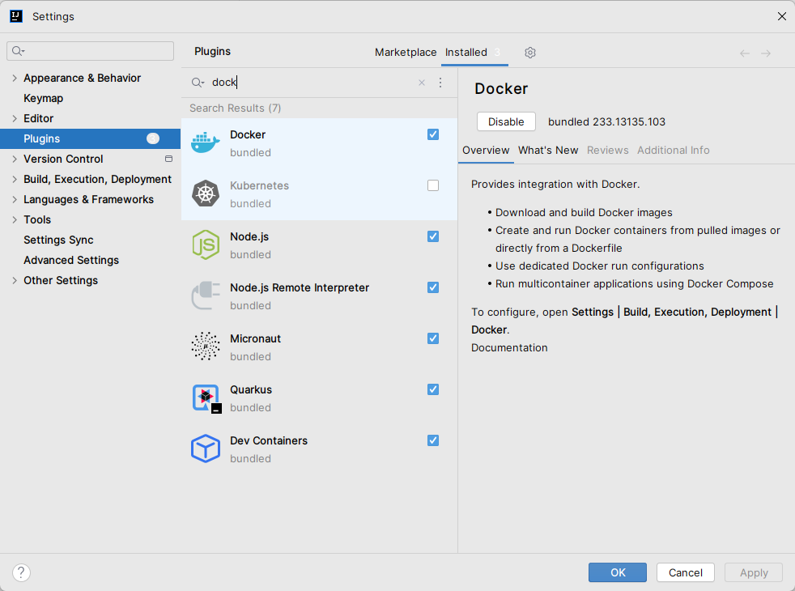

Setting

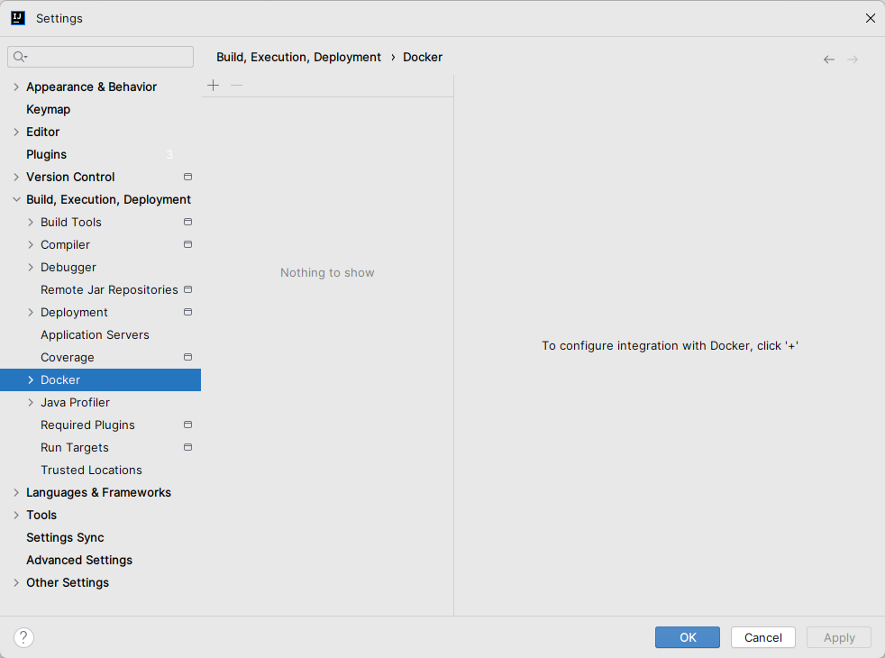

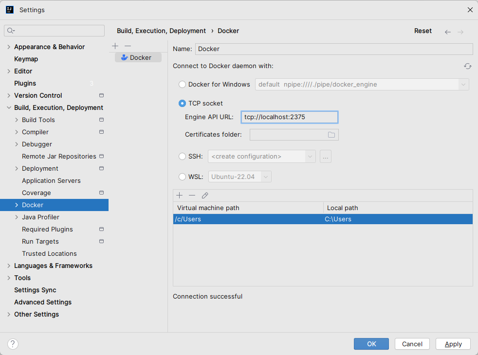

开始编码

[Win11-Docker安装与IDEA集成 - 彼方杂记](https://qiuzhong.fun/archives/docker-tool#4.%E8%BF%9E%E6%8E%A5%E5%AE%BF%E4%B8%BB%E6%9C%BAredis%E6%9C%8D%E5%8A%A1)

引入依赖

```xml
<dependency>
    <groupId>org.springframework.boot</groupId>
    <artifactId>spring-boot-starter-data-redis</artifactId>
</dependency>
```

application.properties

```properties
# 应用服务 WEB 访问端口
server.port=8080

spring.redis.host=127.0.0.1
spring.redis.port=6379
spring.redis.password=123456
spring.redis.timeout=5000
spring.redis.database=0

spring.redis.lettuce.pool.max-active=10
spring.redis.lettuce.pool.max-idle=5
spring.redis.lettuce.pool.min-idle=1
spring.redis.lettuce.pool.max-wait=2000ms
```

RedisConfiguration.java

```java
import org.springframework.context.annotation.Bean;
import org.springframework.context.annotation.Configuration;
import org.springframework.data.redis.connection.RedisConnectionFactory;
import org.springframework.data.redis.core.StringRedisTemplate;

@Configuration
public class RedisConfiguration {

    @Bean
    public StringRedisTemplate redisTemplate(RedisConnectionFactory redisConnectionFactory) {
        StringRedisTemplate stringRedisTemplate = new StringRedisTemplate();
        stringRedisTemplate.setConnectionFactory(redisConnectionFactory);
        return stringRedisTemplate;
    }
}

```

RedisController.java

```java
import org.springframework.beans.factory.annotation.Autowired;
import org.springframework.data.redis.core.StringRedisTemplate;
import org.springframework.web.bind.annotation.GetMapping;
import org.springframework.web.bind.annotation.RequestMapping;
import org.springframework.web.bind.annotation.RequestParam;
import org.springframework.web.bind.annotation.RestController;

@RestController
@RequestMapping("/docker/redis")
public class RedisController {

    @Autowired
    private StringRedisTemplate stringRedisTemplate;

    @GetMapping("/set")
    public String setRedisData(@RequestParam("value") String value) {
        String key = "redis_key";
        stringRedisTemplate.opsForValue().set(key, value);
        String result = stringRedisTemplate.opsForValue().get(key);
        return result;
    }
}
```

启动项目，访问 <http://127.0.0.1:8080/docker/redis/set?value=value2>

Another 客户端查看

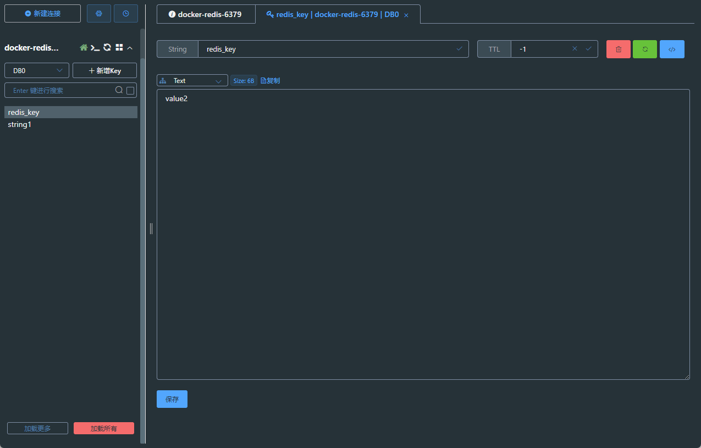


## 打包项目到本地 Docker


[Win11-Docker安装与IDEA集成 - 彼方杂记](https://qiuzhong.fun/archives/docker-tool#5.%E8%BF%9E%E6%8E%A5docker%E4%B8%ADredis%E6%9C%8D%E5%8A%A1)

[一键部署 Spring Boot 到远程 Docker 容器 | 二哥的Java进阶之路](https://javabetter.cn/springboot/docker.html#%E4%BD%BF%E7%94%A8-docker-%E9%83%A8%E7%BD%B2-spring-boot)

[使用Dockerfile为SpringBoot应用构建Docker镜像上次写过一篇使用Maven插件为SpringBoo - 掘金](https://juejin.cn/post/6844903871366561800#heading-14)


创建 Dockerfile 文件，位于项目根目录，即 "项目名 / Decokerfile"

[一键部署 Spring Boot 到远程 Docker 容器 | 二哥的Java进阶之路](https://javabetter.cn/springboot/docker.html#%E4%BD%BF%E7%94%A8-docker-%E9%83%A8%E7%BD%B2-spring-boot)

```dockerfile
# "蓝图"，定义如何构建镜像
FROM openjdk:8-jdk-alpine
ARG JAR_FILE=target/*.jar
COPY ${JAR_FILE} app.jar
ENTRYPOINT ["java","-jar","/app.jar"]
```

pom.xml 添加 Maven 制作 Docker 镜像的插件

[Win11-Docker安装与IDEA集成 - 彼方杂记](https://qiuzhong.fun/archives/docker-tool#idea%E9%9B%86%E6%88%90docker)

```xml
<build>
        <plugins>

            <plugin><!--制作docker镜像的maven插件-->
                <groupId>com.spotify</groupId>
                <artifactId>docker-maven-plugin</artifactId>
                <version>1.2.2</version>
                <executions>
                    <execution>
                        <id>build-image</id>
                        <phase>package</phase>
                        <goals>
                            <goal>build</goal>
                        </goals>
                    </execution>
                </executions>
                <configuration>
                    <imageName>${project.artifactId}</imageName><!--镜像名,注意:这里的镜像名一定要小写，如果你的应用名字是大写会报错的-->
                    <imageTags>
                        <imageTag>latest</imageTag>
                    </imageTags>
                    <dockerDirectory>${project.basedir}</dockerDirectory><!--Dockerfile所在的目录-->
                    <dockerHost>http://127.0.0.1:2375</dockerHost><!--docker所在的宿主机地址,或者填写http://yourip:2375-->
                    <resources>
                        <resource><!--这里配置的就是打包后jar所在的位置-->
                            <targetPath>/</targetPath>
                            <directory>${project.build.directory}</directory><!--构建的class文件路径 一般是target-->
                            <include>${project.build.finalName}.jar</include>
                        </resource>
                    </resources>
                </configuration>
            </plugin>


        </plugins>
    </build>
```

Maven 打包（注：我这里的配置是有问题的，部署到Docker的SpringBoot项目是访问不到Docker中的Redis容器的，解决办法在后续指出）

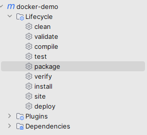

创建并运行 Docker 中 SpringBoot 项目镜像的 容器

```shell
docker run -d --name <容器名> -p 8080:8080 <镜像名:tag>
```

报错，启动失败

```
G:\Java\Project\docker-demo\target\docker-demo-0.0.1-SNAPSHOT.jar中没有主清单属性
```

Maven 打包插件错误？

[SpringBoot程序打包失败（.jar中没有主清单属性）处理我的SpringBoot模板是基于aliyun镜像创建的 - 掘金](https://juejin.cn/post/7249288803532914749)

```xml
<build>
        <plugins>

            <plugin>
                <groupId>org.apache.maven.plugins</groupId>
                <artifactId>maven-compiler-plugin</artifactId>
                <version>3.8.1</version>
                <configuration>
                    <source>1.8</source>
                    <target>1.8</target>
                    <encoding>UTF-8</encoding>
                </configuration>
            </plugin>
            <plugin>
                <groupId>org.springframework.boot</groupId>
                <artifactId>spring-boot-maven-plugin</artifactId>
                <version>${spring-boot.version}</version>
                <!-- 把这里给删除就可以打包成功 -->
                <!--<configuration>
                    <mainClass>com.sun.SSMPApplication</mainClass>
                    <skip>true</skip>
                </configuration>-->
                <executions>
                    <execution>
                        <id>repackage</id>
                        <goals>
                            <goal>repackage</goal>
                        </goals>
                    </execution>
                </executions>
            </plugin>

            <plugin><!--制作docker镜像的maven插件-->
                <groupId>com.spotify</groupId>
                <artifactId>docker-maven-plugin</artifactId>
                <version>1.2.2</version>
                <executions>
                    <execution>
                        <id>build-image</id>
                        <phase>package</phase>
                        <goals>
                            <goal>build</goal>
                        </goals>
                    </execution>
                </executions>
                <configuration>
                    <imageName>${project.artifactId}</imageName><!--镜像名,注意:这里的镜像名一定要小写，如果你的应用名字是大写会报错的-->
                    <imageTags>
                        <imageTag>latest</imageTag>
                    </imageTags>
                    <dockerDirectory>${project.basedir}</dockerDirectory><!--Dockerfile所在的目录-->
                    <dockerHost>http://127.0.0.1:2375</dockerHost><!--docker所在的宿主机地址,或者填写http://yourip:2375-->
                    <resources>
                        <resource><!--这里配置的就是打包后jar所在的位置-->
                            <targetPath>/</targetPath>
                            <directory>${project.build.directory}</directory><!--构建的class文件路径 一般是target-->
                            <include>${project.build.finalName}.jar</include>
                        </resource>
                    </resources>
                </configuration>
            </plugin>


        </plugins>
    </build>
```

重新 clean 并且 package

创建并运行 Docker 中 SpringBoot 项目镜像的 容器

测试访问 http://127.0.0.1:8080/docker/redis/set?value=value2

报错，Docker 中的 SpringBoot 项目容器 无法访问 Docker 中已运行的 Redis 容器

```
Servlet.service() for servlet [dispatcherServlet] in context with path [] threw exception [Request processing failed; nested exception is org.springframework.data.redis.RedisConnectionFailureException: Unable to connect to Redis; nested exception is io.lettuce.core.RedisConnectionException: Unable to connect to 127.0.0.1:6379] with root cause
```


重新修改配置

application.properties

```properties
spring.redis.host=${SPRING_REDIS_HOST:redis}
spring.redis.port=${SPRING_REDIS_PORT:6379}
spring.redis.password=123456
spring.redis.timeout=5000
spring.redis.database=0
```

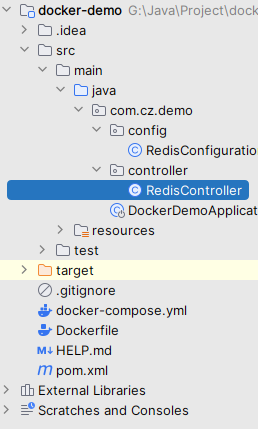

创建 docker-compose.yml 文件

```yml
# 引用dockerfile"蓝图"创建镜像
# docker-compose up -d 创建并启动容器
version: '3'
services:
  # 这是又创建了一个 Redis 容器，不是沿用之前 Docker 中已创建的Redis容器
  redis:
    image: redis
    container_name: myredis
    ports:
      - "6379:6379"
  springboot-app:
    #build: .
    image: docker-demo
    container_name: docker-demo
    ports:
      - "8080:8080"
    depends_on:
      - redis
    environment:
      - SPRING_REDIS_HOST=myredis
      - SPRING_REDIS_PORT=6379
```

右上角 

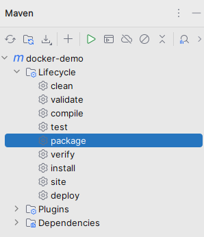

clean 以及 package

Docker Desktop中已经有镜像了


IDEA 左下角 Terminal，运行 docker-compose.yml 文件

```shell
docker-compose up -d
```

```shell
PS G:\Java\Project\docker-demo> docker-compose up -d
time="2024-09-04T17:22:48+08:00" level=warning msg="G:\\Java\\Project\\docker-demo\\docker-compose.yml: the attribute `version` is obsolete, it will be ignored, please remove it to avoid potential confusion"
[+] Running 3/3
 ✔ Network docker-demo_default  Created                                                                                                                                                              0.3s 
 ✔ Container myredis            Started                                                                                                                                                              4.1s 
 ✔ Container docker-demo        Started 
```

Docker Desktop 查看运行的容器，docker-demo 包括了 Redis 和 SpringBoot 项目容器

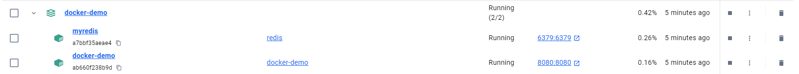

通过 发起 Http 请求来尝试更改 Redis 中的 Value

```java
@RestController
@RequestMapping("/docker/redis")
public class RedisController {

    @Autowired
    private StringRedisTemplate stringRedisTemplate;

    @GetMapping("/set")
    public String setRedisData(@RequestParam("value") String value) {
        String key = "redis_key";
        stringRedisTemplate.opsForValue().set(key, value);
        String result = stringRedisTemplate.opsForValue().get(key);
        return result;
    }
}
```

访问测试 <http://127.0.0.1:8080/docker/redis/set?value=value2>


## 使用已存在的 Redis 容器


创建自定义网络

```shell
docker network create <network-name>
```

```shell
PS G:\Java\Project\docker-demo> docker network create net-test
3a32dd9a38738d46a721e1e66d6ce8df7aef197413e0495b0a086e03d3fccd05

PS G:\Java\Project\docker-demo> docker network create ls      
11651994a3b0058b4c7bc3f93401f9435ea4a6b1966ed8dc430bcf0366bd6f0c
```

创建并运行 Redis 容器 docker-redis-6379，并连接到 自定义网络

```shell
docker run -p 6379:6379 --name docker-redis-6379 --network net-test -v G:\Software\Redis\docker-redis:/etc/redis/redis.conf -v G:\Software\Redis\docker-redis\data:/data -d redis redis-server /etc/redis/redis.conf --requirepass 123456 --appendonly yes
```

SpringBoot项目 连接到自定义网络，并使用 已运行 的 Redis 容器

application.properties

```properties
# #自定义 Redis 容器名
spring.redis.host=docker-redis-6379
spring.redis.port=6379
spring.redis.password=123456
spring.redis.timeout=5000
spring.redis.database=0
```

docker-compose.yml

```yml
# 引用dockerfile"蓝图"创建镜像
# docker-compose up -d 创建并启动容器
version: '3'
services:
  springboot-app:
    image: docker-demo
    container_name: docker-demo
    ports:
      - "8080:8080"
    environment:
      - SPRING_REDIS_HOST=docker-redis-6379
    networks:
      - net-test

networks:
  net-test:
    external: true
```

Maven 打包，并制作 Docker 镜像

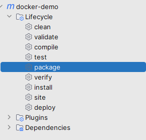

IDEA 左下角 Terminal

```shell
docker-compose up -d 
```

查看运行中的容器

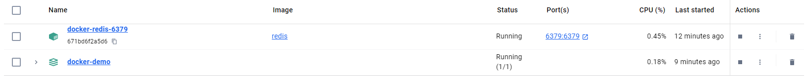

测试 <http://127.0.0.1:8080/docker/redis/set?value=value2>


## 补充

采用 cmd 安装 docker desktop 并更改安装路径（docker desktop 版本 4.34.0）

```shell
start /w "" "Docker Desktop Installer.exe" install --installation-dir="G:\Software\Docker"
```


```shell
I:\Chome下载>start /w "" "Docker Desktop Installer.exe" install --installation-dir="G:\Software\Docker"
-------------------------------------------------------------------------------->8
Version: 4.34.0 (165256)
Sha1:
Started on: 2024/09/05 04:40:24.017
Resources: I:\Chome下载\resources
OS: Windows 10 Pro
Edition: Professional
Id: 2009
Build: 22000
BuildLabName: 22000.1.amd64fre.co_release.210604-1628
File: C:\ProgramData\DockerDesktop\install-log-admin.txt
CommandLine: "Docker Desktop Installer.exe"  install --installation-dir="G:\Software\Docker"
You can send feedback, including this log file, at https://github.com/docker/for-win/issues
[2024-09-05T04:40:24.290910200Z][ManifestAndExistingInstallationLoader][I] Install path is G:\Software\Docker. Loading manifest first
[2024-09-05T04:40:24.302904100Z][ManifestAndExistingInstallationLoader][I] No manifest found, returning no existing install
[2024-09-05T04:40:24.303902000Z][Installer][I] No installation found
[2024-09-05T04:40:24.459662700Z][InstallWorkflow][I] Using package: res:DockerDesktop
[2024-09-05T04:40:24.460673400Z][InstallWorkflow][I] Downloading
[2024-09-05T04:40:32.686646800Z][InstallWorkflow][I] Extracting manifest
[2024-09-05T04:40:34.104018000Z][InstallWorkflow][I] Manifest found: version=165256, displayVersion=4.34.0, channelUrl=https://desktop-stage.docker.com/win/main/amd64/appcast.xml
[2024-09-05T04:40:34.104018000Z][InstallWorkflow][I] Checking prerequisites
[2024-09-05T04:40:34.866760700Z][InstallWorkflow][I] Prompting for optional features
[2024-09-05T04:40:56.912993800Z][InstallWorkflow][I] Selected backend mode: wsl-2
[2024-09-05T04:40:56.913980300Z][InstallWorkflow][I] Unpacking artifacts
[2024-09-05T04:43:21.474132900Z][InstallWorkflow][I] Deploying component Docker.Installer.CreateGroupAction
[2024-09-05T04:43:42.013055100Z][InstallWorkflow][I] Deploying component Docker.Installer.AddToGroupAction
[2024-09-05T04:43:53.414082600Z][InstallWorkflow][I] Deploying component Docker.Installer.EnableFeaturesAction
[2024-09-05T04:43:53.598753700Z][InstallWorkflow-EnableFeaturesAction][I] Required features: VirtualMachinePlatform, Microsoft-Windows-Subsystem-Linux
[2024-09-05T04:43:55.135748600Z][InstallWorkflow][I] Deploying component Docker.Installer.ServiceAction
[2024-09-05T04:43:55.138749100Z][InstallWorkflow-ServiceAction][I] Removing service
[2024-09-05T04:43:55.143769000Z][InstallWorkflow-ServiceAction][I] Creating service
[2024-09-05T04:43:55.320761000Z][InstallWorkflow][I] Deploying component Docker.Installer.ShortcutAction
[2024-09-05T04:43:55.372750000Z][InstallWorkflow-ShortcutAction][I] Creating shortcut: C:\ProgramData\Microsoft\Windows\Start Menu\Docker Desktop.lnk/Docker Desktop
[2024-09-05T04:43:55.443748900Z][InstallWorkflow][I] Deploying component Docker.Installer.ShortcutAction
[2024-09-05T04:43:55.446751400Z][InstallWorkflow-ShortcutAction][I] Creating shortcut: C:\Users\WIN11\Desktop\Docker Desktop.lnk/Docker Desktop
[2024-09-05T04:43:55.650462800Z][InstallWorkflow][I] Deploying component Docker.Installer.AutoStartAction
[2024-09-05T04:43:55.880461900Z][InstallWorkflow][I] Deploying component Docker.Installer.PathAction
[2024-09-05T04:43:57.236321800Z][InstallWorkflow][I] Deploying component Docker.Installer.ExecAction
[2024-09-05T04:43:57.243325000Z][InstallWorkflow-ExecAction][I] Running: G:\Software\Docker\InstallerCli.exe -i with timeout=-1
[2024-09-05T04:44:00.249391900Z][InstallWorkflow][I] Registering product
[2024-09-05T04:44:01.062078100Z][InstallWorkflow][I] Deleting C:\ProgramData\DockerDesktop\install-settings.json
[2024-09-05T04:44:01.064036100Z][InstallWorkflow][I] Installation succeeded
```

安装好后，并不会报  docker desktop engine stopped

但是，修改image文件夹出错

```
failed to move WSL disk: creating directory to move file: mkdir G:\Software\Docker\DockerImage\DockerDesktopWSL: Access is denied.
更改image位置时报错
```


修改文件夹权限

```
1. 右击父文件夹，选择"属性"
2. 切换到"安全"选项卡
3. 点击"编辑"
4. 选择你的用户账户，点击"编辑"
5. 勾选"完全控制"的"允许"框
6. 点击"应用"和"确定"
```

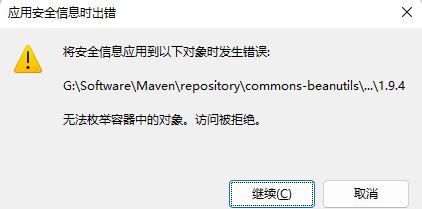

另外，在 G:\Software\Docker\DockerImage 文件夹下新建文件夹好像也要申请权限？

不知道是不是自己电脑原因，发现没安装在C盘好多权限的问题...

倒腾了下也不知道是为什么，看到了 Windows 用户组有个 docker-user，我的账户已经加入其中

由于不是很清楚 Windows 的用户权限控制，暂时打算重新装回C盘...
