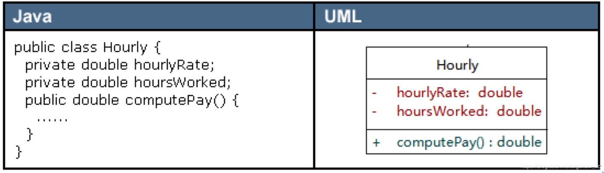

# 参考链接

+ [一文掌握14种UML图-腾讯云开发者社区-腾讯云](https://cloud.tencent.com/developer/article/1684161)
+ [看懂UML类图和时序图 — Graphic Design Patterns](https://design-patterns.readthedocs.io/zh-cn/latest/read_uml.html)
+ [什么是统一建模语言（UML）？](https://www.visual-paradigm.com/cn/guide/uml-unified-modeling-language/what-is-uml/#timing-diagram)
+ [类图 - 维基百科，自由的百科全书](https://zh.wikipedia.org/wiki/%E9%A1%9E%E5%88%A5%E5%9C%96)
+ [Mermaid之类图(classDiagram) | PasseRR's Blog](https://www.xiehai.zone/2021-12-11-mermaid-class-diagram.html#%E8%AE%BF%E9%97%AE%E4%BF%AE%E9%A5%B0%E7%AC%A6)
+ [30分钟学会UML类图 - 知乎](https://zhuanlan.zhihu.com/p/109655171)
+ [Class diagrams | Mermaid](https://mermaid.js.org/syntax/classDiagram.html) / [类图 | Mermaid 中文网](https://mermaid.nodejs.cn/syntax/classDiagram.html)
+ [小书匠语法说明之mermaid | 小书匠](https://soft.xiaoshujiang.com/docs/grammar/feature/mermaid/)

# UML
🔅统一建模语言（Unified Model Language，UML），由一整套图表组成的标准化建模语言。

🔅UML 图大致可分为：结构性图 和 行为性图。

🔅结构性图 显示了系统在不同抽象层次和实现层次上的静态结构以及它们之间的相互关系。结构性图可分为七种类型：

+ 类图（Class Diagram）
+ 组件图（Component Diagrm）
+ 部署图（Deployment Diagram）
+ 对象图（Object Diagram）
+ 包图（Package Diagram）
+ 复合结构图（Composite Structure Diagram）
+ 轮廓图（Profile Diagram）

🔅行为性图 显示了系统中对象的动态行为，可用以表达系统随时间的变化。行为性图 可分为七种类型：

+ 用例图（Use Case Diagram）
+ 活动图（Activity Diagram）
+ 状态机图（State Machine Diagram）
+ 序列图（Sequence Diagram）
+ 交互概述图（Interaction Overview Diagram）
+ 时序图（Timing Diagram）

# 类图
✨访问修饰符的表示

`+`: public

`-`: private

`#`: protected

`~`: package / default

`$`: static 

✨具体类、抽象类、接口 的表示

1、类（成员变量及类型、方法的参数及返回类型）

2、接口（抽象类为`<<abstract>>`）

✨线条与箭头总览：

✨泛化（Generalization） / 继承（Inheritance）

✨实现（Realization / Implementation）

个人的理解记忆：实现有“实”字却比较“虚”（三角形为空心），而继承是“实实在在”的（三角形为实心）。

✨聚合（Aggregation）

1、代码体现：成员变量。

2、聚合关系，整体和部分不是强依赖，即使整体不存在了，部分仍可以存在，弱包含，"... owns a ..."。

✨组合（Composition）

1、组合关系：一种强依赖的特殊聚合关系，如果整体不存在了，则部分也不存在了，强包含，"... is a part of ..."。

2、代码体现：成员变量。

3、个人理解性记忆：组合关系比较“实”（菱形为实心），整体不存在则部分也不存在了；而聚合关系整体与部分就比较“虚”了（菱形为实心），整体不存在，部分仍可存在。

✨依赖（Denpendency）

1、依赖：类 A 使用到了类 B，"... uses a ..."，被依赖对象只作为一种工具，依赖者 并不持有被依赖对象引用，使用关系具有偶然性、临时性、非常弱。

2、代码体现：函数参数。

✨关联（Association）

1、关联：两个类之间 / 类与接口之间一种强依赖关系，是一种长期的稳定关系，"... has a..."。

2、代码体现：`People`拥有`Car`成员变量。

（图片中线存在箭头，可能去掉箭头更合适）

✨具体的使用示例：[看懂UML类图和时序图 — Graphic Design Patterns](https://design-patterns.readthedocs.io/zh-cn/latest/read_uml.html)

# 时序图
[UML建模之时序图（Sequence Diagram） - 灵动生活 - 博客园](https://www.cnblogs.com/ywqu/archive/2009/12/22/1629426.html)

