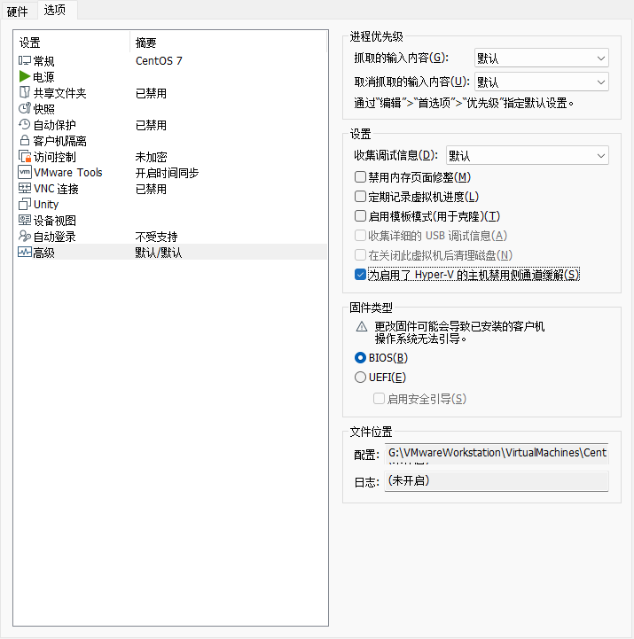

# Linux系统封装GDS、NFS over RDMA协议，底层使用ZFS管理多个SSD

### 概念初探

---

- **NFS**：网络文件系统（Network File System），一种分布式文件系统，力求客户端主机可以访问服务器端文件，并且其过程与访问本地存储时一样；NFS是基于UDP/IP协议的应用，其实现主要是采用远程过程调用RPC机制
- **RPC**：远程过程调用（Remote Procedure Call），该协议允许运行于一台计算机的程序调用另一个地址空间（通常为一个开放网络的一台计算机）的子程序，而程序员就像调用本地程序一样，无需额外地为这个交互作用编程（无需关注细节）
- **RDMA**：远程直接内存访问（Remote Direct Memory Access），它允许客户端系统将数据从存储服务器的内存直接复制到该客户端自己的内存中
- **NFS over RDMA：**依赖于RDMA技术实现NFS客户端与存储之间的数据直通，相比TCP传输，可以有效降低网络时延，减少客户端和服务端的CPU负载，提升NFS协议访问性能。
- **RoCE**（RDMA over Converged Ethernet）：一种网络技术，允许在以太网上实现远程直接内存访问（RDMA）。RoCE通过提供一种高效的方式来直接从一个服务器的内存传输数据到另一个服务器的内存，**从而绕过传统的网络协议栈**，减少了延迟，降低了CPU的使用率，并提高了数据传输的速度。

- [https://blog.csdn.net/CapejasmineY/article/details/99730297](https://blog.csdn.net/CapejasmineY/article/details/99730297)
- NFS（Network File System，网络文件系统）：允许网络中的计算机通过TCP/IP网络共享资源；本地NFS客户端可以像访问本地文件一样读写位于远程NFS服务器上的文件
- NFS端口：2049+其他随机端口（小于1024，通过RPC告诉客户端）
- RPC（Remote Procedure Call，远程过程调用）--portmap/rpcbind服务，回报客户端NFS功能所对应的port number
- 包安装：nfs-utils（NFS主程序），rpcbind（RPC主程序）
- 服务器挂载：
   - 配置文件：/etc/exports，内容：共享目录+*（主机地址）+（权限）
   - exportfs（管理NFS共享目录命令） -v/-a/-r/-o
   - exportfs -o rw（权限）,fsid=1（文件系统ID）,root_squash（客户端-匿名用户）,no_subtree_check（禁用子目录检查） 192.168.1.100:/shared
- 客户端
   - 挂载：mount 192.168.1.105：/data /mnt
   - 注意文件权限，以及uid/gid
- Linux学习
   - list -l ：权限  引用计数  所有者  所属组  大小  文件修改时间  文件名
   - rwx权限：-rw-所有者  r--所属组  r--其他人
   - （0：无权限，1-x-执行，2-w-执行，4-r-读）
   - chmod：修改文件/目录权限，chmod u=rwx，go，=（设定） -（删除） +（加入）
   - 环境变量：定义系统运行环境的一些参数（每个用户不同的家目录
      - PATH：定义命令行解释器搜索用户执行命令的路径（which：查找命令所在绝对路径
      - export：修改环境变量；/etc/environment：全局环境变量

### 处理思路

---

- 大致思路：
   - 虚拟机
   - centos（宿主）
   - 内核裁剪
   - 启用NFS/RDMA/GDS/ZFS
   - 编译
   - +bash/gcc
   - 添加boot等文件
   - 复制镜像

### 虚拟机 以及 CentOS 的安装

---

**参考链接**

https://www.ssymon.com/archives/vmware-install-centos7

[https://blog.csdn.net/qq_42582489/article/details/104429908](https://blog.csdn.net/qq_42582489/article/details/104429908)

[https://blog.csdn.net/u010308917/article/details/125157774](https://blog.csdn.net/u010308917/article/details/125157774)

[https://blog.csdn.net/hjp2020/article/details/106156642](https://blog.csdn.net/hjp2020/article/details/106156642)

VMware Workstation Pro的安装

更改安装位置

CentOS-7.9.2009 阿里云镜像

https://mirrors.aliyun.com/centos/7.9.2009/isos/x86_64/?spm=a2c6h.25603864.0.0.6286f5adZsDvV2

使用NAT网络

CentOS的安装，语言的选择

设置时区

磁盘分区

设置密码

查看NAT设置和DHCP设置

虚拟网关IP

子网掩码，起始和结束IP，静态IP从区间中选择一个

设置VMnet8

查看虚拟机网卡信息：ip add

cat /etc/sysconfig/network-scripts/ifcfg-ens33

vim /etc/sysconfig/network-scripts/ifcfg-ens33

设置静态IP

service network restart

ping 一下自己

宿主机测试

虚拟机网络测试

ping ww.baidu.com

SSH客户端远程连接

> shift+pageup 翻页

### Linux内核下载

---

> 参考链接：
> [https://zhou-yuxin.github.io/articles/2015/%E4%BB%8E%E9%9B%B6%E5%BC%80%E5%A7%8B%E6%9E%84%E5%BB%BAlinux%EF%BC%88%E4%B8%80%EF%BC%89%E2%80%94%E2%80%94%E7%BC%96%E8%AF%91linux%E5%86%85%E6%A0%B8/index.html](https://zhou-yuxin.github.io/articles/2015/%E4%BB%8E%E9%9B%B6%E5%BC%80%E5%A7%8B%E6%9E%84%E5%BB%BAlinux%EF%BC%88%E4%B8%80%EF%BC%89%E2%80%94%E2%80%94%E7%BC%96%E8%AF%91linux%E5%86%85%E6%A0%B8/index.html)

1. cd ~
2. wget http://www.kernel.org/pub/linux/kernel/
3. yum install xz
4. tar xvf linux-x.x.tar.xz 
5. yum install gcc
6. yum install ncurses-devel

### 内核裁切

---

1. make i386_defconfig
> - 生成一个适用于 32 位 x86 架构（i386）的默认配置文件
> - 通过先使用 make i386_defconfig 命令，你可以快速获取一组通用的配置选项，省去了手动设置每个选项的麻烦。这对于那些不太熟悉内核配置的人来说，提供了一个简单的起点

2. 
3. yum install flex
4. 
5.  yum install bison
6. make menuconfig
> - 执行 make menuconfig 进入内核配置菜单界面。
> - 按下 "/" 键打开**搜索框**。
> - 使用方向键（上下键）浏览搜索结果。可以继续按 "/" 键寻找下一个匹配项。

> **搜索结果：**
> //配置选项的名称
> Symbol: INFINIBAND [=n]
> //配置选项的类型，表示可以选择三种状态：启用、禁用、或作为模块编译，  [ ]（禁用）、[*]（启用）或 [M]（编译为模块）
> Type  : tristate
> //配置选项在内核源代码中的位置
> Defined at drivers/infiniband/Kconfig:2         
> //该选项的功能或意义
> Prompt: InfiniBand support   
> //该配置选项所依赖的其他选项。这些依赖项必须处于特定状态才能启用或选择该选项，否则该选项将不可用
> Depends on: HAS_IOMEM [=y] && HAS_DMA [=y] && NET [=y] && INET [=y] && (m && MODULES [=y] || IPV6 [=y
> //选项在配置菜单中的位置
> Location: 
> (1) -> Device Drivers
> //选择该选项时会引起的其他配置选项的改变
> Selects: IRQ_POLL [=n] && DIMLIB [=n]   

7. File systems ---> Network File Systems ---> NFS 
8. Device Drivers ---> InfiniBand support
9. Device Drivers ---> NVME Support

