# RabbitMQ


## 参考链接

[沉默王二](https://www.javabetter.cn/mq/rabbitmq-rumen.html)

[稀土掘金-Jlo_](https://juejin.cn/post/7071589818886520869#heading-17)

[分类 - 07_RabbitMQ - 姜源の云笔记](https://janycode.github.io/categories/08-%E6%A1%86%E6%9E%B6%E6%8A%80%E6%9C%AF/07-RabbitMQ/)

[RabbitMQ Tutorials | RabbitMQ](https://www.rabbitmq.com/tutorials)

[RabbitMQ六种工作模式详解_rabbitmq工作模式-CSDN博客](https://blog.csdn.net/qq_44760609/article/details/125084962)


## AMQP

信息传递链中，传递消息为上游，接收消息为下游

消息队列（Message Queue，MQ），队列，消息 先进先出

高级消息队列协议（Advanced Message Queue Protocol，AMQP）

* 一种开放的消息中间件协议，用于在分布式系统之间进行消息的发送和接收。它定义了消息的格式、路由和传输机制，旨在实现不同系统之间的互操作性（Answer by ChatGPT）
* RabbitMQ 是一个基于 AMQP 的消息代理（消息中间件），它实现了 AMQP 协议，并提供了一系列相应的功能和特性（Answer by ChatGPT）
* [AMQP 0-9-1 Model Explained | RabbitMQ ~ AMQP 0-9-1 模型解释 | RabbitMQ](https://www.rabbitmq.com/tutorials/amqp-concepts#highlevel-overview)


## MQ的作用

[MQ作用的详细解释——04-RabbitMQ 高级教程 - 姜源の云笔记 (janycode.github.io)](https://janycode.github.io/2021/08/17/08_框架技术/07_RabbitMQ/04-RabbitMQ 高级教程/index.html#1-2-为什么要用-MQ)

流量削峰

应用解耦

异步处理

广播


## MQ的分类

[MQ的分类详讲 - 04-RabbitMQ 高级教程 - 姜源の云笔记](https://janycode.github.io/2021/08/17/08_%E6%A1%86%E6%9E%B6%E6%8A%80%E6%9C%AF/07_RabbitMQ/04-RabbitMQ%20%E9%AB%98%E7%BA%A7%E6%95%99%E7%A8%8B/index.html#1-3-MQ-%E7%9A%84%E5%88%86%E7%B1%BB)

ActiveMQ

Kafka

RocketMQ

RabbitMQ


## RabbitMQ

### RabbitMQ安装

~~Erlang安装~~(用Chocolatey安装RabbitMQ可直接跳过Erlang安装RabbitMQ)

<https://erlang.org/download/otp_versions_tree.html>

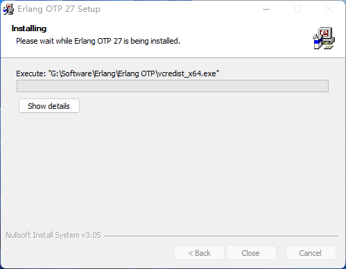

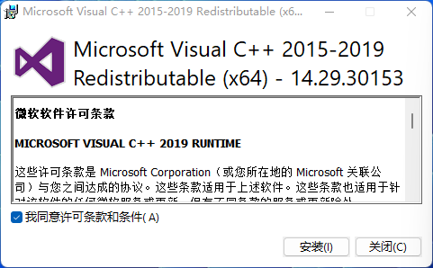

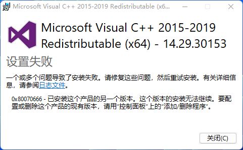

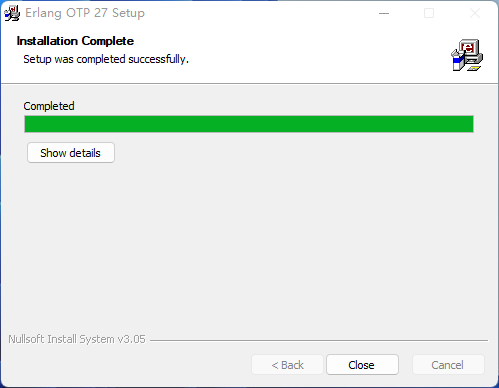

貌似也能用过Chocolatey

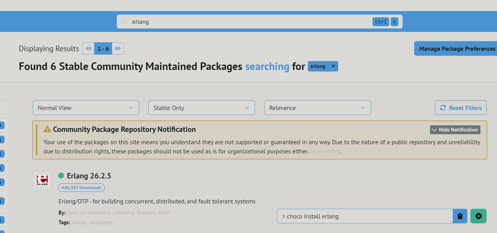

安装Rabbit MQ

<https://www.rabbitmq.com/install-windows.html>

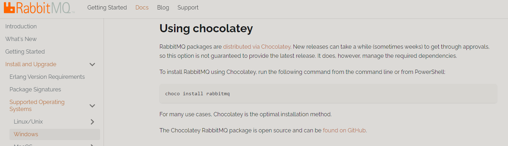

使用Chocolatey安装

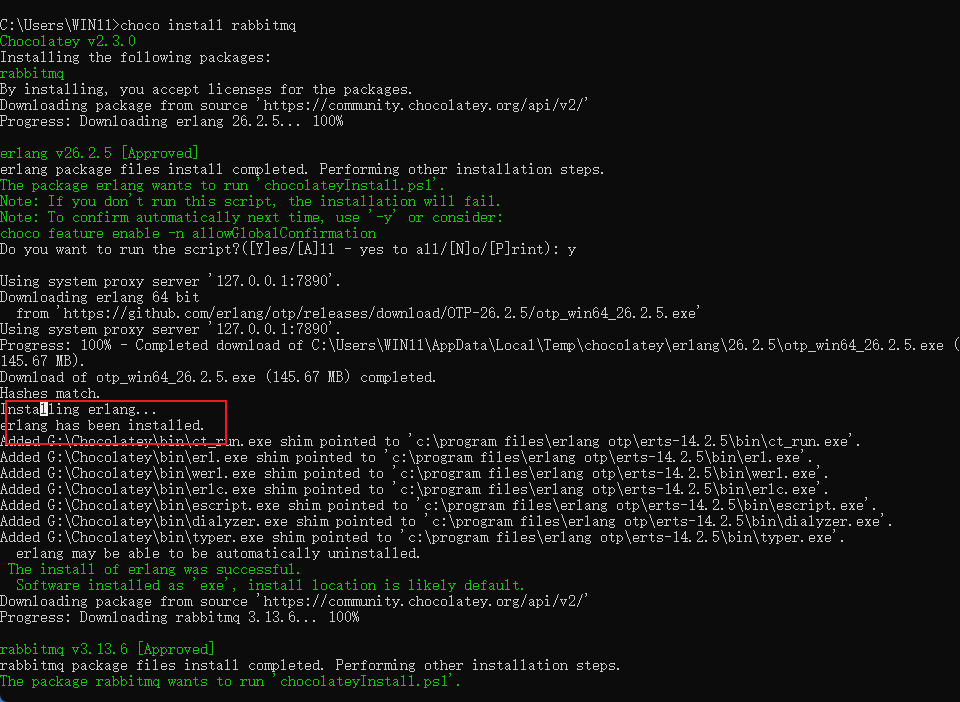

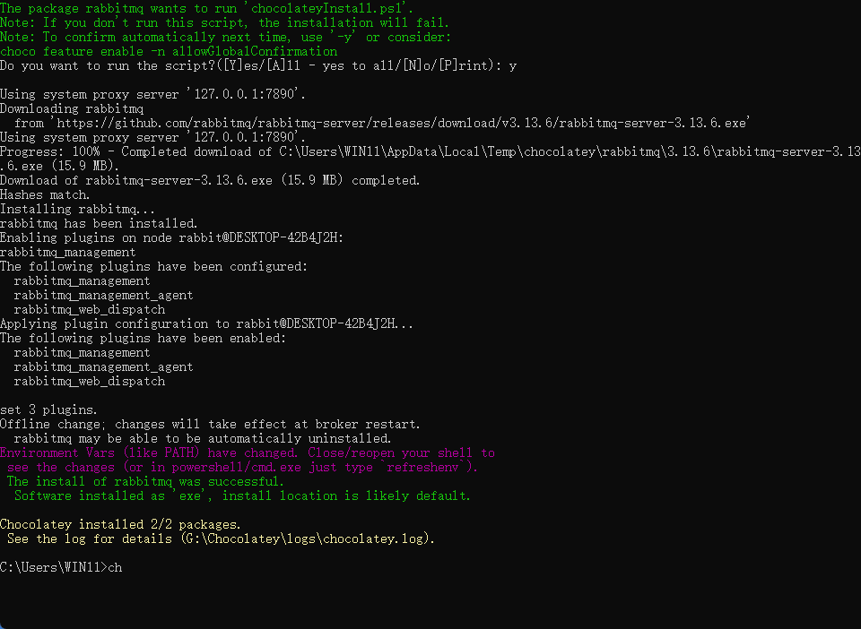

貌似Erlang又装了一遍...

删除原先的Erlang

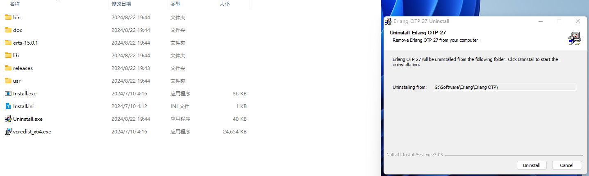

打开 RabbitMQ Command Prompt (sbin dir)  输入 rabbitmqctl.bat status 来确认 RabbitMQ 的启动状态

报错了...

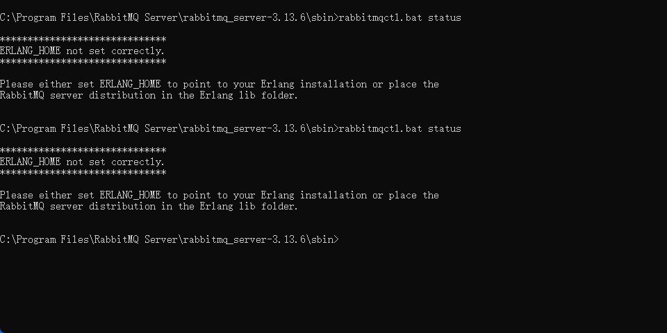

环境变量出问题了，指向原先卸载的路径

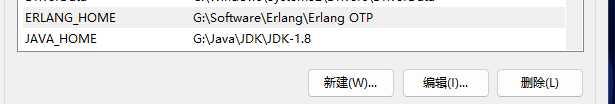

修改环境路径

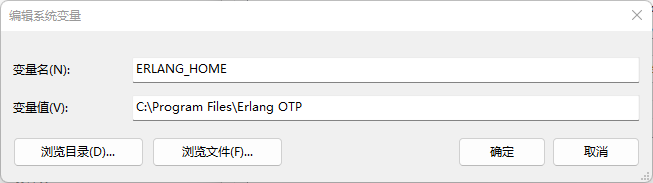

还是报错

```
C:\Program Files\RabbitMQ Server\rabbitmq_server-3.13.6\sbin>rabbitmqctl.bat status
Error: unable to perform an operation on node 'rabbit@DESKTOP-42B4J2H'. Please see diagnostics information and suggestions below.

Most common reasons for this are:

 * Target node is unreachable (e.g. due to hostname resolution, TCP connection or firewall issues)
 * CLI tool fails to authenticate with the server (e.g. due to CLI tool's Erlang cookie not matching that of the server)
 * Target node is not running

In addition to the diagnostics info below:

 * See the CLI, clustering and networking guides on https://rabbitmq.com/documentation.html to learn more
 * Consult server logs on node rabbit@DESKTOP-42B4J2H
 * If target node is configured to use long node names, don't forget to use --longnames with CLI tools

DIAGNOSTICS
===========

attempted to contact: ['rabbit@DESKTOP-42B4J2H']

rabbit@DESKTOP-42B4J2H:
  * connected to epmd (port 4369) on DESKTOP-42B4J2H
  * epmd reports: node 'rabbit' not running at all
                  no other nodes on DESKTOP-42B4J2H
  * suggestion: start the node

Current node details:
 * node name: 'rabbitmqcli-20-rabbit@DESKTOP-42B4J2H'
 * effective user's home directory: c:/Users/WIN11
 * Erlang cookie hash: rzge9A98Fk+Pr2fBfdq6CQ==
```

使用 choco uninstall rabbitmq 以及 choco uninstall erlang，重新安装一遍

成功了，显示PID等信息了

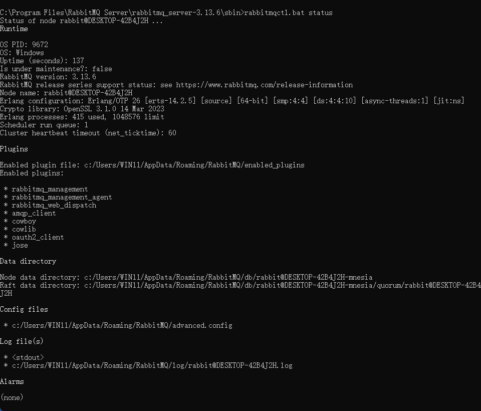

启用客户端管理的UI插件

```
rabbitmq-plugins enable rabbitmq_management
```

访问地址<http://localhost:15672>


### RabbitMQ简单配置

默认用户名 / 密码：guest

新建一个VirtualHosts

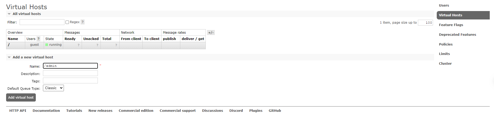

新建一个User

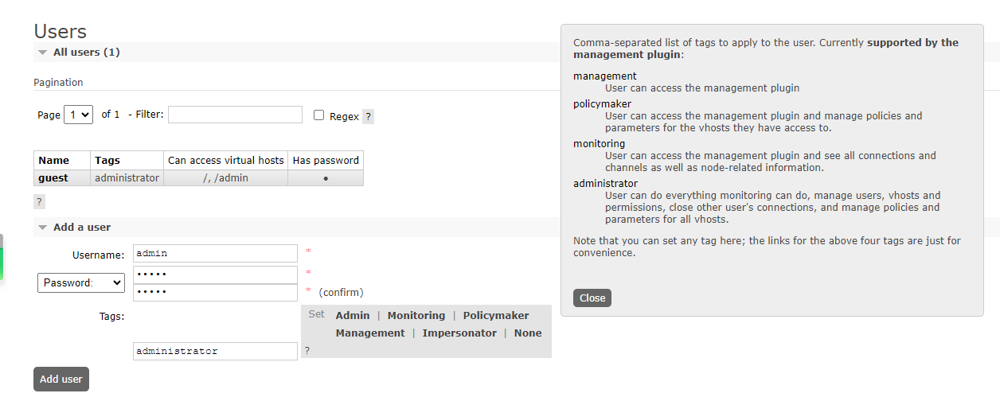

设置User在 VirtualHosts ：/admin 的权限

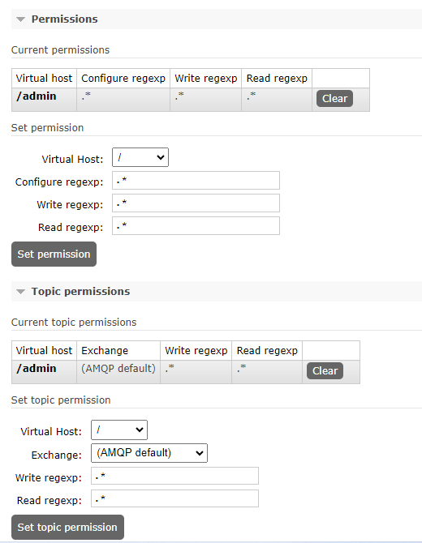

[用户配置 及 虚拟主机 说明](https://juejin.cn/post/7071589818886520869#heading-19)


### 核心概念

[核心概念的解释——04-RabbitMQ 高级教程 - 姜源の云笔记 (janycode.github.io)](https://janycode.github.io/2021/08/17/08_框架技术/07_RabbitMQ/04-RabbitMQ 高级教程/index.html#2-2-四大核心概念)

生产者 （Producer）：生产消息

交换机（Exchange）：转发消息，本身并不存储消息

队列（Queue）：消息缓冲区

消费者（Consumer）：消费消息


Broker

Connection：producer / cosumer 与 broker 之间的 TCP 连接

Channel：在connection内部建立的逻辑连接

Binding：exchange和queue之间的虚拟连接


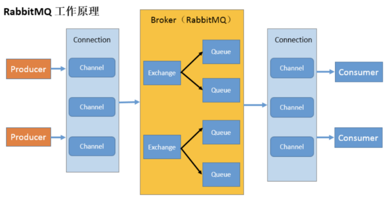


### AMQP模型

[AMQP 0-9-1 Model Explained | RabbitMQ](https://www.rabbitmq.com/tutorials/amqp-concepts#amqp-model)

> The AMQP 0-9-1 Model has the following view of the world: messages are published to *exchanges*, which are often compared to post offices or mailboxes. Exchanges then distribute message copies to *queues* using rules called *bindings*. Then the broker either deliver messages to consumers subscribed to queues, or consumers fetch/pull messages from queues on demand.
>
> AMQP 0-9-1 模型具有以下世界观：消息发布到交换器，交换器通常与邮局或邮箱进行比较。然后，交换器使用称为绑定的规则将消息副本分发到队列。然后，代理要么将消息传递给订阅队列的消费者，要么消费者按需从队列中获取/拉取消息。


#### Exchange类型

[AMQP 0-9-1 Model Explained | RabbitMQ ~ AMQP 0-9-1 模型解释 | RabbitMQ](https://www.rabbitmq.com/tutorials/amqp-concepts#exchanges)

* Direct

* Fanout

* Topic

* Headers（用得少）
  * [中间件系列七 RabbitMQ之header exchange(头交换机)用法-CSDN博客](https://blog.csdn.net/hry2015/article/details/79188615)


#### Queues

[AMQP 0-9-1 Model Explained | RabbitMQ ~ AMQP 0-9-1 模型解释 | RabbitMQ](https://www.rabbitmq.com/tutorials/amqp-concepts#queues)

* Name
* Durable


#### Bindings

[AMQP 0-9-1 Model Explained | RabbitMQ ~ AMQP 0-9-1 模型解释 | RabbitMQ](https://www.rabbitmq.com/tutorials/amqp-concepts#bindings)

Bindings are rules that exchanges use (among other things) to route messages to queues.

* Queue
* Exchange


#### Consumer

[AMQP 0-9-1 Model Explained | RabbitMQ ~ AMQP 0-9-1 模型解释 | RabbitMQ](https://www.rabbitmq.com/tutorials/amqp-concepts#consumers)

* Message Acknowledgements
* Rejecting Message
* Negative Message
* Prefetching Message


### RabbitMQ 工作模式

[RabbitMQ Tutorials | RabbitMQ - 有配图有讲解](https://www.rabbitmq.com/tutorials#queue-tutorials)


#### 1.简单模式

一个生产者，一个消费者


#### 2.工作队列模式

一个生产者，多个消费者

公平分发、不公平分发、Qos：[RabbitMQ六种工作模式详解_rabbitmq工作模式-CSDN博客](https://blog.csdn.net/qq_44760609/article/details/125084962)


#### 3.发布订阅模式 

Exchange type：FANOUT

将消息广播发送给每个队列


#### 4.路由模式 

Exchange type：DIRECT(定向)

比较 消息中的 Routing key 与 Binding 中的 Routing key，相等则发送到 Binding对应的Queue


#### 5.主题模式 

Exchange type：TOPIC

A few valid routing key examples: "`stock.usd.nyse`", "`nyse.vmw`", "`quick.orange.rabbit`". 

> [RabbitMQ tutorial - Topics | RabbitMQ](https://www.rabbitmq.com/tutorials/tutorial-five-java)

通配符，`*` 代表一个单词，`#`代表零或多个单词


#### 6.RPC模式

远程过程调用（Remote Procedure Call，RPC）

[RabbitMQ tutorial - Remote procedure call (RPC) | RabbitMQ](https://www.rabbitmq.com/tutorials/tutorial-six-java)


### 消息分发

[04-RabbitMQ 高级教程 - 姜源の云笔记](https://janycode.github.io/2021/08/17/08_%E6%A1%86%E6%9E%B6%E6%8A%80%E6%9C%AF/07_RabbitMQ/04-RabbitMQ%20%E9%AB%98%E7%BA%A7%E6%95%99%E7%A8%8B/index.html#2-6-%E6%B6%88%E6%81%AF%E5%88%86%E5%8F%91)

* 轮询分发
* 不公平分发
  * channel.basicQos(n);

* 限流


### 消息确认

[04-RabbitMQ 高级教程 - 姜源の云笔记](https://janycode.github.io/2021/08/17/08_%E6%A1%86%E6%9E%B6%E6%8A%80%E6%9C%AF/07_RabbitMQ/04-RabbitMQ%20%E9%AB%98%E7%BA%A7%E6%95%99%E7%A8%8B/index.html#2-7-%E6%B6%88%E6%81%AF%E7%A1%AE%E8%AE%A4)

* 发布确认（生产者——交换机）
* 消息应答（消费者）
  * channel.basicAck()
  * channel.basicNack()
  * channel.basicReject()


### 持久化

[04-RabbitMQ 高级教程 - 姜源の云笔记](https://janycode.github.io/2021/08/17/08_%E6%A1%86%E6%9E%B6%E6%8A%80%E6%9C%AF/07_RabbitMQ/04-RabbitMQ%20%E9%AB%98%E7%BA%A7%E6%95%99%E7%A8%8B/index.html#2-8-%E6%8C%81%E4%B9%85%E5%8C%96)

* 队列持久化
* 消息持久化


### 队列

[04-RabbitMQ 高级教程 - 姜源の云笔记](https://janycode.github.io/2021/08/17/08_%E6%A1%86%E6%9E%B6%E6%8A%80%E6%9C%AF/07_RabbitMQ/04-RabbitMQ%20%E9%AB%98%E7%BA%A7%E6%95%99%E7%A8%8B/index.html#2-9-%E9%98%9F%E5%88%97)

* 死信队列
  * 由于某些原因导致队列中的消息无法被消费（例如 消息的 TTL 过期、队列已满、消息被拒绝）
  * 正常队列 与 死信队列 的绑定
* 延迟队列
  * 队列 TTL / 消息 TTL + 死信队列
* 优先队列
  * 队列 / 消息 优先级设置
* 惰性队列
  * 尽可能将消息持久化到磁盘，消费者消费时才加载到内存


### TTL——最大存活时间

[04-RabbitMQ 高级教程 - 姜源の云笔记](https://janycode.github.io/2021/08/17/08_%E6%A1%86%E6%9E%B6%E6%8A%80%E6%9C%AF/07_RabbitMQ/04-RabbitMQ%20%E9%AB%98%E7%BA%A7%E6%95%99%E7%A8%8B/index.html#2-10-TTL)

* 队列 TTL
* 消息 TTL


### 幂等性

[04-RabbitMQ 高级教程 - 姜源の云笔记](https://janycode.github.io/2021/08/17/08_%E6%A1%86%E6%9E%B6%E6%8A%80%E6%9C%AF/07_RabbitMQ/04-RabbitMQ%20%E9%AB%98%E7%BA%A7%E6%95%99%E7%A8%8B/index.html#2-11-%E5%B9%82%E7%AD%89%E6%80%A7)

* 消费 可能存在 重复消费 问题
* 幂等性保障


## SpringBoot整合Rabbit MQ


### 参考链接

[Spring Boot 整合RabbitMQ (netfilx.github.io)](https://netfilx.github.io/spring-boot/8.springboot-rabbitmq/springboot-rabbitmq)

[Springboot 整合RabbitMq ，用心看完这一篇就够了_springboot rabbitmq-CSDN博客](https://blog.csdn.net/qq_35387940/article/details/100514134)


新建一个SpringBoot工程

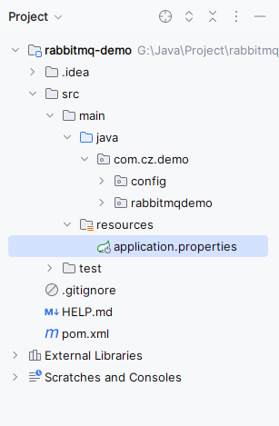

### 引入依赖

```xml
<!-- https://mvnrepository.com/artifact/org.springframework.boot/spring-boot-starter-amqp -->
<dependency>
    <groupId>org.springframework.boot</groupId>
    <artifactId>spring-boot-starter-amqp</artifactId>
    <version>3.3.2</version>
</dependency>
```

记得Load maven changes

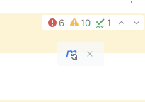

### 配置文件application.properties

```properties
#rabbitmq
spring.rabbitmq.host=127.0.0.1
# virtual host
spring.rabbitmq.virtual-host=/admin
spring.rabbitmq.port=5672
spring.rabbitmq.username=admin
spring.rabbitmq.password=admin
```

### RabbitConfig

```java
package com.cz.demo.config;

import org.springframework.amqp.core.Binding;
import org.springframework.amqp.core.BindingBuilder;
import org.springframework.amqp.core.DirectExchange;
import org.springframework.amqp.core.Queue;
import org.springframework.context.annotation.Bean;
import org.springframework.context.annotation.Configuration;

@Configuration
public class RabbitConfig {

    //队列
    @Bean
    public Queue queue() {
        return new Queue("queue");
    }
}
```

### 生产者

```java
package com.cz.demo.mq;

import lombok.extern.slf4j.Slf4j;
import org.springframework.amqp.rabbit.core.RabbitTemplate;
import org.springframework.beans.factory.annotation.Autowired;
import org.springframework.stereotype.Component;

@Slf4j
@Component
public class Producer {

    @Autowired
    private RabbitTemplate rabbitTemplate;

    public void sendMessage() {
        String message = "Hello RabbitMQ";
        log.info("发送消息: {}", message);
        try {
            //注：这里少指定了routing key
            //正确语句：rabbitTemplate.convertAndSend("queue", message);
            rabbitTemplate.convertAndSend(message);
        } catch (Exception e) {
            log.error("send message error: {}", e.getMessage());
        }
    }
}
```

### 消费者

```java
package com.cz.demo.mq;

import lombok.extern.slf4j.Slf4j;
import org.springframework.amqp.rabbit.annotation.RabbitHandler;
import org.springframework.amqp.rabbit.annotation.RabbitListener;
import org.springframework.stereotype.Component;

@Component
@RabbitListener(queues = "queue")
@Slf4j
public class Consumer {

    @RabbitHandler
    public void receive(String message){
        log.info("接收到消息: {}", message);
    }
}
```

### 测试

```java
package com.cz.demo.test;

import com.cz.demo.mq.Producer;
import org.junit.jupiter.api.Test;
import org.springframework.beans.factory.annotation.Autowired;
import org.springframework.boot.test.context.SpringBootTest;


@SpringBootTest
public class RabbitmqTest {

    @Autowired
    private Producer producer;

    @Test
    public void send() {
        producer.sendMessage();
    }
}
```

开始Debug

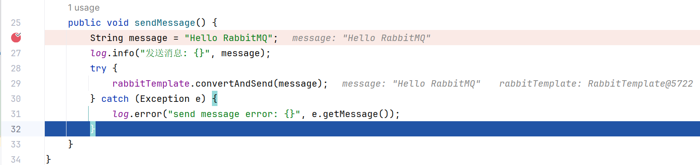

发送消息后，打开[RabbitMQ Management](http://localhost:15672)

> 受到 [Springboot 整合RabbitMq ，用心看完这一篇就够了_springboot rabbitmq-CSDN博客](https://blog.csdn.net/qq_35387940/article/details/100514134) 博客的启发，想到了可以运用 Debug + RabbitMQ Management 来查看队列中的消息

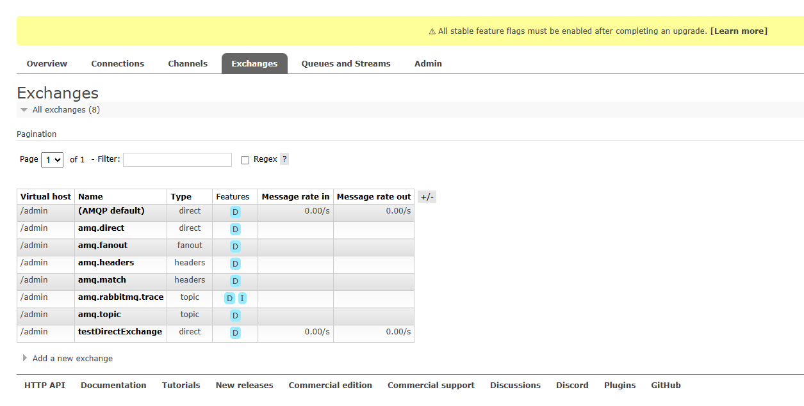

切换到默认的 Exchange（AMQP default）

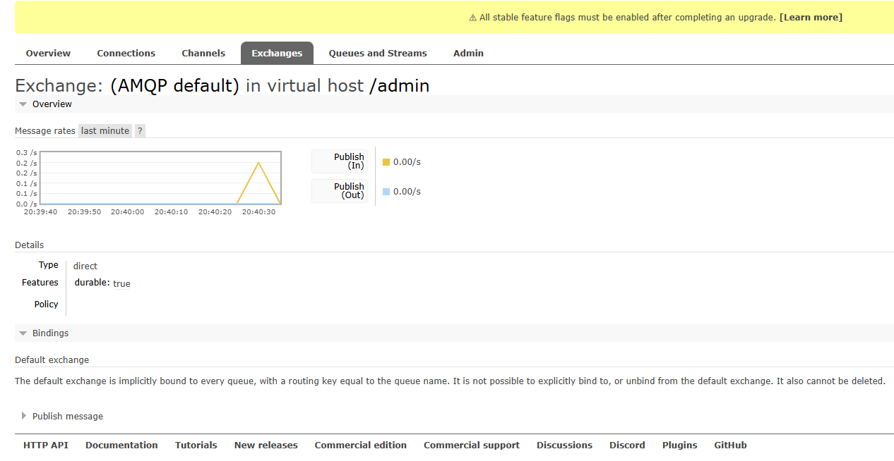

切换到Queue界面

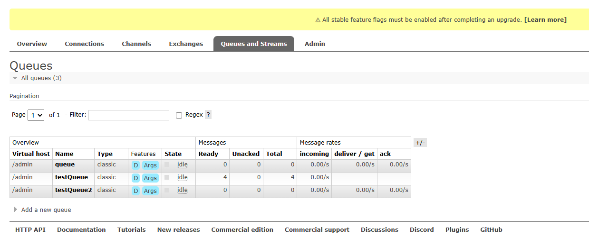

进入queue，并没有看到队列中有消息

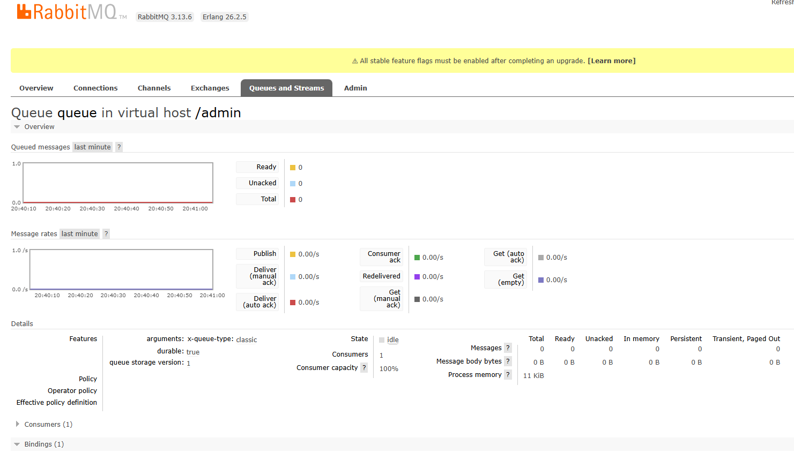

运行后，控制台并没有消费者输出的消息

### 问题

Exchange 和 queue 貌似没有匹配上？

进入 Exchange: (AMQP default) in virtual host /admin 中看到 Binding 

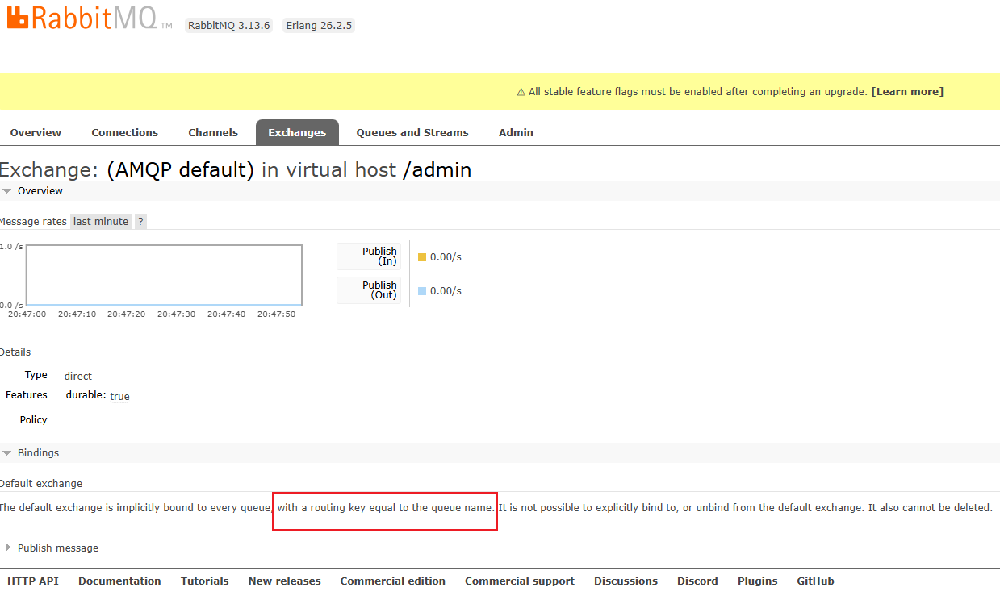

修改Producer.java，convertAndSend中加上routingKey

```java
public void sendMessage() {
    String message = "Hello RabbitMQ";
    log.info("发送消息: {}", message);
    try {
        rabbitTemplate.convertAndSend("queue", message);
    } catch (Exception e) {
        log.error("send message error: {}", e.getMessage());
    }
}
```

重新测试，并在sendMessage() 中打断点

一样在发送消息后，消费者 消费 消息之前，回到 [RabbitMQ Management](http://localhost:15672) 查看Exchange

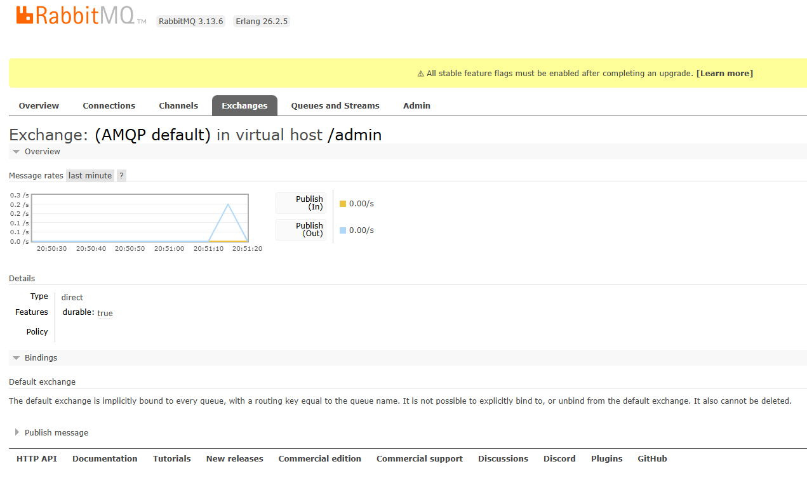

然后，查看Queue中的queue，收到消息了

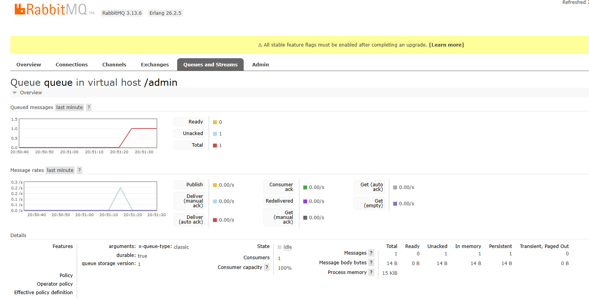

但是，控制台没有收到消息，可能跟 Debug 停留太久有关（纯猜测），重新运行，先消费之前在队列的消息，然后，接着消费此次运行生产的消息

### 问题所在

没有在RabbitConfig中指定Exchange时，采用默认的（AMOP default）Exchange，而默认的Exchange Type是Direct，routing key 默认为 Queue 名

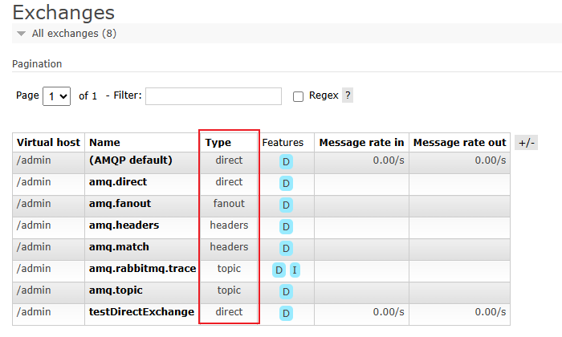

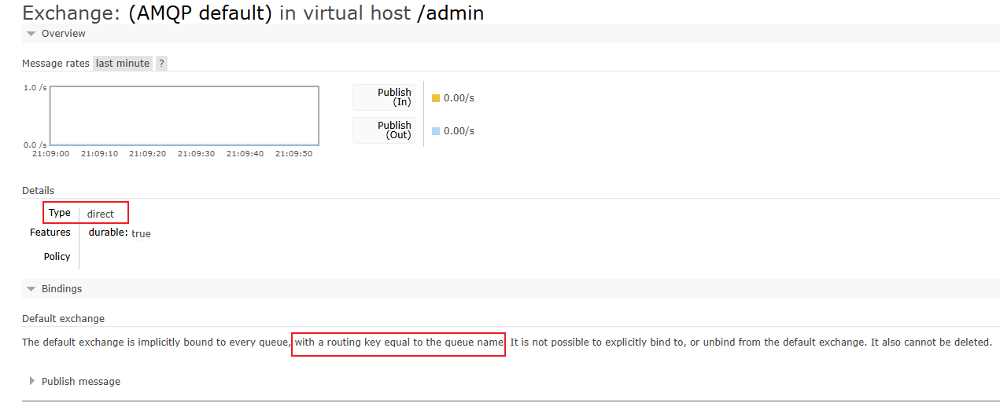

### 尝试指定Exchange和routing key

RabbitConfig.java

```java
	//队列
    @Bean
    public Queue queue() {
        return new Queue("testQueue3");
    }

    //交换机，路由模式
    @Bean
    DirectExchange testDirectExchange() {
        return new DirectExchange("testDirectExchange2", true, false);
    }

    //Binding，绑定队列和交换机
    @Bean
    Binding bindingDirect() {
        return BindingBuilder.bind(queue()).to(testDirectExchange()).with("testRoutingKey");
    }
```

Producer.java

```java
public void send() {
    String message = "Hello RabbitMQ";
    log.info("send message: {}", message);
    try {
        rabbitTemplate.convertAndSend("testDirectExchange2","testRoutingKey", message);
    } catch (Exception e) {
        log.error("send message error: {}", e.getMessage());
    }
}
```

Consumer.java

```java
@RabbitHandler
public void receive(String message){
    log.info("接收到消息: {}", message);
}
```

RabbitTest.java

```java
@Test
public void send2() {
    producer.send();
}
```


