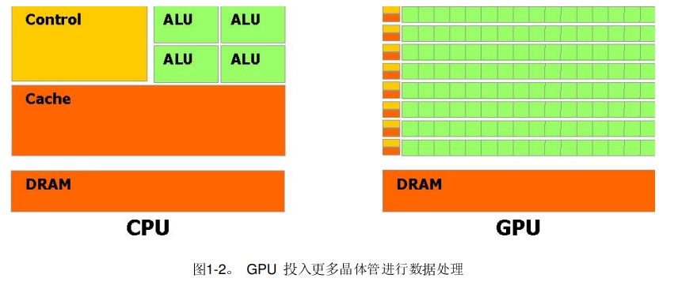
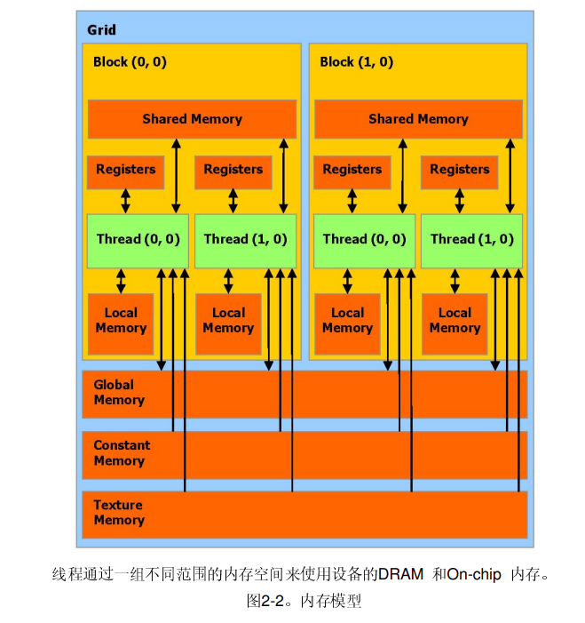
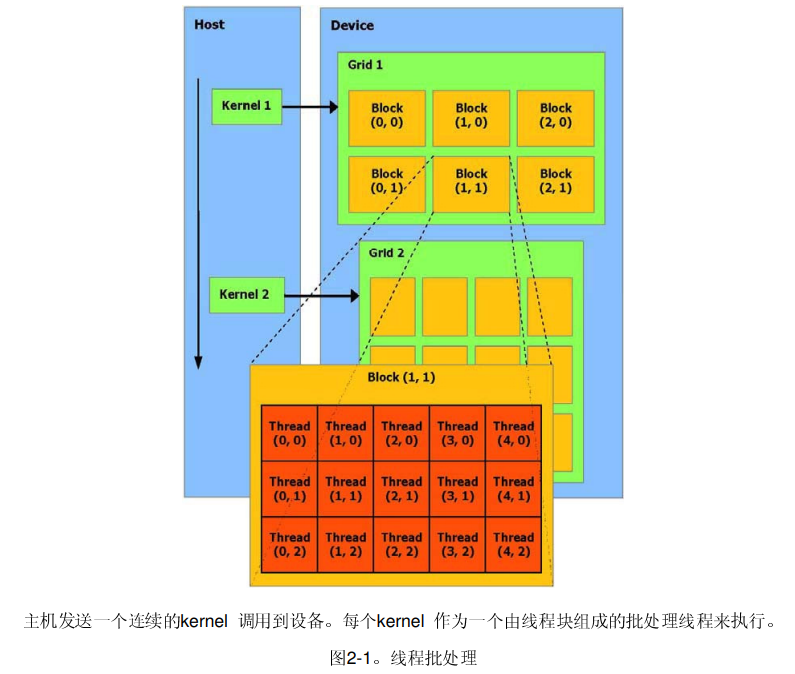

# GPU，CUDA 编程

> 以下内容来自个人理解 + 大语言模型 回答

## CUDA 版本选择

CUDA 版本选择注意要搭配对应的 NVIDIA 驱动版本：

[win10 查看GPU型号，驱动版本，CUDA版本_怎么查看gpu版本号-CSDN博客](https://blog.csdn.net/Strive_For_Future/article/details/104388165)

[不同版本cuda对应的NVIDIA驱动版本_cuda12.1对应的驱动版本-CSDN博客](https://blog.csdn.net/mouse1598189/article/details/86695400)

## CPU 与 GPU

图片来源:<https://www.nvidia.cn/docs/IO/51635/NVIDIA_CUDA_Programming_Guide_1.1_chs.pdf>

## CUDA

- 采用 CUDA 编程模型 可以将程序中适合于并行计算部分的**迁移至 GPU 执行**；

  - 将`for`循环的迭代过程分摊到`GPU`的线程上，每个线程独立负责部分迭代过程，共同完成整个`for`循环的迭代；

  - 需要考虑原先程序中 循环变量`i、j`与线程索引的映射关系；

- 针对程序中 GPU 计算资源利用不充分问题，

  - 优化 **数据存储布局**（数组中数据的存放方式可能影响计算效率，为了更好利用 合并访问 减少 GPU 访问全局内存的次数（全局内存时延较大），将 AOS 改成了 SOA）；

  - AOS（Array of Structures）

  - SOA（Structure of Arrays）

  - AOS和SOA理解：结构体的所有属性放在一起 和 所有结构体的第n个属性放在一起；

- 使用 **共享内存**（使用 线程块的共享内存作为全局内存的缓存）；

  
  

图片来源:<https://www.nvidia.cn/docs/IO/51635/NVIDIA_CUDA_Programming_Guide_1.1_chs.pdf>

- **线程层次结构**（如何组织 GPU 中的线程，NVIDIA GPU 的 SM 每次调度 32 个线程，若线程块大小非 32 倍数或资源分配不当，可能造成部分线程未被利用）。

  

图片来源:<https://www.nvidia.cn/docs/IO/51635/NVIDIA_CUDA_Programming_Guide_1.1_chs.pdf>

## 概念理解

### SM（Streaming Multiprocessor）

SM 是 NVIDIA GPU 的核心计算单元，负责执行 CUDA 线程；每个 SM 包含多个 CUDA 核心，并配备寄存器、共享内存、缓存等资源。

并行执行多个线程块（Block），每个线程块包含多个线程束（Wrap）。

通过动态调度 Wrap 隐藏内存访问延迟，提升吞吐量。

### 线程束（Wrap）

1个 Wrap 包含32个线程，是 SM 的最小调度单位。所有线程执行相同的指令（SIMT 模式），但操作不同的数据。

### 线程块（Block）和 Wrap 的映射

Block 被分配到 SM 后，硬件将其划分为多个 Wrap。

设计建议

- 设置 Block 大小为 32 的倍数，避免资源浪费。

### 合并访问（Coalesced Access）

确保同一 Wrap 的线程访问全局内存的连续地址，减少内存事务访问。

### 共享内存分块

将全局内存数据分块加载到共享内存，利用局部性减少重复访问，同时避免 Bank Conflict（如 通过内存填充或对齐）。
