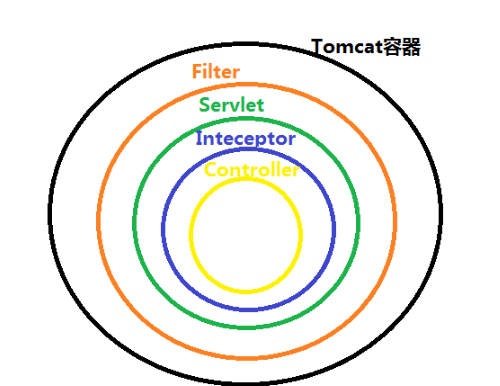
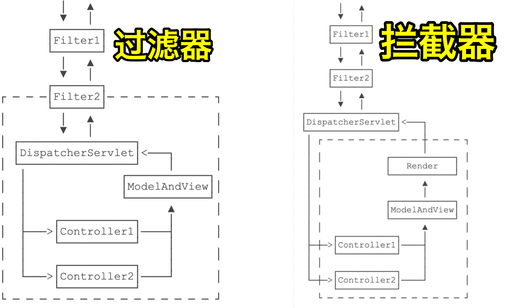
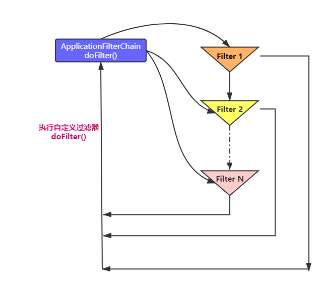
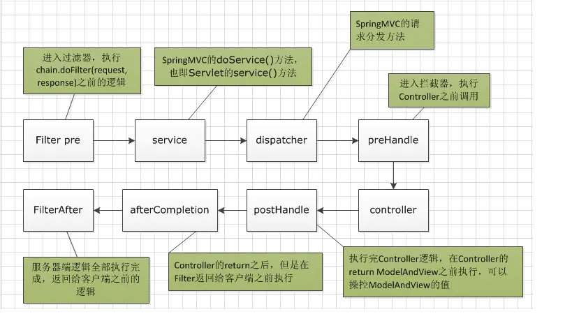
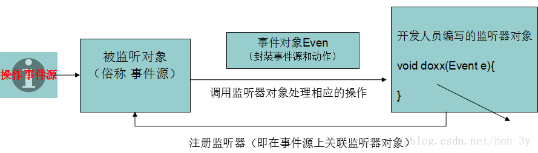

# SpringBoot 使用 过滤器、拦截器、监听器

## 参考链接

<https://javabetter.cn/springboot/Filter-Interceptor-Listener.html>

<https://segmentfault.com/a/1190000037755221>

<https://blog.csdn.net/xinzhifu1/article/details/106356958>

<https://segmentfault.com/a/1190000013240470#item-1>

---






过滤器 依赖于 Servlet 容器

拦截器依赖于 Spring 的 IoC容器（因此可以通过注入方式获取容器中的对象）

监听器 用于监听Web应用中某些对象的创建销毁、增加、修改、删除等动作并作出相应的处理


过滤器（Filter）：过滤符合预期的请求

拦截器（Interceptor）：干涉请求？

监听器（Listener）：监听请求具体做了什么？


### 过滤器

---

#### 作用

* 过滤敏感词汇（防止SQL注入？
* 设置字符编码
* URL级别的权限访问控制
* 压缩响应信息


#### 过滤器链 FilterChain

xxxFilter（自定义过滤器）s先执行自身 doFilter（）过滤逻辑，最后执行filterChain.doFilter(servletRequest, servletResponse)，回调ApplicationFilterChain的doFilter（）方法，以此循环执行 实现 函数回调



自定义过滤器

```java
@Override
public void doFilter(ServletRequest servletRequest, ServletResponse servletResponse, FilterChain filterChain) throws IOException, ServletException {
    //do something...
    filterChain.doFilter(servletRequest, servletResponse);
}
```

ApplicationFilterChain

```java
public final class ApplicationFilterChain implements FilterChain {
    @Override
    public void doFilter(ServletRequest request, ServletResponse response) {
            ...//省略
            internalDoFilter(request,response);
    }
 
    private void internalDoFilter(ServletRequest request, ServletResponse response){
    if (pos < n) {
            //获取第pos个filter    
            ApplicationFilterConfig filterConfig = filters[pos++];        
            Filter filter = filterConfig.getFilter();
            ...
            filter.doFilter(request, response, this);
        }
    }
 
}
```

FilterChain

```java
public interface FilterChain {
    void doFilter(ServletRequest var1, ServletResponse var2) throws IOException, ServletException;
}
```


#### 过滤器的使用

**SpringBoot提供的FilterRegistrationBean注册Filter**

自定义Filter `implements` Filter

```java
public class MyFilter implements Filter {
    @override
    public void init(){}
    
    @override
    pubic void doFilter(){}
    
    @override
    public void destroy(){}
    
}
```

使用SpringBoot提供的FilterRegistrationBean注册Filter

```java
@Configuration
public class FilterConfig {
    @Bean
    public FilterRegistrationBean registFilter() {
        FilterRegistrationBean registation = new FilterRegistationBean();
        registation.setFilter(new MyFilter());
        registration.addUrlPatterns("/*");
        registration.setName("LogCostFilter");
        registration.setOrder(1);
        return registration;
    }
}
```


**使用原生Servlet注解定义Filter**

启动类 添加注解 `@ServletComponentScan` 定义扫描的包

自定义Filter

```java
@Component
//filterName，过滤的url
@WebFilter(filterName = "xxx", urlPatterns = "/*")
public class MyFilter implements Filter {
    @override
    public void init(){}
    
    @override
    pubic void doFilter(){}
    
    @override
    public void destroy(){}
}
```


### 拦截器

---

#### 作用

* 登陆验证
* 权限验证（如校验token
* 日志记录（记录请求的用户IP、访问时间
* 处理cookie、本地化、国际化、主题等
* 性能监控，监控请求处理时长等


拦截器 本质上是面向切面编程（AOP）


#### 拦截器的使用

自定义拦截器

```java
public class MyInterceptor implements HandlerInterceptor {
    //Controller 方法调用前执行
    @Override
    public bolean preHandle(){}
    
    //postHandler是请求结束执行,只有preHandle方法返回true的时候才会执行
    @Override
    public void postHandle() {}
    
    //视图渲染完成后才执行,同样需要preHandle返回true，该方法通常用于清理资源等工作
    @Override
    public void afterCompletion() {}
}
```

注册拦截器

```java
@Configuration
public class InterceptorConfig extends WebMvcConfigurer {
    @Override
    public void addInterceptors(InterceptorRegistry registry) {
        registry.addInterceptor(new MyInterceptor()).addPathPatterns("/**");
    }
}
```


### 执行流程

---

Filter->Interceptor.preHandle->Handler->Interceptor.postHandle->Interceptor.afterCompletion->Filter


过滤器的实现 基于 **回调** 函数，拦截器（代理模式？）的实现 基于 **反射？**





### 监听器

----

监听器的组件

事件源，事件对象，事件监听器




Servlet中，监听器的监听对象（事件源）可以分为

ServletContext，HttpSession，ServletRequest


#### 监听对象的创建和销毁

**ServletRequestListener**

监听Context对象的创建和销毁

可以获取web.xml里面的参数配置


**HttpSessionListener**

监听 Session（会话） 对象的创建和销毁

可以用来收集在线者信息


**ServletRequestListener**

监听 Request（封装请求数据）对象的创建和销毁


#### 监听对象属性变化

ServletContextAttributeListener

HttpSessionAttributeListener

ServletRequestAttributeListener


#### 监听Session内的对象

HttpSessionBindingListener

HttpSessionActivationListener


#### 自定义Listener

```java
//使用注解代替web.xml
@WebListener
public class MyListener implements ServletContextListener {
    @Override
    public void contextInitialized(ServletContextEvent sce) {
        System.out.println("上下文创建");
    }

    @Override
    public void contextDestroyed(ServletContextEvent sce) {
        System.out.println("上下文销毁");
    }
}
//ServletContextListener 能够监听整个 Web 应用程序的生命周期。当 Web 应用启动时触发 contextInitialized 方法，关闭时触发 contextDestroyed 方法
```

