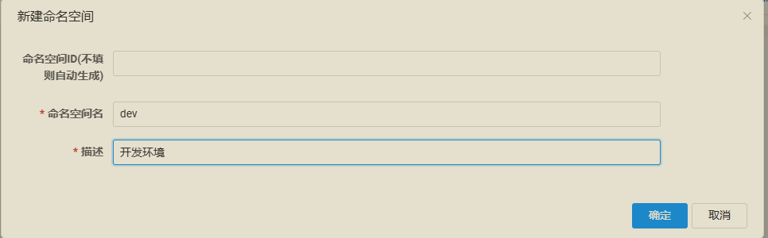
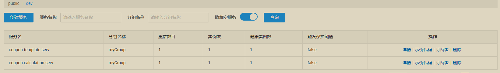
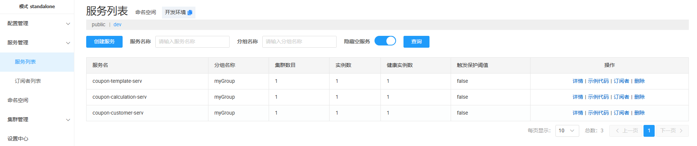
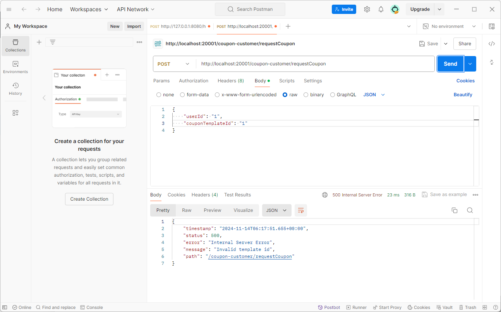
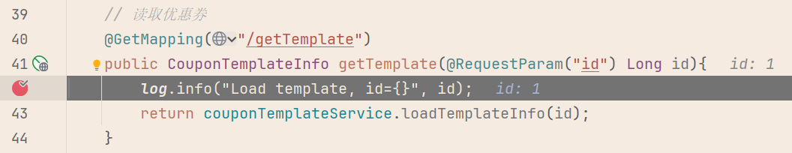
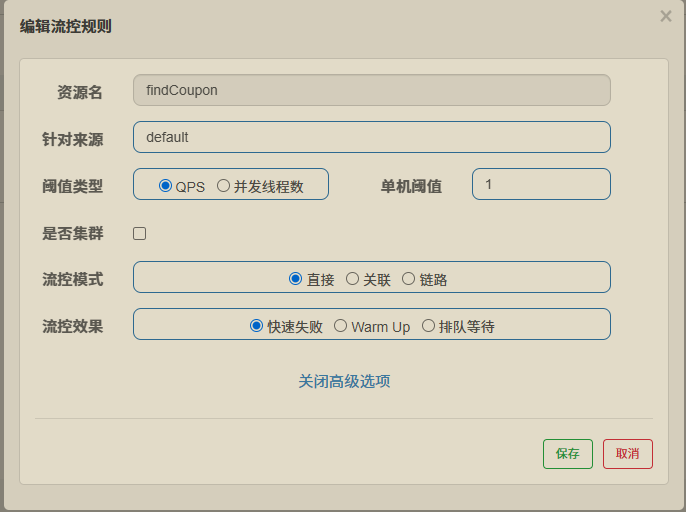
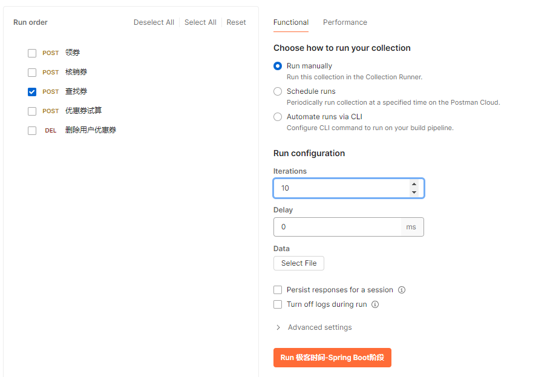
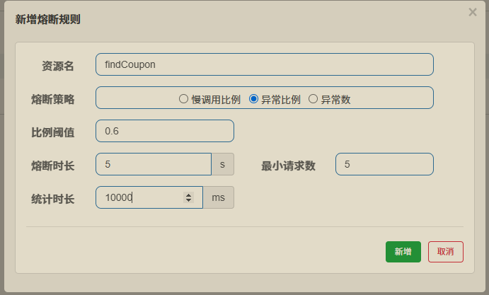
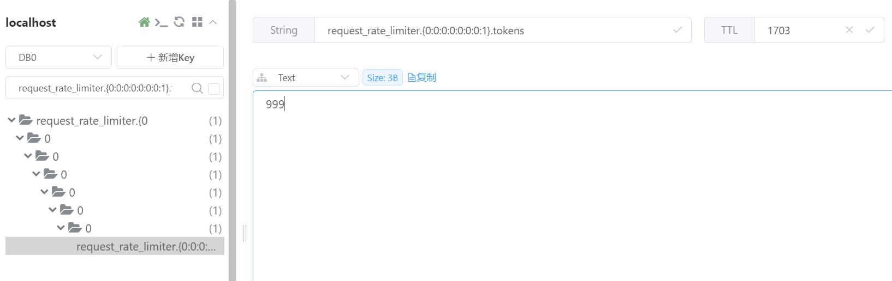

# Nacos + OpenFeign + Sentinel + Gateway 初探

## 参考链接

[Spring Cloud 微服务项目实战](https://time.geekbang.org/column/intro/100101301?tab=catalog)

[Nacos 快速开始 | Nacos 官网](https://nacos.io/docs/latest/quickstart/quick-start/)

[Nacos的基本使用（注册中心、配置中心） - wenxuehai - 博客园](https://www.cnblogs.com/wenxuehai/p/16179629.html)

[sentinel （史上最全+入门教程） - 疯狂创客圈 - 博客园](https://www.cnblogs.com/crazymakercircle/p/14285001.html)


## 环境搭建

1、下载链接

[Releases · alibaba/nacos](https://github.com/alibaba/nacos/releases)

2、解压，修改配置 conf / application.properties，实现配置项的持久化

```
#*************** Config Module Related Configurations ***************#
### If use MySQL as datasource:
### Deprecated configuration property, it is recommended to use `spring.sql.init.platform` replaced.
# spring.datasource.platform=mysql
spring.sql.init.platform=mysql

### Count of DB:
db.num=1

### Connect URL of DB:
db.url.0=jdbc:mysql://127.0.0.1:3306/nacos?characterEncoding=utf8&connectTimeout=1000&socketTimeout=3000&autoReconnect=true&useUnicode=true&useSSL=false&serverTimezone=UTC
db.user.0=root
db.password.0=「个人密码」
```

3、新建数据库 nacos

4、导入建表语句 conf / mysql-schema.sql

5、启动 nacos server

```bash
# windows，单机模式
startup.cmd -m standalone
```

```bash
G:\Software\nacos\nacos\bin>startup.cmd -m standalone
"nacos is starting with standalone"

         ,--.
       ,--.'|
   ,--,:  : |                                           Nacos 2.4.3
,`--.'`|  ' :                       ,---.               Running in stand alone mode, All function modules
|   :  :  | |                      '   ,'\   .--.--.    Port: 8848
:   |   \ | :  ,--.--.     ,---.  /   /   | /  /    '   Pid: 14556
|   : '  '; | /       \   /     \.   ; ,. :|  :  /`./   Console: http://192.168.112.1:8848/nacos/index.html
'   ' ;.    ;.--.  .-. | /    / ''   | |: :|  :  ;_
|   | | \   | \__\/: . ..    ' / '   | .; : \  \    `.      https://nacos.io
'   : |  ; .' ," .--.; |'   ; :__|   :    |  `----.   \
|   | '`--'  /  /  ,.  |'   | '.'|\   \  /  /  /`--'  /
'   : |     ;  :   .'   \   :    : `----'  '--'.     /
;   |.'     |  ,     .-./\   \  /            `--'---'
'---'        `--`---'     `----'

2024-11-13 20:33:57,656 INFO Tomcat initialized with port(s): 8848 (http)

2024-11-13 20:33:58,708 INFO Root WebApplicationContext: initialization completed in 6641 ms

2024-11-13 20:34:07,435 INFO Will secure any request with [org.springframework.security.web.session.DisableEncodeUrlFilter@50fe837a, org.springframework.security.web.context.request.async.WebAsyncManagerIntegrationFilter@3a62c01e, org.springframework.security.web.context.SecurityContextPersistenceFilter@30f5a68a, org.springframework.security.web.header.HeaderWriterFilter@652a7737, org.springframework.security.web.csrf.CsrfFilter@654d8173, org.springframework.security.web.authentication.logout.LogoutFilter@71b3bc45, org.springframework.security.web.savedrequest.RequestCacheAwareFilter@4f2c9ba6, org.springframework.security.web.servletapi.SecurityContextHolderAwareRequestFilter@53f48368, org.springframework.security.web.authentication.AnonymousAuthenticationFilter@7a8fa663, org.springframework.security.web.session.SessionManagementFilter@2bef51f2, org.springframework.security.web.access.ExceptionTranslationFilter@5b057c8c]

2024-11-13 20:34:08,022 INFO Adding welcome page: class path resource [static/index.html]

2024-11-13 20:34:08,887 INFO Exposing 1 endpoint(s) beneath base path '/actuator'

2024-11-13 20:34:08,944 WARN You are asking Spring Security to ignore Ant [pattern='/**']. This is not recommended -- please use permitAll via HttpSecurity#authorizeHttpRequests instead.

2024-11-13 20:34:08,963 INFO Will not secure Ant [pattern='/**']

2024-11-13 20:34:08,965 WARN You are asking Spring Security to ignore Mvc [pattern='/prometheus']. This is not recommended -- please use permitAll via HttpSecurity#authorizeHttpRequests instead.

2024-11-13 20:34:08,969 INFO Will not secure Mvc [pattern='/prometheus']

2024-11-13 20:34:08,970 WARN You are asking Spring Security to ignore Mvc [pattern='/prometheus/namespaceId/{namespaceId}']. This is not recommended -- please use permitAll via HttpSecurity#authorizeHttpRequests instead.

2024-11-13 20:34:08,970 INFO Will not secure Mvc [pattern='/prometheus/namespaceId/{namespaceId}']

2024-11-13 20:34:08,971 WARN You are asking Spring Security to ignore Mvc [pattern='/prometheus/namespaceId/{namespaceId}/service/{service}']. This is not recommended -- please use permitAll via HttpSecurity#authorizeHttpRequests instead.

2024-11-13 20:34:08,971 INFO Will not secure Mvc [pattern='/prometheus/namespaceId/{namespaceId}/service/{service}']

2024-11-13 20:34:09,210 INFO Tomcat started on port(s): 8848 (http) with context path '/nacos'

2024-11-13 20:34:09,267 INFO No TaskScheduler/ScheduledExecutorService bean found for scheduled processing

2024-11-13 20:34:09,320 INFO Nacos started successfully in stand alone mode. use external storage
```

6、访问 <http://127.0.0.1:8848/nacos>


## 服务注册

1、父模块添加依赖，SpringBoot Version：2.4.2

```xml
<dependency>
    <groupId>org.springframework.cloud</groupId>
    <artifactId>spring-cloud-dependencies</artifactId>
    <version>2020.0.1</version>
    <type>pom</type>
    <scope>import</scope>
</dependency>


<dependency>
    <groupId>com.alibaba.cloud</groupId>
    <artifactId>spring-cloud-alibaba-dependencies</artifactId>
    <version>2021.1</version>
    <type>pom</type>
    <scope>import</scope>
</dependency>
```

2、子模块添加依赖

```xml
<dependencies>

    <dependency>
        <groupId>com.alibaba.cloud</groupId>
        <artifactId>spring-cloud-starter-alibaba-nacos-discovery</artifactId>
    </dependency>

</dependencies>
```

3、Nacos 控制台 新建命名空间



4、application.yml

```yml
spring:
  application:
    name: coupon-calculation-serv
  # Spring Cloud Nacos 配置
  cloud:
    nacos:
      discovery:
        # nacos服务地址
        server-addr: 127.0.0.1:8848
        # 心跳时间间隔
        heart-beat-interval: 5000
        # 心跳超时时间
        heart-beat-timeout: 20000
        # 命名空间
        namespace: 4677fc72-dd47-42f5-b01f-39ac74c61676
        # namespace: dev
        # 分组
        group: myGroup
        # 服务注册
        register-enabled: true
```

5、服务注册成功




## 服务调用

1、添加 openfeign、nacos、loadbalancer依赖

```xml
<!-- OpenFeign组件 -->
        <dependency>
            <groupId>org.springframework.cloud</groupId>
            <artifactId>spring-cloud-starter-openfeign</artifactId>
        </dependency>

        <dependency>
            <groupId>com.alibaba.cloud</groupId>
            <artifactId>spring-cloud-starter-alibaba-nacos-discovery</artifactId>
        </dependency>

        <dependency>
            <groupId>org.springframework.cloud</groupId>
            <artifactId>spring-cloud-starter-loadbalancer</artifactId>
        </dependency>
```

2、application.yml

```yml
spring:
  application:
    name: coupon-customer-serv
  cloud:
    nacos:
      discovery:
        # nacos服务地址
        server-addr: 127.0.0.1:8848
        # 心跳时间间隔
        heart-beat-interval: 5000
        # 心跳超时时间
        heart-beat-timeout: 20000
        # 命名空间
        namespace: 4677fc72-dd47-42f5-b01f-39ac74c61676
        # 分组
        group: myGroup
        # 服务注册
        register-enabled: true
```

3、定义OpenFeign接口

```java
@FeignClient(value = "coupon-calculation-serv", path = "/calculator")
public interface CalculationService {

    // 订单结算
    @PostMapping("/checkout")
    ShoppingCart checkout(ShoppingCart settlement);

    // 优惠券试算
    @PostMapping("/simulate")
    public SimulationResponse simulate(SimulationOrder simulator);
}
```

4、修改ServiceImpl中原先需要跨服务调用的Bean为创建的OpenFeign接口

```java
@Autowired
private CalculationService calculationService;
```

5、启动类中加上 @EnableFeignClients 注解，并指定需要扫描的包

```java
// OpenFeign
@EnableFeignClients(basePackages = {"com.geekbang"})
public class CustomImplApplication {

    public static void main(String[] args) {
        SpringApplication.run(CustomImplApplication.class, args);
    }
}
```

6、启动application，刷新 Nacos 控制台



7、启动 Postman 发起请求



8、Debug，跨服务调用成功




## Sentinel 流控

1、下载 sentinel-dashboard 的 jar 包

[Releases · alibaba/Sentinel](https://github.com/alibaba/Sentinel/releases)

2、启动 Sentinel 控制台，启动后可通过网页访问控制台 <http://127.0.0.1:8080>

```
java -Dserver.port=8080 -Dcsp.sentinel.dashboard.server=localhost:8080 -Dproject.name=sentinel-dashboard -jar sentinel-dashboard-1.8.8.jar
```

> 注意可能需要修改jar包版本

3、添加sentinel依赖

```xml
<dependency>
    <groupId>com.alibaba.cloud</groupId>
    <artifactId>spring-cloud-starter-alibaba-sentinel</artifactId>
</dependency>
```

4、使用Sentinel注解对资源进行标记

```java
// 实现的时候最好封装一个search object类
@PostMapping("findCoupon")
@SentinelResource(value = "findCoupon", blockHandler = "findCoupon_block", blockHandlerClass = {SentinelBlockHandler.class})
// @SentinelResource(value = "findCoupon", blockHandler = "findCoupon_block")
public List<CouponInfo> findCoupon(@Valid @RequestBody SearchCoupon request) {
    return customerService.findCoupon(request);
}
```

5、新建类，编写限流后的降级方法

```java
@Slf4j
public class SentinelBlockHandler {

    /**
     * 限流处理方法
     * 访问修饰符需要为public，返回类型、参数类型需要与原方法相同
     * （方法参数多了一个BlockException）
     * 若与原方法（findCoupon）处在不同类中，需要声明为static
     * 
     * @param request
     * @return
     */
    public static List<CouponInfo> findCoupon_block(SearchCoupon request, BlockException exception) {
        log.error("接口被限流");
        return new ArrayList<CouponInfo>(0);
    }
}
```

6、启动应用，并先用 Postman发起请求，Sentinel 控制台才会出现对应的应用

7、Sentinel 控制台新增流控规则（直接流控，每秒QPS <= 1，流控效果：快速失败）



8、Postman 模拟并发



9、触发限流，IDEA 控制台打印代码中的提示信息

```
2024-11-14 22:38:19.260 ERROR 17980 --- [io-20001-exec-5] c.g.c.c.sentinel.SentinelBlockHandler    : 接口被限流
```


## Sentinel 降级熔断

1、在需要降级熔断接口指定降级逻辑

```java
@PostMapping("findCoupon")
@SentinelResource(value = "findCoupon",
        blockHandler = "findCoupon_block", blockHandlerClass = {SentinelBlockHandler.class},
        fallback = "findCoupon_fallback", fallbackClass = {SentinelBlockHandler.class})
// @SentinelResource(value = "findCoupon", blockHandler = "findCoupon_block")
public List<CouponInfo> findCoupon(@Valid @RequestBody SearchCoupon request) {
    // return customerService.findCoupon(request);
    log.error("接口降级测试");
    throw new RuntimeException("test sentinel");
}
```

2、降级处理方法

```java
@Slf4j
public class SentinelBlockHandler {

    /**
     * 限流处理方法
     * @param request
     * @return
     */
    public static List<CouponInfo> findCoupon_block(SearchCoupon request, BlockException exception) {
        log.error("接口被限流");
        return new ArrayList<CouponInfo>(0);
    }

    /**
     * 降级处理方法
     * @param request
     * @return
     */
    public static List<CouponInfo> findCoupon_fallback(SearchCoupon request) {
        log.error("接口被降级");
        return new ArrayList<CouponInfo>(0);
    }
}
```

3、无熔断规则，使用Postman 发起10个并发请求

```xml
2024-11-15 00:09:36.014 ERROR 15320 --- [o-20001-exec-10] c.g.c.c.c.CouponCustomerController       : 接口降级测试
2024-11-15 00:09:36.014 ERROR 15320 --- [o-20001-exec-10] c.g.c.c.sentinel.SentinelBlockHandler    : 接口被降级
2024-11-15 00:09:36.073 ERROR 15320 --- [io-20001-exec-2] c.g.c.c.c.CouponCustomerController       : 接口降级测试
2024-11-15 00:09:36.073 ERROR 15320 --- [io-20001-exec-2] c.g.c.c.sentinel.SentinelBlockHandler    : 接口被降级
2024-11-15 00:09:36.150 ERROR 15320 --- [io-20001-exec-1] c.g.c.c.c.CouponCustomerController       : 接口降级测试
2024-11-15 00:09:36.150 ERROR 15320 --- [io-20001-exec-1] c.g.c.c.sentinel.SentinelBlockHandler    : 接口被降级
2024-11-15 00:09:36.230 ERROR 15320 --- [io-20001-exec-3] c.g.c.c.c.CouponCustomerController       : 接口降级测试
2024-11-15 00:09:36.230 ERROR 15320 --- [io-20001-exec-3] c.g.c.c.sentinel.SentinelBlockHandler    : 接口被降级
2024-11-15 00:09:36.319 ERROR 15320 --- [io-20001-exec-4] c.g.c.c.c.CouponCustomerController       : 接口降级测试
2024-11-15 00:09:36.320 ERROR 15320 --- [io-20001-exec-4] c.g.c.c.sentinel.SentinelBlockHandler    : 接口被降级
2024-11-15 00:09:36.399 ERROR 15320 --- [io-20001-exec-5] c.g.c.c.c.CouponCustomerController       : 接口降级测试
2024-11-15 00:09:36.399 ERROR 15320 --- [io-20001-exec-5] c.g.c.c.sentinel.SentinelBlockHandler    : 接口被降级
2024-11-15 00:09:36.491 ERROR 15320 --- [io-20001-exec-6] c.g.c.c.c.CouponCustomerController       : 接口降级测试
2024-11-15 00:09:36.492 ERROR 15320 --- [io-20001-exec-6] c.g.c.c.sentinel.SentinelBlockHandler    : 接口被降级
2024-11-15 00:09:36.572 ERROR 15320 --- [io-20001-exec-7] c.g.c.c.c.CouponCustomerController       : 接口降级测试
2024-11-15 00:09:36.572 ERROR 15320 --- [io-20001-exec-7] c.g.c.c.sentinel.SentinelBlockHandler    : 接口被降级
2024-11-15 00:09:36.649 ERROR 15320 --- [io-20001-exec-8] c.g.c.c.c.CouponCustomerController       : 接口降级测试
2024-11-15 00:09:36.649 ERROR 15320 --- [io-20001-exec-8] c.g.c.c.sentinel.SentinelBlockHandler    : 接口被降级
2024-11-15 00:09:36.744 ERROR 15320 --- [io-20001-exec-9] c.g.c.c.c.CouponCustomerController       : 接口降级测试
2024-11-15 00:09:36.744 ERROR 15320 --- [io-20001-exec-9] c.g.c.c.sentinel.SentinelBlockHandler    : 接口被降级
```

4、设置熔断规则后，10个并发请求



```xml
2024-11-15 00:11:07.886 ERROR 15320 --- [io-20001-exec-1] c.g.c.c.c.CouponCustomerController       : 接口降级测试
2024-11-15 00:11:07.886 ERROR 15320 --- [io-20001-exec-1] c.g.c.c.sentinel.SentinelBlockHandler    : 接口被降级
2024-11-15 00:11:07.964 ERROR 15320 --- [io-20001-exec-3] c.g.c.c.c.CouponCustomerController       : 接口降级测试
2024-11-15 00:11:07.964 ERROR 15320 --- [io-20001-exec-3] c.g.c.c.sentinel.SentinelBlockHandler    : 接口被降级
2024-11-15 00:11:08.040 ERROR 15320 --- [io-20001-exec-4] c.g.c.c.c.CouponCustomerController       : 接口降级测试
2024-11-15 00:11:08.040 ERROR 15320 --- [io-20001-exec-4] c.g.c.c.sentinel.SentinelBlockHandler    : 接口被降级
2024-11-15 00:11:08.132 ERROR 15320 --- [io-20001-exec-5] c.g.c.c.c.CouponCustomerController       : 接口降级测试
2024-11-15 00:11:08.132 ERROR 15320 --- [io-20001-exec-5] c.g.c.c.sentinel.SentinelBlockHandler    : 接口被降级
2024-11-15 00:11:08.247 ERROR 15320 --- [io-20001-exec-6] c.g.c.c.c.CouponCustomerController       : 接口降级测试
2024-11-15 00:11:08.247 ERROR 15320 --- [io-20001-exec-6] c.g.c.c.sentinel.SentinelBlockHandler    : 接口被降级
2024-11-15 00:11:08.323 ERROR 15320 --- [io-20001-exec-7] c.g.c.c.sentinel.SentinelBlockHandler    : 接口被限流
2024-11-15 00:11:08.385 ERROR 15320 --- [io-20001-exec-8] c.g.c.c.sentinel.SentinelBlockHandler    : 接口被限流
2024-11-15 00:11:08.449 ERROR 15320 --- [io-20001-exec-9] c.g.c.c.sentinel.SentinelBlockHandler    : 接口被限流
2024-11-15 00:11:08.544 ERROR 15320 --- [o-20001-exec-10] c.g.c.c.sentinel.SentinelBlockHandler    : 接口被限流
2024-11-15 00:11:08.637 ERROR 15320 --- [io-20001-exec-2] c.g.c.c.sentinel.SentinelBlockHandler    : 接口被限流
```

5、熔断处理时长过后，半开启状态，再次测试，10个并发请求

```xml
2024-11-15 00:14:41.098 ERROR 15320 --- [io-20001-exec-4] c.g.c.c.c.CouponCustomerController       : 接口降级测试
2024-11-15 00:14:41.099 ERROR 15320 --- [io-20001-exec-4] c.g.c.c.sentinel.SentinelBlockHandler    : 接口被降级
2024-11-15 00:14:41.190 ERROR 15320 --- [io-20001-exec-5] c.g.c.c.sentinel.SentinelBlockHandler    : 接口被限流
2024-11-15 00:14:41.231 ERROR 15320 --- [io-20001-exec-6] c.g.c.c.sentinel.SentinelBlockHandler    : 接口被限流
2024-11-15 00:14:41.323 ERROR 15320 --- [io-20001-exec-7] c.g.c.c.sentinel.SentinelBlockHandler    : 接口被限流
2024-11-15 00:14:41.414 ERROR 15320 --- [io-20001-exec-8] c.g.c.c.sentinel.SentinelBlockHandler    : 接口被限流
2024-11-15 00:14:41.495 ERROR 15320 --- [io-20001-exec-9] c.g.c.c.sentinel.SentinelBlockHandler    : 接口被限流
2024-11-15 00:14:41.599 ERROR 15320 --- [o-20001-exec-10] c.g.c.c.sentinel.SentinelBlockHandler    : 接口被限流
2024-11-15 00:14:41.689 ERROR 15320 --- [io-20001-exec-2] c.g.c.c.sentinel.SentinelBlockHandler    : 接口被限流
2024-11-15 00:14:41.776 ERROR 15320 --- [io-20001-exec-1] c.g.c.c.sentinel.SentinelBlockHandler    : 接口被限流
2024-11-15 00:14:41.855 ERROR 15320 --- [io-20001-exec-3] c.g.c.c.sentinel.SentinelBlockHandler    : 接口被限流
```


## Spring Cloud Gateway

1、新建模块gateway

2、引入依赖

```xml
<dependency>
    <groupId>org.springframework.cloud</groupId>
    <artifactId>spring-cloud-starter-gateway</artifactId>
</dependency>
<!-- I版中移除了Ribbon，gateway玩不转了，需要手动加入loadbalancer注解 -->
<dependency>
    <groupId>org.springframework.cloud</groupId>
    <artifactId>spring-cloud-starter-loadbalancer</artifactId>
</dependency>

<dependency>
    <groupId>com.alibaba.cloud</groupId>
    <artifactId>spring-cloud-starter-alibaba-nacos-discovery</artifactId>
</dependency>
```

3、application.yml 配置文件

```yml
server:
  port: 30000

spring:
  application:
    name: coupon-gateway
  cloud:
    nacos:
      # Nacos 配置
      discovery:
        server-addr: localhost:8848
        heart-beat-interval: 5000
        heart-beat-timeout: 15000
        namespace: 命名空间ID
        group: myGroup
        register-enabled: true
      # Gateway配置
      gateway:
        locator:
          enabled: true
          lower-case-service-id: true
  # redis
  redis:
    host: localhost
    port: 6379
    password: 123456

logging:
  level:
    org.springframework.cloud.gateway: DEBUG
#    com.geekbang.gateway.RedisLimitationConfig: DEBUG
```

4、在网关层面配置一个轻量级限流方案，采用Redis + Lua（默认使用令牌桶限流算法）

>  Lua 脚本文件
>
> [spring-cloud-gateway/spring-cloud-gateway-server/src/main/resources/META-INF/scripts/request_rate_limiter.lua at main · spring-cloud/spring-cloud-gateway](https://github.com/spring-cloud/spring-cloud-gateway/blob/main/spring-cloud-gateway-server/src/main/resources/META-INF/scripts/request_rate_limiter.lua)

限流配置类代码

```java
@Configuration
public class RedisLimitationConfig {

    /**
     * 从请求对象中提取客户端的 IP 地址作为用于限流的 Key
     * @return
     */
    @Bean
    @Primary
    public KeyResolver remoteHostLimitationKey() {
        return exchange -> Mono.just(
                exchange.getRequest()
                        .getRemoteAddress()
                        .getAddress()
                        .getHostAddress()
        );
    }

    /**
     * customer 服务限流规则
     * @return
     */
    @Bean(name = "customerRateLimiter")
    public RedisRateLimiter customerRateLimiter() {
        // 每秒产生 1 个令牌，令牌桶的最大容量为 2
        return new RedisRateLimiter(1, 2);
    }

    @Bean(name = "templateRateLimiter")
    public RedisRateLimiter templateRateLimiter() {
        return new RedisRateLimiter(1,1000);
    }

    @Bean(name = "calculatorRateLimiter")
    public RedisRateLimiter calculatorRateLimiter() {
        return new RedisRateLimiter(1, 2);
    }

    @Bean(name = "defaultRateLimiter")
    @Primary
    public RedisRateLimiter defaultRateLimiter() {
        return new RedisRateLimiter(1, 2);
    }
}
```

5、新建配置类管理 路由规则

```java
@Configuration
public class RoutesConfiguration {

    @Autowired
    private KeyResolver keyResolver;

    @Autowired
    @Qualifier("customerRateLimiter")
    private RateLimiter customerRateLimiter;

    @Autowired
    @Qualifier("templateRateLimiter")
    private RateLimiter templateRateLimiter;

    @Autowired
    @Qualifier("calculatorRateLimiter")
    private RateLimiter calculatorRateLimiter;

    /**
     * 配置路由
     * @param builder
     * @return
     */
    @Bean
    public RouteLocator declare(RouteLocatorBuilder builder) {
        return builder.routes()
                .route(route -> route
                                // 谓词，路由匹配规则
                                .path("/gateway/coupon-customer/**")
                                // 过滤器
                                .filters(filter -> filter.stripPrefix(1)
                                        .requestRateLimiter(limiter -> {
                                            // 客户端的 IP 地址作为用于限流的 Key
                                            limiter.setKeyResolver(keyResolver);
                                            // 每秒产生 1 个令牌，令牌桶的最大容量为 2
                                            limiter.setRateLimiter(customerRateLimiter);
                                            // 设置限流异常返回状态码
                                            limiter.setStatusCode(HttpStatus.BANDWIDTH_LIMIT_EXCEEDED);
                                        }))
                                // 路由，负载均衡，转发的目标服务
                                .uri("lb://coupon-customer-serv")
                ).route(route -> route
                                .path("/gateway/template/**")
                                .filters(filter -> filter.stripPrefix(1)
                                        .requestRateLimiter(limiter -> {
                                            limiter.setKeyResolver(keyResolver);
                                            limiter.setRateLimiter(templateRateLimiter);
                                            limiter.setStatusCode(HttpStatus.BANDWIDTH_LIMIT_EXCEEDED);
                                        }))
                                .uri("lb://coupon-template-serv")
                ).route(route -> route
                                .path("/gateway/calculator/**")
                                .filters(filter -> filter.stripPrefix(1)
                                        .requestRateLimiter(limiter -> {
                                            limiter.setKeyResolver(keyResolver);
                                            limiter.setRateLimiter(calculatorRateLimiter);
                                            limiter.setStatusCode(HttpStatus.BANDWIDTH_LIMIT_EXCEEDED);
                                        }))
                                .uri("lb://coupon-calculator-serv")
                ).build();
    }
}
```

6、使用 Postman 发起请求前，启动一个redis客户端监控 Redis 操作

```
redis-cli.exe -h localhost -p 6379 -a 密码
```

7、Postman发起请求后，观察到有关使用Redis进行限流的相关操作

```
1731677432.966835 [0 127.0.0.1:57015] "EVALSHA" "9d491aea731237273f4274f9ed9660b432b23791" "2" "request_rate_limiter.{0:0:0:0:0:0:0:1}.tokens" "request_rate_limiter.{0:0:0:0:0:0:0:1}.timestamp" "1" "1000" "1731677432" "1"
1731677432.966908 [0 lua] "get" "request_rate_limiter.{0:0:0:0:0:0:0:1}.tokens"
1731677432.966921 [0 lua] "get" "request_rate_limiter.{0:0:0:0:0:0:0:1}.timestamp"
1731677432.966938 [0 lua] "setex" "request_rate_limiter.{0:0:0:0:0:0:0:1}.tokens" "2000" "999"
1731677432.966956 [0 lua] "setex" "request_rate_limiter.{0:0:0:0:0:0:0:1}.timestamp" "2000" "1731677432"
```

8、使用 Another 搜索到相关的键


