# 前后端参数传递方式探寻


## 参考链接

<https://juejin.cn/post/7211537759848316986#heading-4>

<https://blog.csdn.net/weixin_43606226/article/details/106538723>

<https://www.cnblogs.com/smfx1314/p/10205736.html>

<https://juejin.cn/post/7033208780682690590#heading-7>

<https://www.cnblogs.com/blogtech/p/11172168.html>

<https://www.cnblogs.com/baby123/p/11431293.html>

[黑马苍穹外卖](https://www.bilibili.com/video/BV1TP411v7v6?p=1&vd_source=d999675f6dab8c0e0ef800a3c2bf4be5)


---

### http请求方法分类：

Get、Post、Put、Delete

区别：Get通常将参数拼接在url上，没有content-type字段，Post/Put/Delete请求通常有content-type字段


---

### 前端参数传递方式以及后端接收方式测试：

个人使用测试工具：Postman + IDEA

新建一个SpringBoot工程（Version：2.6.13），基于生成的BasicController以及PathVariableController修改并测试


#### conten-type：application/json

前端：

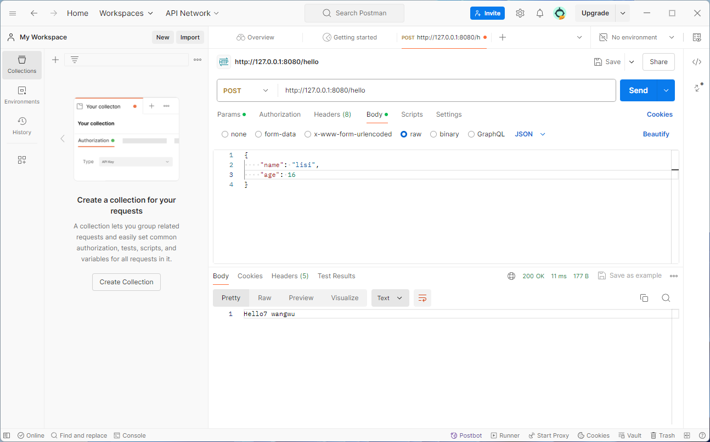

后端：

```java
//json
    @RequestMapping(value = "/hello", method = RequestMethod.POST)
    @ResponseBody
    public String hello(@RequestBody User user) {
        return "Hello " + user.getName();
    }
```

测试结果：

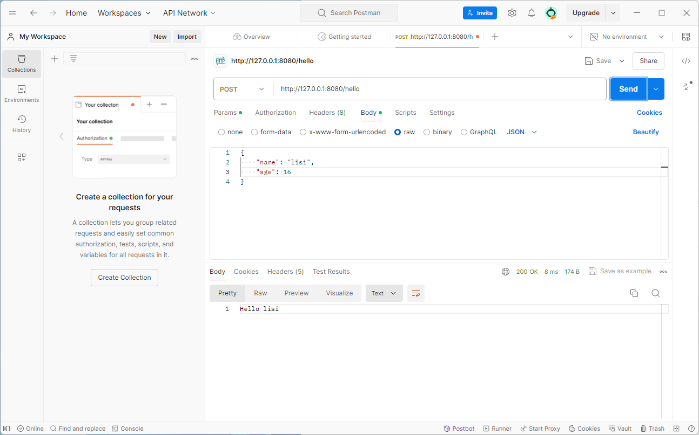


> 无注解测试：

```java
//json
    @RequestMapping(value = "/hello", method = RequestMethod.POST)
    @ResponseBody
    public String hello(User user) {
        return "Hello " + user.getName();
    }
```

测试结果：?


再次测试：

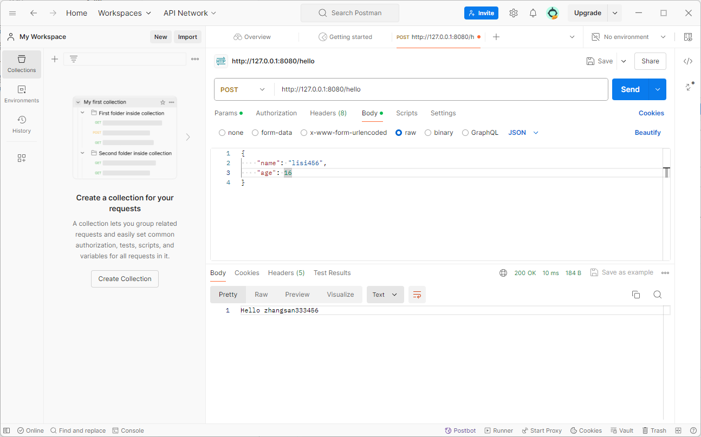

可能原因：

```java
@ModelAttribute
    public void parseUser(@RequestParam(name = "name", defaultValue = "unknown user") String name
            , @RequestParam(name = "age", defaultValue = "12") Integer age, User user) {
        user.setName("zhangsan333456");
        user.setAge(18);
        System.out.println(name +  " " + age);
    }
```

控制台输出：

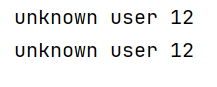


> @RequestParam测试

```java
//json
    @RequestMapping(value = "/hello", method = RequestMethod.POST)
    @ResponseBody
    public String hello(@RequestParam String name) {
        return "Hello " + name;
    }
```

测试结果：

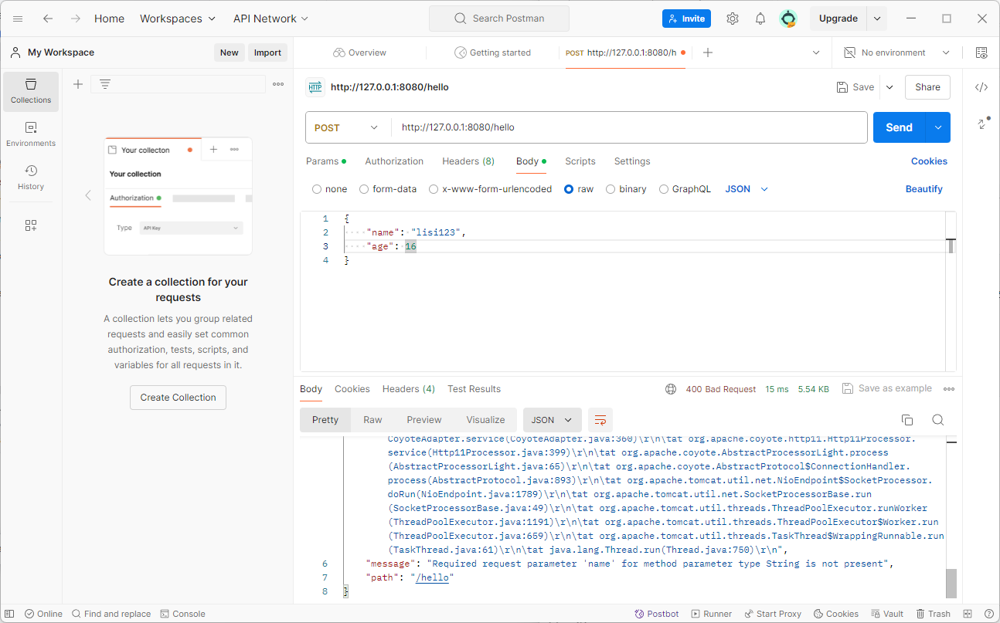


> 使用参数类型不匹配测试：

```java
//json
@RequestMapping(value = "/hello", method = RequestMethod.POST)
@ResponseBody
public String hello(@RequestBody String name) {
    return "Hello " + name;
}
```

结果：

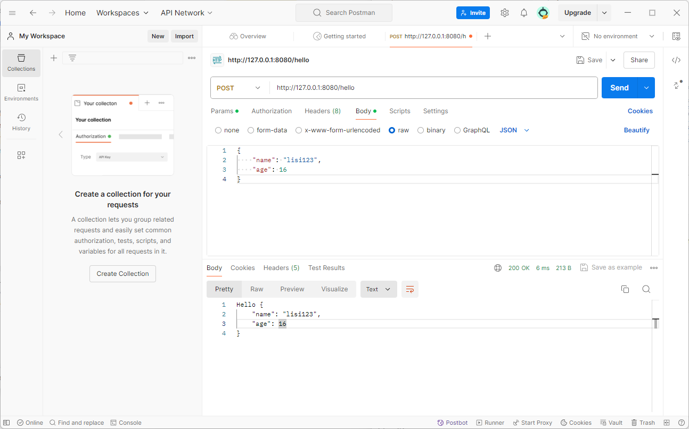


> 不使用注解测试

```java
//json
@RequestMapping(value = "/hello", method = RequestMethod.POST)
@ResponseBody
public String hello(User user) {
    return "Hello " + user.getName();
}
```

测试结果：

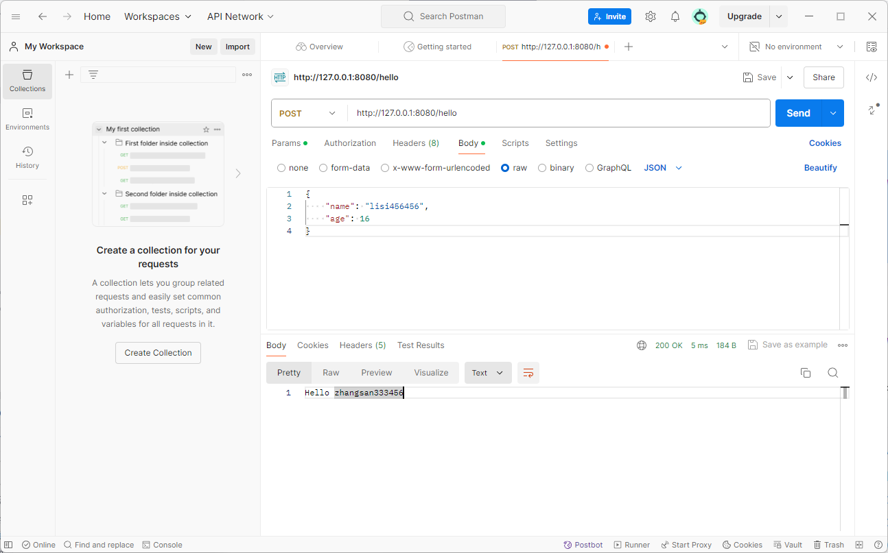


> 执行顺序测试：

```java
//json
@RequestMapping(value = "/hello", method = RequestMethod.POST)
@ResponseBody
public String hello(@RequestBody User user) {
    System.out.println(user);
    return "Hello " + user.getName() + " " + user.getAge();
}

@ModelAttribute
    public void parseUser(@RequestParam(name = "name", defaultValue = "unknown user") String name
            , @RequestParam(name = "age", defaultValue = "12") Integer age, User user) {
        user.setName("zhangsan333456");
        user.setAge(18);
        System.out.println(name +  " " + age);
    }
```

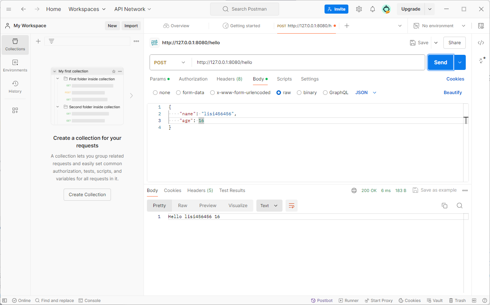

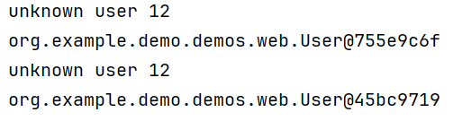


#### URL中占位符参数传递


**Get请求**

前端：

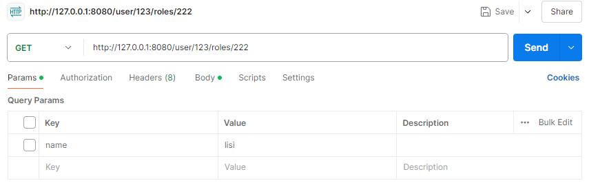

后端：

```java
// http://127.0.0.1:8080/user/123/roles/222
@RequestMapping(value = "/user/{userId}/roles/{roleId}", method = RequestMethod.GET)
@ResponseBody
public String getLogin(@PathVariable("userId") String userId, @PathVariable("roleId") String roleId) {
    return "User Id : " + userId + " Role Id : " + roleId;
}
```

测试结果：

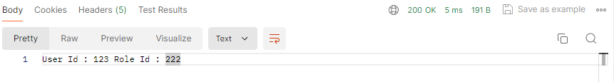


**Post请求**

前端：


后端：

```java
@RequestMapping(value = "/user/{userId}/roles/{roleId}", method = RequestMethod.POST)
@ResponseBody
public String getLogin2(@PathVariable("userId") String userId, @PathVariable("roleId") String roleId) {
    return "User Id : " + userId + " Role Id : " + roleId;
}
```

测试结果：

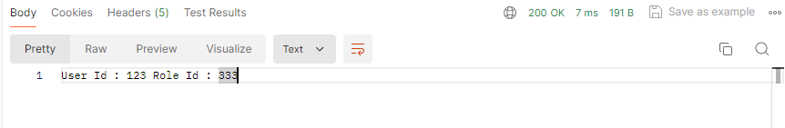


#### URL传参


**Get请求**

前端:

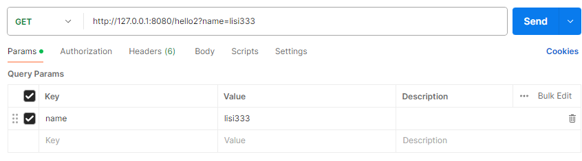

后端：

```java
// http://127.0.0.1:8080/hello2?name=lisi    Get-@RequestParam
@RequestMapping(value = "/hello2", method = RequestMethod.GET)
@ResponseBody
public String hello2(@RequestParam(name = "name", defaultValue = "unknown user") String name) {
    return "Hello2 " + name;
}
```

测试结果：

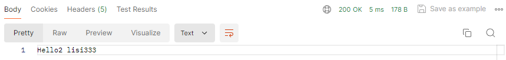


**Post请求**

前端：

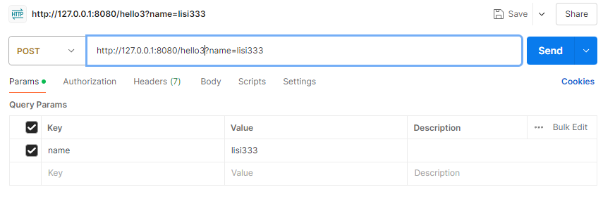

后端：

```java
// http://127.0.0.1:8080/hello3?name=lisi    Post-@RequestParam
@RequestMapping(value = "/hello3", method = RequestMethod.POST)
@ResponseBody
public String hello3(@RequestParam(name = "name", defaultValue = "unknown user") String name) {
    return "Hello3 " + name;
}
```

测试结果：

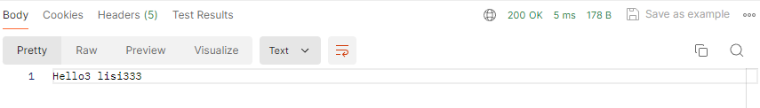


**后端无注解测试，Get请求**

前端：

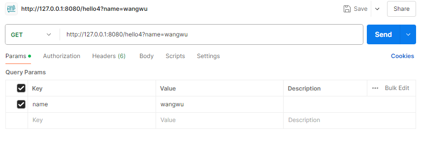

后端——无注解：

```java
// http://127.0.0.1:8080/hello4?name=lisi    Get-无注解
@RequestMapping(value = "/hello4", method = RequestMethod.GET)
@ResponseBody
public String hello4(String name) {
    return "Hello4 " + name;
}
```

测试结果：

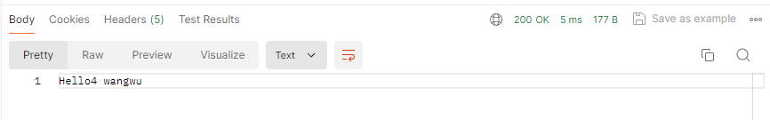


**后端无注解，Post请求**

前端：


后端——无注解：

```java
// http://127.0.0.1:8080/hello5?name=lisi    POST-无注解
@RequestMapping(value = "/hello5", method = RequestMethod.POST)
@ResponseBody
public String hello5(String name) {
    return "Hello5 " + name;
}
```

测试结果：

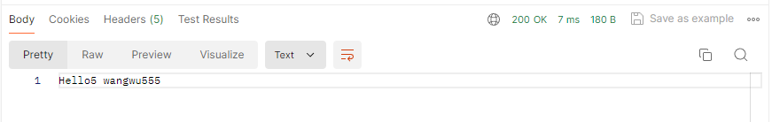


#### content-type：form-data

前端：

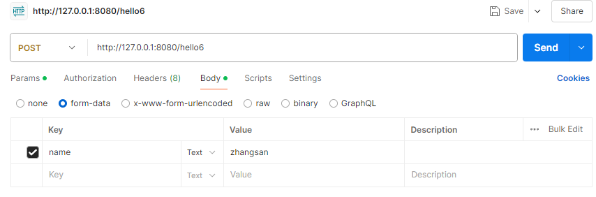

后端：

```java
// POST-form-data-@RequestParam
@RequestMapping(value = "/hello6", method = RequestMethod.POST)
@ResponseBody
public String hello6(@RequestParam String name) {
    return "Hello6 " + name;
}
```

测试结果：

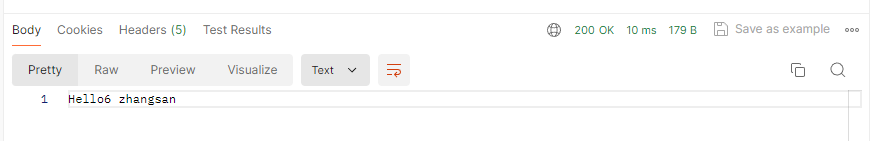


#### content-type：x-www-form-urlencoded

前端：

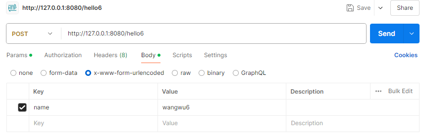

后端：

```java
// POST-form-data-@RequestParam
@RequestMapping(value = "/hello6", method = RequestMethod.POST)
@ResponseBody
public String hello6(@RequestParam String name) {
    return "Hello6 " + name;
}
```

测试结果：

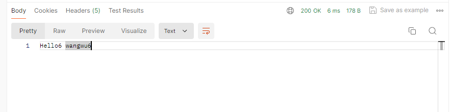


#### content-type：form-data无注解

前端：

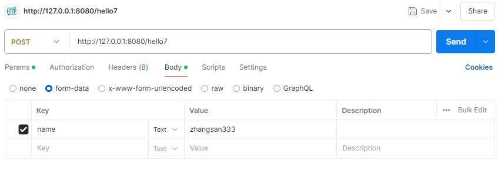

后端——无注解：

```java
// POST-form-data-无注解
@RequestMapping(value = "/hello7", method = RequestMethod.POST)
@ResponseBody
public String hello7(String name) {
    return "Hello7 " + name;
}
```

测试结果：

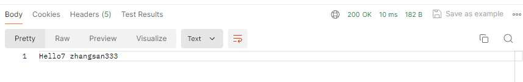


#### content-type：x-www-form-urlencoded无注解

前端：

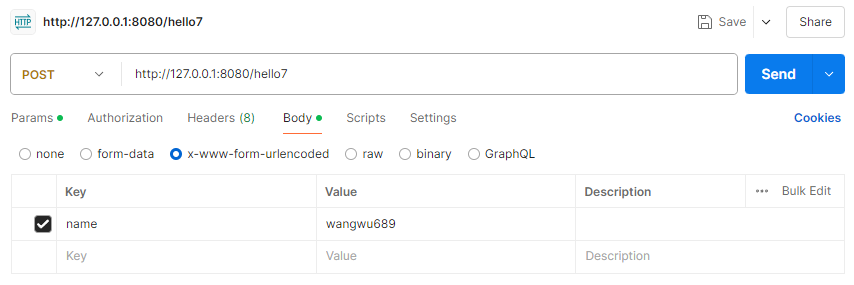

后端：

```java
// POST-form-data-无注解
@RequestMapping(value = "/hello7", method = RequestMethod.POST)
@ResponseBody
public String hello7(String name) {
    return "Hello7 " + name;
}
```

测试结果：

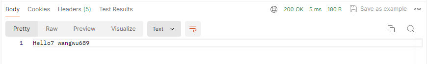


#### 个人所做测试总结

（测试用例未考虑所有情况，测试总结的结果未必正确）

json —— @RequestBody

URL占位符 —— @PathVariable

http:// 地址 + ？name = 16 —— @RequestParam / 无注解

form-data —— @RequestParam / 无注解

form-urlencoded —— @RequestParam / 无注解

> @RequestParam（需要注意 参数名匹配问题）
>
> @RequestParam注解详细使用：https://blog.csdn.net/qq_44543508/article/details/101026720


### 补充

---

#### 补充1

其他的参数传递方式

@CookieValue

@RequestHead

HttpServeletRequest

application / xml


#### 补充2

**黑马苍穹外卖——菜品分页查询业务**

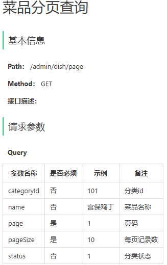

后端处理请求代码，采用DTO封装请求参数，方法参数加注解 @RequestParam

```java
@ApiOperation("菜品分页查询")
@GetMapping("/page")
public Result<PageResult> page(@RequestParam DishPageQueryDTO dishPageQueryDTO) {
    log.info("菜品分页查询：{}", dishPageQueryDTO);
    PageResult pageResult = dishService.pageQuery(dishPageQueryDTO);
    return Result.success(pageResult);
}
```

Swagger（http://localhost:8080/doc.html）测试，请求参数显示为 DishPageQueryDTO

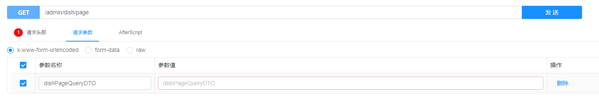

采用前端发送请求方式测试功能

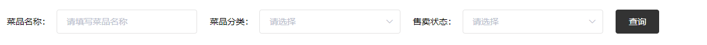

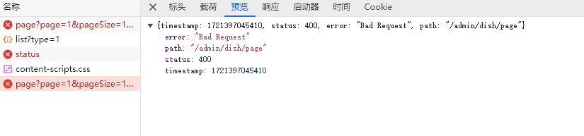

Console 控制台 报错信息

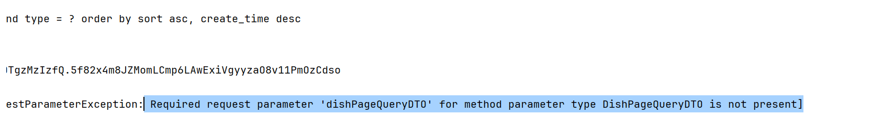

删除@RequestParam

```java
@ApiOperation("菜品分页查询")
@GetMapping("/page")
public Result<PageResult> page(DishPageQueryDTO dishPageQueryDTO) {
    log.info("菜品分页查询：{}", dishPageQueryDTO);
    PageResult pageResult = dishService.pageQuery(dishPageQueryDTO);
    return Result.success(pageResult);
}
```

Swagger（http://localhost:8080/doc.html）测试界面中，显示 DishPageQueryDTO 的全部属性

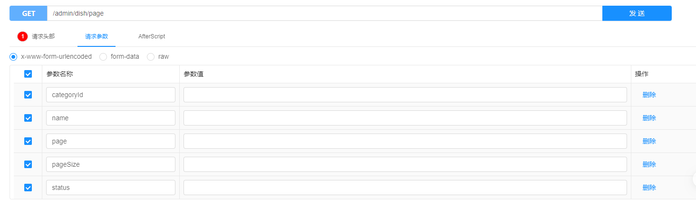


#### 补充3

**黑马苍穹外卖-用户查询分类**

前端发起请求，Get，URL 无参数传递

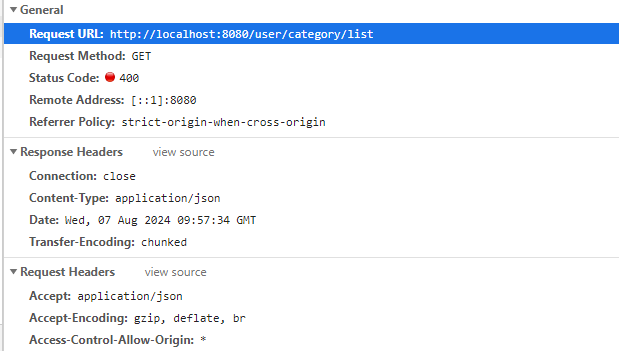

后端处理请求代码，方法参数为 type

```java
@GetMapping("/list")
@ApiOperation("查询分类")
public Result<List<Category>> list(@RequestParam Integer type) {
    List<Category> list = categoryService.list(type);
    return Result.success(list);
}
```

Console 报错

```
Resolved [org.springframework.web.bind.MissingServletRequestParameterException: Required request parameter 'type' for method parameter type Integer is not present]
```

修改：后端方法参数 去掉注解 @RequestParam

```java
@GetMapping("/list")
@ApiOperation("查询分类")
public Result<List<Category>> list(Integer type) {
    List<Category> list = categoryService.list(type);
    return Result.success(list);
}
```

成功响应, console信息

```
Preparing: select * from category where status = 1 order by sort asc, create_time desc
Parameters: 
Total: 11
```


#### 补充4

**黑马苍穹外卖-批量删除套餐**

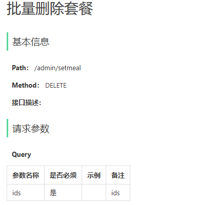

后端处理请求

```java
/**
 * 批量删除套餐
 * @param
 * @return
 */
@ApiOperation("批量删除套餐")
@DeleteMapping
public Result deleteSetmeal(List<Long> ids) {
    log.info("删除套餐：{}", ids);
    setmealService.deleteBatch(ids);
    return Result.success();
}
```

测试，Console报错

```
java.lang.IllegalStateException: No primary or single unique constructor found for interface java.util.List
at org.springframework.beans.BeanUtils.getResolvableConstructor(BeanUtils.java:267) ~[spring-beans-5.3.22.jar:5.3.22]
at javax.servlet.http.HttpServlet.service(HttpServlet.java:687) ~[tomcat-embed-core-9.0.65.jar:4.0.FR]
at javax.servlet.http.HttpServlet.service(HttpServlet.java:764) ~[tomcat-embed-core-9.0.65.jar:4.0.FR]
```

后端处理请求，增加 @RequestParam

```java
/**
 * 批量删除套餐
 * @param
 * @return
 */
@ApiOperation("批量删除套餐")
@DeleteMapping
public Result deleteSetmeal(@RequestParam List<Long> ids) {
    log.info("删除套餐：{}", ids);
    setmealService.deleteBatch(ids);
    return Result.success();
}
```

测试，请求成功，Console信息（先查询售卖状态，再执行删除）

```
==>  Preparing: select * from setmeal where id = ?
==> Parameters: 32(Long)
<==      Total: 1
```

debug查看ids（ArrayList

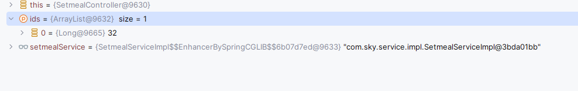

修改为ArrayList，删除@RequestParam，测试，测试结果：ArrayList.size == 0 ？？？

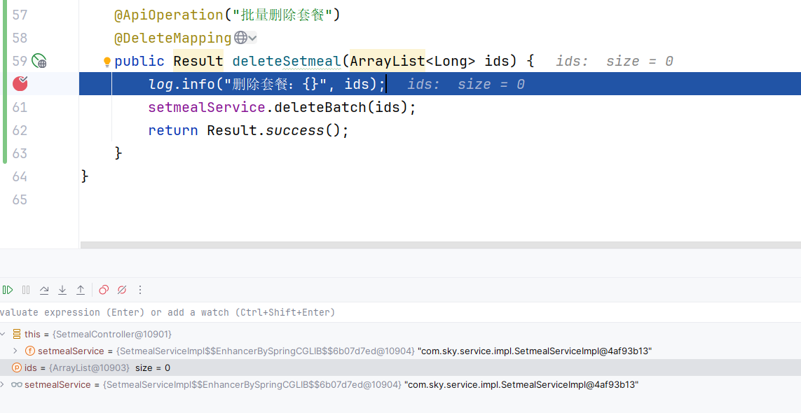

查看浏览器Http请求，URL是有附带参数的，但是处理方法上没有接收到 / 解析到 ？？？

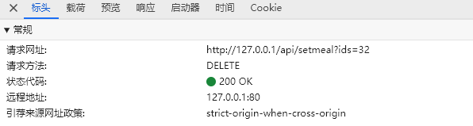

#### 补充5

**黑马苍穹外卖-营业额数据统计**

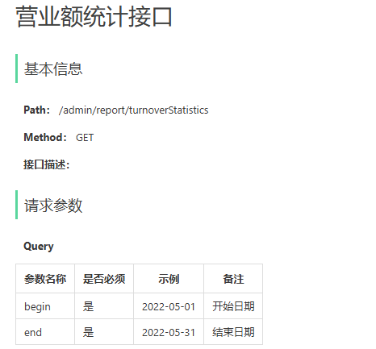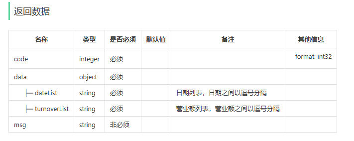

后端处理请求代码

```java
@ApiOperation("营业额数据统计")
    @GetMapping("/turnoverStatistics")
    public Result<TurnoverReportVO> turnoverStatistics(
            //TODO: 参数传递与转换
            //UTC 与 当地时间
//            @DateTimeFormat(pattern = "yyyy-MM-dd") LocalDate begin,
//            @DateTimeFormat(pattern = "yyyy-MM-dd") LocalDate end
            LocalDate begin,
            LocalDate end
    ) {
        log.info("营业额数据统计：{}, {}", begin, end);
        TurnoverReportVO turnoverReportVO = reportService.getTurnover(begin, end);
        return Result.success(turnoverReportVO);
    }
```

前端发起http请求

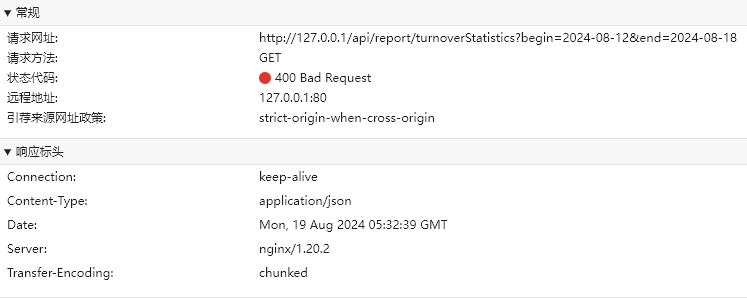

后端控制台报错

```
2024-08-19 13:34:03.640 [http-nio-8080-exec-8] WARN  o.s.w.s.m.s.DefaultHandlerExceptionResolver: Resolved [org.springframework.web.method.annotation.MethodArgumentTypeMismatchException: Failed to convert value of type 'java.lang.String' to required type 'java.time.LocalDate'; nested exception is org.springframework.core.convert.ConversionFailedException: Failed to convert from type [java.lang.String] to type [java.time.LocalDate] for value '2024-08-12'; nested exception is java.lang.IllegalArgumentException: Parse attempt failed for value [2024-08-12]]
```

后端代码修改

```java
    @ApiOperation("营业额数据统计")
    @GetMapping("/turnoverStatistics")
    public Result<TurnoverReportVO> turnoverStatistics(
            //TODO: 参数传递与转换
            //UTC 与 当地时间
            @DateTimeFormat(pattern = "yyyy-MM-dd") LocalDate begin,
            @DateTimeFormat(pattern = "yyyy-MM-dd") LocalDate end
//            LocalDate begin,
//            LocalDate end
    ) {
        log.info("营业额数据统计：{}, {}", begin, end);
        TurnoverReportVO turnoverReportVO = reportService.getTurnover(begin, end);
        return Result.success(turnoverReportVO);
    }
```

成功接收请求参数

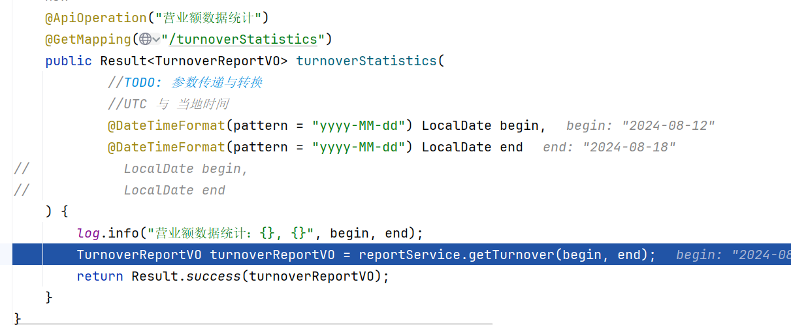
