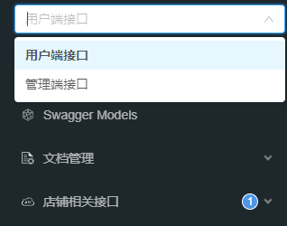

# Swagger接口文档

## 参考链接

<黑马苍穹外卖>

---

**接口文档URL**

http://127.0.0.1:8080/doc.html


**接口文档分类摆放**

管理端 和 用户端



```java
WebConfiguration.java

    @Bean
    public Docket docketAdmin() {
        log.info("准备生成管理端接口文档...");
        ApiInfo apiInfo = new ApiInfoBuilder()
                .title("苍穹外卖项目接口文档")
                .version("2.0")
                .description("苍穹外卖项目接口文档")
                .build();
        Docket docket = new Docket(DocumentationType.SWAGGER_2)
                .groupName("管理端接口")    //一定要指定groupName
                .apiInfo(apiInfo)
                .select()                                .apis(RequestHandlerSelectors.basePackage("com.sky.controller.admin"))
                .paths(PathSelectors.any())
                .build();
        return docket;
    }

    @Bean
    public Docket docketUser() {
        log.info("准备生成用户端接口文档...");
        ApiInfo apiInfo = new ApiInfoBuilder()
                .title("苍穹外卖项目接口文档")
                .version("2.0")
                .description("苍穹外卖项目接口文档")
                .build();
        Docket docket = new Docket(DocumentationType.SWAGGER_2)
                .groupName("用户端接口")    //一定要指定groupName
                .apiInfo(apiInfo)
                .select()               .apis(RequestHandlerSelectors.basePackage("com.sky.controller.user"))
                .paths(PathSelectors.any())
                .build();
        return docket;
    }
```

