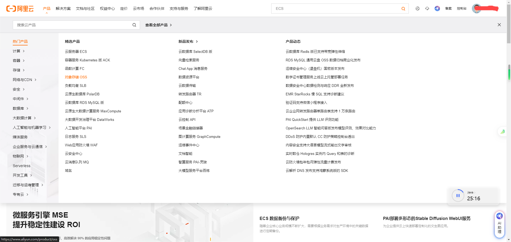
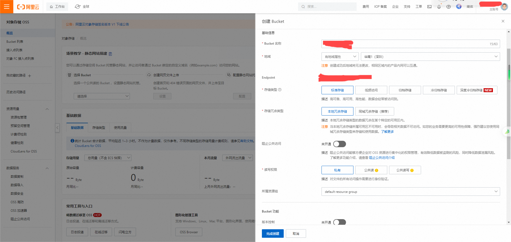
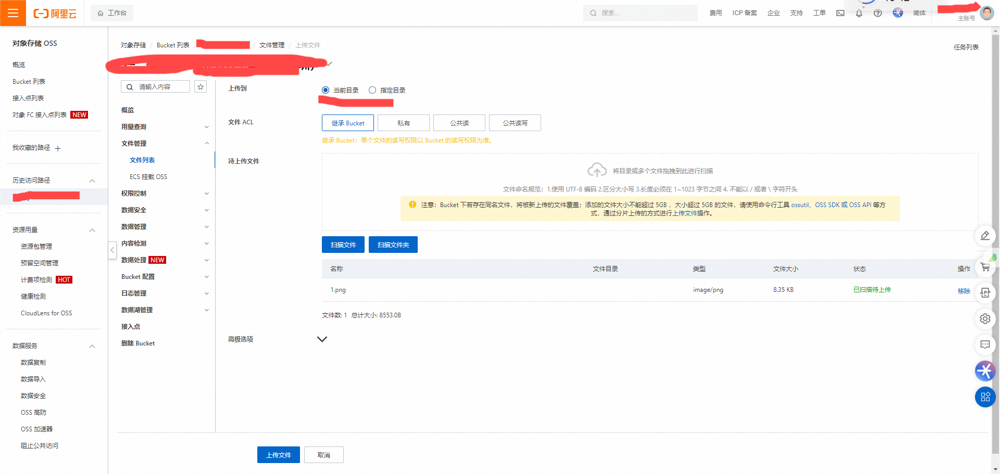
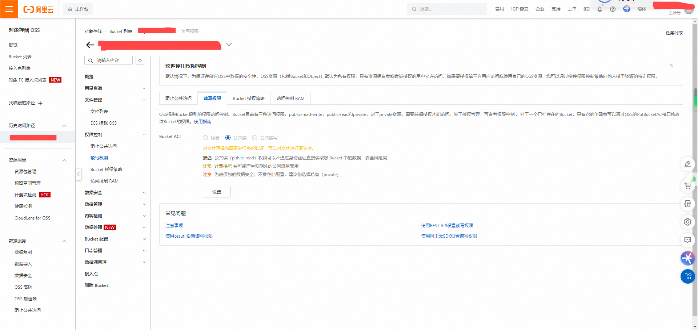
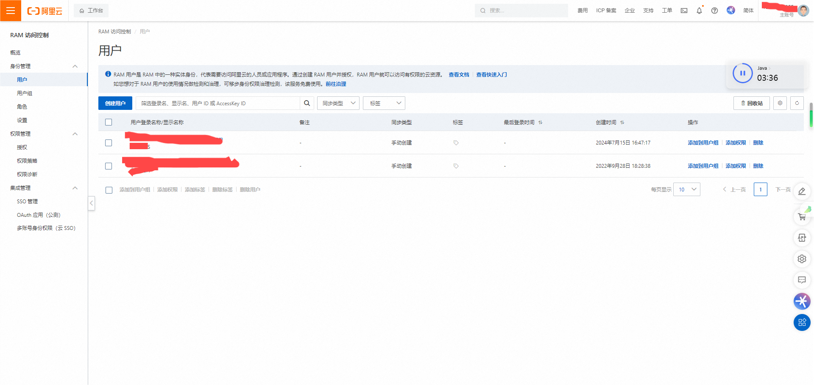
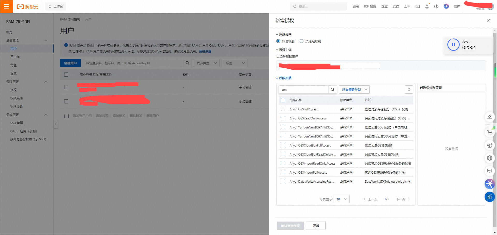

# Spring Boot 文件上传到 ALiOSS

## 参考链接

<https://juejin.cn/post/7068486901488943111>  
<黑马苍穹外卖>

---

**阿里云**

对象存储 控制台管理

创建新的 bucket

测试图片的上传

修改读写权限

创建子用户AccessKey

授予权限

配置application.yml中的 endpoint、access-key-id 、access-key-secret、bucket-name 

---

**Java**

`AliOssProperties.java`

`@Component` ?

`@ConfigurationProperties(prefix = "配置文件中的id")` 读取配置文件

`AliOssUtil.java`

工具类

创建OssClient实例

`OssClient.putObject(bucketName, objectName, inputStream)` 文件上传请求

`StringBuilder.java`生成文件访问URL（https:// + bucketName + . + endpoint + / + objectName

`OssConfiguration.java`

`@Configuration` 注解标注，配置类

`@Bean` 注解标注，交由容器管理，自动创建AliOssUtil对象？，并传递参数（endpoint、id、secret、bucketName

`CommonController.java`

通用接口`@RequestMapping("/admin/common")`

`@PostMapping(/upload)` `public Result<String> upload(MultipartFile file)` 接收文件，文件上传

`UUID.randomUUID().toString()` UUID生成 + 获取源文件扩展名

`String filePath = aliOssUtil.upload(file.getBytes(), objectName);` 文件上传并获取访问URL传递到前端进行图片展示

