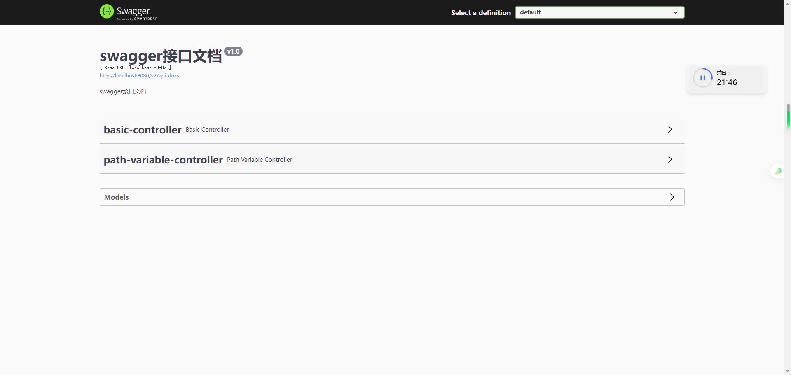

# Swagger and Knife4j


## Swagger


### 参考链接

[黑马苍穹外卖](https://www.bilibili.com/video/BV1TP411v7v6/?spm_id_from=333.337.search-card.all.click&vd_source=d999675f6dab8c0e0ef800a3c2bf4be5)

[Spring Boot整合Swagger，作者：沉默王二](https://javabetter.cn/springboot/swagger.html)


### Swagger官方文档

以下摘抄自 <https://swagger.io/docs/specification/about/>

###### What Is OpenAPI?

**OpenAPI Specification** (formerly Swagger Specification) is an API description format for REST APIs. An OpenAPI file allows you to describe your entire API, including:

- Available endpoints (`/users`) and operations on each endpoint (`GET /users`, `POST /users`)
- Operation parameters Input and output for each operation
- Authentication methods
- Contact information, license, terms of use and other information.

###### What Is Swagger?

**Swagger** is a set of open-source tools built around the OpenAPI Specification that can help you design, build, document and consume REST APIs. The major Swagger tools include:

- [Swagger Editor](https://editor.swagger.io/) – browser-based editor where you can write OpenAPI definitions.
- [Swagger UI](https://github.com/swagger-api/swagger-ui) – renders OpenAPI definitions as interactive documentation.
- [Swagger Codegen](https://github.com/swagger-api/swagger-codegen) – generates server stubs and client libraries from an OpenAPI definition.
- [Swagger Editor Next (beta)](https://editor-next.swagger.io/) – browser-based editor where you can write and review OpenAPI and AsyncAPI definitions.
- [Swagger Core ](https://github.com/swagger-api/swagger-core)– Java-related libraries for creating, consuming, and working with OpenAPI definitions.
- [Swagger Parser](https://github.com/swagger-api/swagger-parser) – standalone library for parsing OpenAPI definitions
- [Swagger APIDom](https://github.com/swagger-api/apidom) – provides a single, unifying structure for describing APIs across various description languages and serialization formats.

> Swagger 是一组围绕 OpenAPI 规范构建的开源工具，可以帮助您设计、构建、记录和使用 REST API

###### Why Use OpenAPI?

The ability of APIs to describe their own structure is the root of all awesomeness in OpenAPI. Once written, an OpenAPI specification and Swagger tools can drive your API development further in various ways:

- Design-first users: use [Swagger Codegen](https://github.com/swagger-api/swagger-codegen) to **generate a server stub** for your API. The only thing left is to implement the server logic – and your API is ready to go live!
- Use [Swagger Codegen](https://github.com/swagger-api/swagger-codegen) to **generate client libraries** for your API in over 40 languages.
- Use [Swagger UI](https://github.com/swagger-api/swagger-ui) to generate **interactive API documentation** that lets your users try out the API calls directly in the browser.
- Use the spec to connect API-related tools to your API. For example, import the spec to [SoapUI](https://soapui.org/) to create automated tests for your API.
- And more! Check out the [open-source](https://swagger.io/tools/open-source/open-source-integrations/) and [commercial tools](https://swagger.io/commercial-tools/) that integrate with Swagger.


### 什么是Swagger？

[什么是 Swagger？作者：Apifox](https://apifox.com/apiskills/what-is-swagger/#%E4%BB%80%E4%B9%88%E6%98%AF-swagger)

Swagger 是一个开源的 API 设计和文档化工具，可以轻松地创建、测试和文档化 RESTful API。


### RESTful

[理解RESTful架构, 作者：阮一峰](https://www.ruanyifeng.com/blog/2011/09/restful.html)

”资源表现层状态转移“


### Springfox

[springfox-swagger 使用指南 | 教你快速集成 Swagger API 文档，作者：Apifox](https://apifox.com/apiskills/springfox-swagger-tutorial/)


### Spring整合Springfox

1）引入依赖

2） SwaggerConfig.java

>  报错

```
org.springframework.context.ApplicationContextException: Failed to start bean 'documentationPluginsBootstrapper'; nested exception is java.lang.NullPointerException
	at org.springframework.context.support.DefaultLifecycleProcessor.doStart(DefaultLifecycleProcessor.java:181) ~[spring-context-5.3.23.jar:5.3.23]
	at org.springframework.context.support.DefaultLifecycleProcessor.access$200(DefaultLifecycleProcessor.java:54) ~[spring-context-5.3.23.jar:5.3.23]
	at org.springframework.context.support.DefaultLifecycleProcessor$LifecycleGroup.start(DefaultLifecycleProcessor.java:356) ~[spring-context-5.3.23.jar:5.3.23]
	at java.lang.Iterable.forEach(Iterable.java:75) ~[na:1.8.0_381]
	at org.springframework.context.support.DefaultLifecycleProcessor.startBeans(DefaultLifecycleProcessor.java:155) ~[spring-context-5.3.23.jar:5.3.23]
	at org.springframework.context.support.DefaultLifecycleProcessor.onRefresh(DefaultLifecycleProcessor.java:123) ~[spring-context-5.3.23.jar:5.3.23]
	at org.springframework.context.support.AbstractApplicationContext.finishRefresh(AbstractApplicationContext.java:935) ~[spring-context-5.3.23.jar:5.3.23]
	at org.springframework.context.support.AbstractApplicationContext.refresh(AbstractApplicationContext.java:586) ~[spring-context-5.3.23.jar:5.3.23]
	at org.springframework.boot.web.servlet.context.ServletWebServerApplicationContext.refresh(ServletWebServerApplicationContext.java:145) ~[spring-boot-2.6.13.jar:2.6.13]
	at org.springframework.boot.SpringApplication.refresh(SpringApplication.java:745) [spring-boot-2.6.13.jar:2.6.13]
	at org.springframework.boot.SpringApplication.refreshContext(SpringApplication.java:420) [spring-boot-2.6.13.jar:2.6.13]
	at org.springframework.boot.SpringApplication.run(SpringApplication.java:307) [spring-boot-2.6.13.jar:2.6.13]
	at org.springframework.boot.SpringApplication.run(SpringApplication.java:1317) [spring-boot-2.6.13.jar:2.6.13]
	at org.springframework.boot.SpringApplication.run(SpringApplication.java:1306) [spring-boot-2.6.13.jar:2.6.13]
	at com.cz.SwaggerDemoApplication.main(SwaggerDemoApplication.java:14) [classes/:na]
Caused by: java.lang.NullPointerException: null
	at springfox.documentation.spring.web.WebMvcPatternsRequestConditionWrapper.getPatterns(WebMvcPatternsRequestConditionWrapper.java:56) ~[springfox-spring-webmvc-3.0.0.jar:3.0.0]
	at springfox.documentation.RequestHandler.sortedPaths(RequestHandler.java:113) ~[springfox-core-3.0.0.jar:3.0.0]
	at springfox.documentation.spi.service.contexts.Orderings.lambda$byPatternsCondition$3(Orderings.java:89) ~[springfox-spi-3.0.0.jar:3.0.0]
	at java.util.Comparator.lambda$comparing$77a9974f$1(Comparator.java:469) ~[na:1.8.0_381]
	at java.util.TimSort.countRunAndMakeAscending(TimSort.java:355) ~[na:1.8.0_381]
	at java.util.TimSort.sort(TimSort.java:220) ~[na:1.8.0_381]
	at java.util.Arrays.sort(Arrays.java:1512) ~[na:1.8.0_381]
	at java.util.ArrayList.sort(ArrayList.java:1464) ~[na:1.8.0_381]
	at java.util.stream.SortedOps$RefSortingSink.end(SortedOps.java:387) ~[na:1.8.0_381]
	at java.util.stream.Sink$ChainedReference.end(Sink.java:258) ~[na:1.8.0_381]
	at java.util.stream.Sink$ChainedReference.end(Sink.java:258) ~[na:1.8.0_381]
	at java.util.stream.Sink$ChainedReference.end(Sink.java:258) ~[na:1.8.0_381]
	at java.util.stream.Sink$ChainedReference.end(Sink.java:258) ~[na:1.8.0_381]
	at java.util.stream.AbstractPipeline.copyInto(AbstractPipeline.java:483) ~[na:1.8.0_381]
	at java.util.stream.AbstractPipeline.wrapAndCopyInto(AbstractPipeline.java:472) ~[na:1.8.0_381]
	at java.util.stream.ReduceOps$ReduceOp.evaluateSequential(ReduceOps.java:708) ~[na:1.8.0_381]
	at java.util.stream.AbstractPipeline.evaluate(AbstractPipeline.java:234) ~[na:1.8.0_381]
	at java.util.stream.ReferencePipeline.collect(ReferencePipeline.java:499) ~[na:1.8.0_381]
	at springfox.documentation.spring.web.plugins.WebMvcRequestHandlerProvider.requestHandlers(WebMvcRequestHandlerProvider.java:81) ~[springfox-spring-webmvc-3.0.0.jar:3.0.0]
	at java.util.stream.ReferencePipeline$3$1.accept(ReferencePipeline.java:193) ~[na:1.8.0_381]
	at java.util.ArrayList$ArrayListSpliterator.forEachRemaining(ArrayList.java:1384) ~[na:1.8.0_381]
	at java.util.stream.AbstractPipeline.copyInto(AbstractPipeline.java:482) ~[na:1.8.0_381]
	at java.util.stream.AbstractPipeline.wrapAndCopyInto(AbstractPipeline.java:472) ~[na:1.8.0_381]
	at java.util.stream.ReduceOps$ReduceOp.evaluateSequential(ReduceOps.java:708) ~[na:1.8.0_381]
	at java.util.stream.AbstractPipeline.evaluate(AbstractPipeline.java:234) ~[na:1.8.0_381]
	at java.util.stream.ReferencePipeline.collect(ReferencePipeline.java:499) ~[na:1.8.0_381]
	at springfox.documentation.spring.web.plugins.AbstractDocumentationPluginsBootstrapper.withDefaults(AbstractDocumentationPluginsBootstrapper.java:107) ~[springfox-spring-web-3.0.0.jar:3.0.0]
	at springfox.documentation.spring.web.plugins.AbstractDocumentationPluginsBootstrapper.buildContext(AbstractDocumentationPluginsBootstrapper.java:91) ~[springfox-spring-web-3.0.0.jar:3.0.0]
	at springfox.documentation.spring.web.plugins.AbstractDocumentationPluginsBootstrapper.bootstrapDocumentationPlugins(AbstractDocumentationPluginsBootstrapper.java:82) ~[springfox-spring-web-3.0.0.jar:3.0.0]
	at springfox.documentation.spring.web.plugins.DocumentationPluginsBootstrapper.start(DocumentationPluginsBootstrapper.java:100) ~[springfox-spring-web-3.0.0.jar:3.0.0]
	at org.springframework.context.support.DefaultLifecycleProcessor.doStart(DefaultLifecycleProcessor.java:178) ~[spring-context-5.3.23.jar:5.3.23]
	... 14 common frames omitted
```

[二哥提到了版本不兼容问题](https://javabetter.cn/springboot/swagger.html#%E7%89%88%E6%9C%AC%E4%B8%8D%E5%85%BC%E5%AE%B9)

自己使用的版本

```
 :: Spring Boot ::               (v2.6.13)
 
 <dependency>
            <groupId>io.springfox</groupId>
            <artifactId>springfox-boot-starter</artifactId>
            <version>3.0.0</version>
</dependency>
```

自己貌似在稀里糊涂的情况下捣鼓通了...

```
2024-08-15 11:24:08.729  INFO 23676 --- [           main] com.cz.SwaggerDemoApplication            : Starting SwaggerDemoApplication using Java 1.8.0_381 on DESKTOP-42B4J2H with PID 23676 (G:\Java\Project\swagger-demo\target\classes started by WIN11 in G:\Java\Project\swagger-demo)
2024-08-15 11:24:08.733  INFO 23676 --- [           main] com.cz.SwaggerDemoApplication            : No active profile set, falling back to 1 default profile: "default"
2024-08-15 11:24:09.963  INFO 23676 --- [           main] o.s.b.w.embedded.tomcat.TomcatWebServer  : Tomcat initialized with port(s): 8080 (http)
2024-08-15 11:24:09.973  INFO 23676 --- [           main] o.apache.catalina.core.StandardService   : Starting service [Tomcat]
2024-08-15 11:24:09.973  INFO 23676 --- [           main] org.apache.catalina.core.StandardEngine  : Starting Servlet engine: [Apache Tomcat/9.0.68]
2024-08-15 11:24:10.143  INFO 23676 --- [           main] o.a.c.c.C.[Tomcat].[localhost].[/]       : Initializing Spring embedded WebApplicationContext
2024-08-15 11:24:10.143  INFO 23676 --- [           main] w.s.c.ServletWebServerApplicationContext : Root WebApplicationContext: initialization completed in 1353 ms
2024-08-15 11:24:10.802  INFO 23676 --- [           main] o.s.b.w.embedded.tomcat.TomcatWebServer  : Tomcat started on port(s): 8080 (http) with context path ''
2024-08-15 11:24:11.360  INFO 23676 --- [           main] com.cz.SwaggerDemoApplication            : Started SwaggerDemoApplication in 3.117 seconds (JVM running for 4.597)
```



解决原因：@EnableWebMvc

```java
import org.springframework.context.annotation.Configuration;
import org.springframework.web.servlet.config.annotation.EnableWebMvc;

@Configuration
@EnableWebMvc    //主要是这个注解的作用
public class WebConfig {
}

```

稀里糊涂的解决过程：

自己在询问Chat GPT，以下这段代码该放在哪

```java
@Override
public void addResourceHandlers(ResourceHandlerRegistry registry) {
    registry.addResourceHandler("swagger-ui.html")
      .addResourceLocations("classpath:/META-INF/resources/");

    registry.addResourceHandler("/webjars/**")
      .addResourceLocations("classpath:/META-INF/resources/webjars/");
}
```

Chat GPT帮我写了个配置类

```java
import org.springframework.context.annotation.Configuration;
import org.springframework.web.servlet.config.annotation.EnableWebMvc;
import org.springframework.web.servlet.config.annotation.ResourceHandlerRegistry;
import org.springframework.web.servlet.config.annotation.WebMvcConfigurer;

@Configuration
@EnableWebMvc
public class WebConfig implements WebMvcConfigurer {
    @Override
    public void addResourceHandlers(ResourceHandlerRegistry registry) {
        registry.addResourceHandler("swagger-ui.html")
                .addResourceLocations("classpath:/META-INF/resources/");

        registry.addResourceHandler("/webjars/**")
                .addResourceLocations("classpath:/META-INF/resources/webjars/");
    }
}
```

然后，稀里糊涂的发现 @EnableWebMvc 注解...


重新理一下自己 SpringBoot 整合 Springfox 的过程

1）引入依赖

2）SwaggerConfig.java 配置

```java
@Configuration
@EnableOpenApi
public class SwaggerConfig {
    @Bean
    public Docket docket() {
        Docket docket = new Docket(DocumentationType.SWAGGER_2)
                .apiInfo(apiInfo()).enable(true)
                .select()
                //apis： 添加swagger接口提取范围
                .apis(RequestHandlerSelectors.basePackage("YourPackage"))
                .paths(PathSelectors.any())
                .build();

        return docket;
    }

    private ApiInfo apiInfo() {
        return new ApiInfoBuilder()
                .title("swagger接口文档")
                .description("swagger接口文档")
                .version("v1.0")
                .build();
    }
}
```

3）@EnableWebMvc

4）Controller类中

```java
@Api(tags = "")    //作用于类
@ApiOperation("")    //作用于方法
```

5）启动服务，访问 `http://localhost:8080/swagger-ui/index.html`


## Knife4j

knife4j，集Swagger2 和 OpenAPI3 为一体的增强解决方案


### 参考链接

[Spring Boot整合Knife4j，作者：沉默王二]([Spring Boot整合Knife4j，美化强化丑陋的Swagger | 二哥的Java进阶之路 (javabetter.cn)](https://javabetter.cn/gongju/knife4j.html))

[Knife4j官方文档](https://doc.xiaominfo.com/docs/quick-start)

[黑马苍穹外卖](https://www.bilibili.com/video/BV1TP411v7v6/?spm_id_from=333.337.search-card.all.click&vd_source=d999675f6dab8c0e0ef800a3c2bf4be5)


### Knife4j使用

Version：SpringBoot 3 + Knife4j 

引入Maven依赖

application.yml  或  application.properties 配置（貌似可以代替SwaggerConfig？？？）

使用 注解 标注类与方法

访问接口文档URL：<http://ip:port/doc.html>


## 实践

### 接口文档 分组

Version

​	SpringBoot 2.7.3 + Knife4j 3.0.2

管理端 和 用户端 文档分组


```java
WebConfiguration.java

    @Bean
    public Docket docketAdmin() {
        log.info("准备生成管理端接口文档...");
        ApiInfo apiInfo = new ApiInfoBuilder()
                .title("苍穹外卖项目接口文档")
                .version("2.0")
                .description("苍穹外卖项目接口文档")
                .build();
        Docket docket = new Docket(DocumentationType.SWAGGER_2)
                .groupName("管理端接口")    //一定要指定groupName
                .apiInfo(apiInfo)
                .select()                                .apis(RequestHandlerSelectors.basePackage("com.sky.controller.admin"))
                .paths(PathSelectors.any())
                .build();
        return docket;
    }

    @Bean
    public Docket docketUser() {
        log.info("准备生成用户端接口文档...");
        ApiInfo apiInfo = new ApiInfoBuilder()
                .title("苍穹外卖项目接口文档")
                .version("2.0")
                .description("苍穹外卖项目接口文档")
                .build();
        Docket docket = new Docket(DocumentationType.SWAGGER_2)
                .groupName("用户端接口")    //一定要指定groupName
                .apiInfo(apiInfo)
                .select()               .apis(RequestHandlerSelectors.basePackage("com.sky.controller.user"))
                .paths(PathSelectors.any())
                .build();
        return docket;
    }
```

