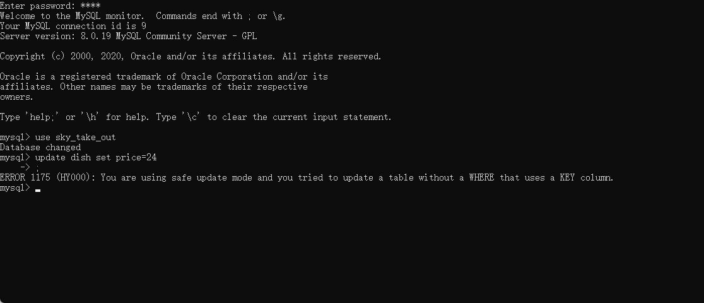

# Mapper.xml


## 参考资料：

黑马苍穹外卖——新增菜品业务

---

插入新数据后回查自增ID

```xml
<Insert id="方法名" useGeneratedKeys="true" keyProperty="id">
    insert into 表名 (列名) VALUES (#{对象.属性})
</Insert>
```


插入一批数据

```xml
<insert id="方法名" >
    insert into 表名 (列名) VALUES
    <foreach collection="集合" item="变量自命名，例如：df" separator=",">
        (#{df.属性}, #{df.属性})
    </foreach>
</insert>
```


SQL连接（join）

```xml
<select id="pageQuery" resultType="com.sky.vo.DishVO">
    select d.*, c.name as categoryName from dish d left outer join category c on d.category_id = c.id
    <where>
        <if test="name != null">
            and d.name like concat('%', #{name}, '%')
        </if>
        <if test="status != null">
            and d.status = #{status}
        </if>
    </where>
    order by d.create_time desc
</select>
```


update

```xml
<update id="update">
    update dish
    <set>
        <if test="name != null">name = #{name},</if>
        <if test="categoryId != null">category_id = #{categoryId},</if>
        <if test="price != null">price = #{price},</if>
        <if test="image != null">image = #{image},</if>
        <if test="description != null">description = #{description},</if>
        <if test="status != null">status = #{status},</if>
        <if test="updateTime != null">update_time = #{updateTime},</if>
        <if test="updateUser != null">update_user = #{updateUser},</if>
    </set>
    <!-- 注意一定要写 where 关键字，否则将全表一起更新！！！ -->
    where id = #{id}
</update>

MySQL开启安全更新模式
参考链接：https://www.cnblogs.com/gomysql/p/3582058.html
查看当前安全更新状态：SHOW VARIABLES LIKE 'sql_safe_updates';
```

开启安全更新模式


