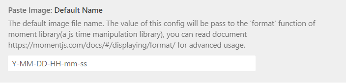
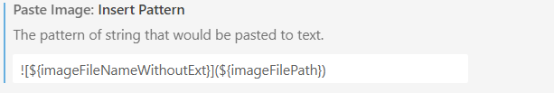
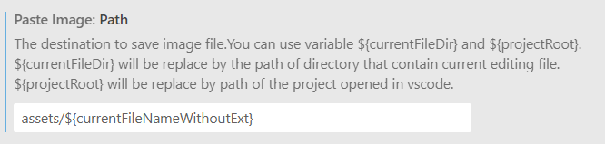

# VSCode

## 扩展

### Paste Image  

**参考链接**  

<https://blog.csdn.net/qq_15615149/article/details/131492905>
<https://blog.csdn.net/u010649766/article/details/88745690>

自定义插入图片的名称 + 位置  

首先安装 Paste Image 扩展

然后进入Paste Image扩展设置中，  

**图片名称设置**，这里使用默认的图片名称  



**插入模板**  



```

```

在Markdown文件中自动生成的图片插入文本类似于以下内容
```

```

**图片的存放路径**



```
assets/${currentFileNameWithoutExt}
```
此设置会在编辑文件的同级目录中生成 `assets` 文件夹，并且在 `assets` 文件夹中再生成 `与文件名相同的文件夹` ，随后在 `assets/filename` 文件夹下存放图片

> 注意：粘贴图片时，请用 `ctrl + alt + v`
