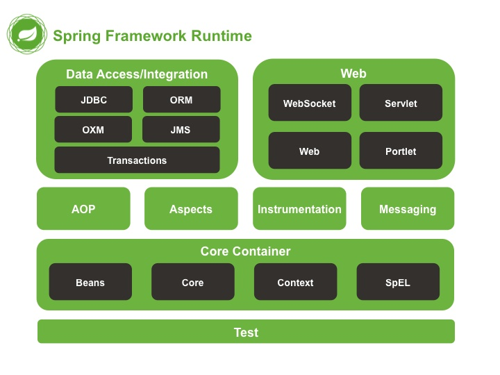
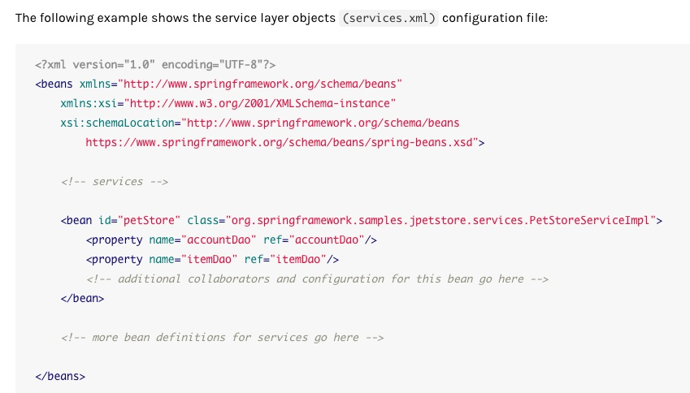
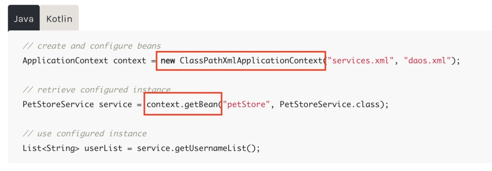

# Spring IoC 初探

## 参考链接
<https://javabetter.cn/springboot/ioc.html#%E6%B7%B1%E5%85%A5%E7%90%86%E8%A7%A3-ioc>

---

**IoC**

​	Bean：由第三方包装的object

​	控制反转（Inversion of Control，IoC）：把  创建和管理  Bean的过程转移给了第三方（Spring IoC Container）

​	IoC把对象之间的依赖关系转成用配置文件来管理，由Spring IoC Container来管理，实现了对象之间的解耦——降低复杂度，防止出现问题的对象影响其他正常对象？，便于管理，方便编程（省略手动创建和管理对象）？

​	依赖注入（dependency injection，DI）：配置文件把资源从外部注入到内部，容器加载了外部的文件、对象、数据，然后把这些资源诸如给程序内的对象，维护了程序内外对象之间的依赖关系

​	IoC 是设计思想，DI 是具体的实现方式

​	IoC可以通过其他方式实现，Spring选择了DI

---

**Spring八大模块**

---

**IoC实践**

IoC容器 依赖于 4个jar包：$Beans, Core, Context, SpEL(SpringExpressLanguage)$ 

配置文件，service.xml

`name`：类的属性，`ref`：属性的具体值

IoC的使用

`ApplicationContext`是`IoC容器`的入口，也是`Spring程序`的入口

​	`ApplicationContext`是`BeanFactory`的子类

​	`BeanFactory`可以理解为`HashMap`，具有`get put`功能，“低级容器”

​	`ApplicationContext`继承多个接口，“高级容器”

​	`ApplicationContext`有两个具体的实现子类，用来读取配置文件：

​		`ClassPathXmlApplicationContext`：从`class path`加载配置文件（常用）

​		`FileSystemXmlApplicationContext`：从本地文件加载配置文件（不常用）

`bean`对象的创建是通过反射实现`clazz.getDeclaredConstructor().newImstance()`

容器中的所有对象在启动容器的时候，就已经被创建好了

---

个人理解 + ChatGPT：

`@Atutowired / @Resource` 来依赖注入某个字段时，需要该类在创建时使用了`@Component / @Service / @Mapper` 等注解，需要确保所要注入的依赖（即字段所代表的服务、组件等）已经在Spring容器中注册

使用`@Autowired/@Resource`注入的字段通常将访问级别设置为`private`，保持封装性

构造方法注入 / setter注入？

`@Autyowired`来自Spring框架的核心容器，`@Resource`来自Java的JSR-330规范

单例注入？