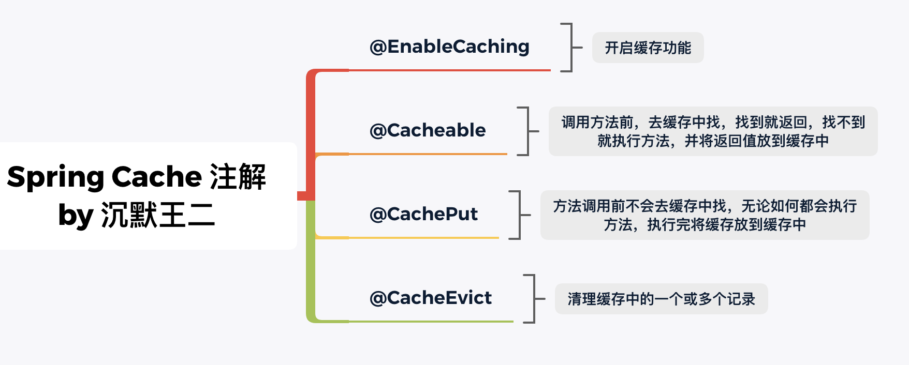

# SpringBoot整合Redis

## 参考链接

<https://javabetter.cn/redis/redis-springboot.html>

<https://redis.com.cn/redis-lists.html>

<https://javaguide.cn/database/redis/redis-data-structures-01.html>

<黑马苍穹外卖>

<http://www.passjava.cn/#/01.PassJava/02.PassJava_Architecture/24.%E7%BC%93%E5%AD%98%E5%AE%9E%E6%88%98%EF%BC%88%E5%9B%9B%EF%BC%89SpringCache>

[疑似抄袭，并且没贴参考链接，原创为上一个链接](https://juejin.cn/post/6997440726627778597)

<https://blog.csdn.net/m0_62946761/article/details/129368226>

<https://blog.csdn.net/HeatDeath/article/details/79450409>

---

### Redis

内存中的数据结构存储系统，可以用作数据库、缓存和消息中间件

支持的数据结构：字符串（string），散列（hash），列表（list），集合（set），有序集合（sorted set），位图（bitmaps），基数统计（hyperloglogs），地理空间（geospatoal）


**String**

​	key - value

**Hash**

​	key - fild - value

**List**

​	key - value

​	按照插入顺序排列，可以在列表的 左 / 右 添加元素

​	lpush（value3, value2, value1）--rpop（value3， value2，value1）


**Set**

​	key - value

​	无序，不可重复

**ZSet**

​	key - score - value

​	有序，不可重复


Redis服务端启动（Windows）

```bash
redis-server.exe redis.windows.conf
```

Redis客户端启动

```bash
redis-cli.exe -h ip地址 -p 端口号（6379） -a 密码（可选）
```


Redis客户端图形工具

https://github.com/qishibo/AnotherRedisDesktopManager


Redis命令查阅

https://redis.com.cn/redis-commands.html


### SpringBoot整合Redis

pom.xml引入引入依赖

```xml
<dependency>
    <groupId>org.springframework.boot</groupId>
    <artifactId>spring-boot-starter-data-redis</artifactId>
</dependency>
```

application.yml添加Redis配置

```xml
spring:
  redis:
    host: xxx.xxx.99.232 # Redis服务器地址
    database: 0 # Redis数据库索引（默认为0）
    port: 6379 # Redis服务器连接端口
    password: xxx # Redis服务器连接密码（默认为空）
```

编写配置类

```java
@Configuration
@Slf4j
public class RedisConfiguration {

    @Bean
    public RedisTemplate redisTemplate(RedisConnectionFactory redisConnectionFactory){
        log.info("开始创建redis模板对象...");
        RedisTemplate redisTemplate = new RedisTemplate();
        //设置redis的连接工厂对象
        redisTemplate.setConnectionFactory(redisConnectionFactory);
        //设置redis key的序列化器
        redisTemplate.setKeySerializer(new StringRedisSerializer());
        return redisTemplate;
    }
}
```

RedisTemplate: Spring Data Redis提供的模板类，可以对Redis进行增删改查

```java
RedisTemplate.opsForValue    //操作 string
RedisTemplate.opsForHash     //操作 hash
RedisTemplate.opsForList     //操作 list
RedisTemplate.opsForSet      //操作 set
RedisTemplate.opsForZSet     //操作 zset
```


### SpringCache

Spring Cache是Spring提供的缓存解决方案，本身并没有提供缓存的实现，但提供了一整套接口和代码规范、配置、注解等，可以整合各种缓存方案，不用关心操作缓存的细节

实现原理：AOP（面向切面编程）

通过使用注解 @Cacheable、@CachePut、@CacheEvict、@EnableCaching 来操作缓存




**SpringCache使用**

引入依赖

```xml
<dependency>
    <groupId>org.springframework.boot</groupId>
    <artifactId>spring-boot-starter-cache</artifactId>
</dependency>
```

选择缓存中间件

* caffeine
* couchbase
* generic
* hazelcast
* infinispan
* jcache
* redis
* simple
* none

> 示例：配置文件application.yml

```yml
spring:
    cache:
        type: redis
```

引入redis依赖

application.yml添加redis连接配置

```yml
spring:
    redis:
        host: 118.xx.xx.xxx # Redis服务器地址
        database: 0 # Redis数据库索引（默认为0）
        port: 6379 # Redis服务器连接端口
        password: xx # Redis服务器连接密码（默认为空）
        timeout: 1000ms # 连接超时时间（毫秒）
```

`RedisConfig.java extends CachingConfigurerSupport`

```java
@EnableCaching
@Configuration
public class RedisConfig extends CachingConfigurerSupport{
    @Bean
    public RedisTemplate<Strign, Object> redisTemplate(RedisConnectionFactory redisConnectionFactory) {
        redisTemplate.setConnectionFactory(redisConnectionFactory);
        //指定 key 与 value 的序列化类型
    }
    
    @Bean
    public RedisCacheManager redisCacheManager(RedisConnectionFactory redisConnectionFactory) {
        //通过RedisCacheConfiguration设置超时时间，避免产生不必要的缓存数据
    }
}
```

在某个方法上 加上 @CachePut / @Cacheable 等注解

```java
@Cacheable(value = "", key = "", condition = "", unless = "")
```

* value，缓存名称，每个缓存名称下可以放置多个key
* key，缓存名称 中的 key值，可用 SpEL 表达式，key = "#root.methodName" 表示使用方法名作为key，https://docs.spring.io/spring-framework/docs/current/javadoc-api/org/springframework/cache/annotation/CachePut.html#key()
* condition，条件符合则缓存
* unless，条件符合则不缓存

自定义配置

```yml
spring:
    cache:
        type: redis
    	    redis:
    	        # 缓存 key 前缀
      		    key-prefix: test_
      		    # 是否使用缓存前缀
      			use-key-prefix: true
      			# 缓存过期时间
      			time-to-live: 3600s
      			# 缓存控制，防止缓存穿透 ？
      			cache-null-values: true
```

添加配置类 读取配置文件信息


### Redis连接池

由于与Redis数据库 建立 / 断开 连接 可能需要消耗较多时间 （？，未经过测试），使用连接池可以实现客户端建立多个连接，需要的时候从连接池取出，用完再放回去，如此节省了 建立 / 断开 连接所消耗的时间


> 争议？
>
> https://juejin.cn/post/7201400444873654333
>
> "大多数情况下连接池不是必需的，他只有在某些特殊的场景下使用连接池才会带来比较大的正向收益，比如使用了Pipeline或者事务?"
>
> https://juejin.cn/post/7168676366643118110
>
> "在执行一些简单指令的情况下，lettuce不配置连接池，使用单连接是最佳方案。连接池配置太小，性能会急剧下降，连接池配置太大，性能和单连接情况下大致相当，但会造成资源浪费。"


**Redis客户端**

* Jedis：Spring Boot 1.5x 版本的默认Redis客户端，多线程环境下是非线程安全的 ？
* Lettuce：Spring Boot 2.x 版本后默认的Redis客户端，支持多个线程并发访问 ？


**使用**

application.yml添加Lettuce连接池配置

```yml
spring:
    redis:
        lettuce:
          pool:
            max-active: 8 # 连接池最大连接数
            max-idle: 8 # 连接池最大空闲连接数
            min-idle: 0 # 连接池最小空闲连接数
            max-wait: -1ms # 连接池最大阻塞等待时间，负值表示没有限制
```

添加 commons-pool2 依赖

```xml
<dependency>
    <groupId>org.apache.commons</groupId>
    <artifactId>commons-pool2</artifactId>
    <version>2.6.2</version>
    <type>jar</type>
    <scope>compile</scope>
</dependency>
```


